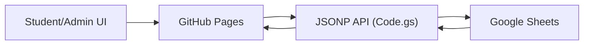
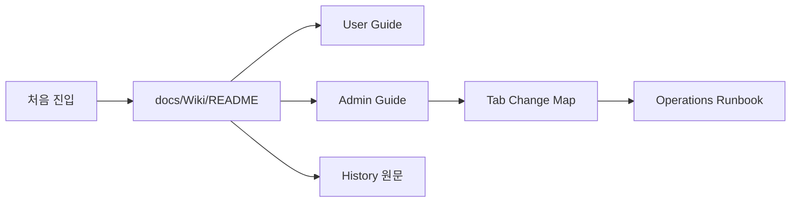

# CloudClub Attendance Documentation Hub

> 문서 링크: [README.md](./README.md) | [GitHub](https://github.com/cloud-club/CloudClubAttendanceSystem/blob/gh-pages/README.md)

## 빠른 흐름도

## 문서 네비게이션 흐름도

CloudClub 출석 시스템 문서는 다음 원칙으로 정리되어 있습니다.
- `docs/Wiki`: 현재 운영 기준(정본)
- `docs/History`: 과거 정책/기록 원문

## 시작 경로
- 위키 메인: [docs/Wiki/README.md](./docs/Wiki/README.md) | [GitHub](https://github.com/cloud-club/CloudClubAttendanceSystem/blob/gh-pages/docs/Wiki/README.md)
- 히스토리 인덱스: [docs/History/README.md](./docs/History/README.md) | [GitHub](https://github.com/cloud-club/CloudClubAttendanceSystem/blob/gh-pages/docs/History/README.md)

## 운영 URL
- 관리자: `https://cloud-club.github.io/CloudClubAttendanceSystem/web/admin/`
- 학생(Latest): `https://cloud-club.github.io/CloudClubAttendanceSystem/web/student/latest/`
- 랜딩: `https://cloud-club.github.io/CloudClubAttendanceSystem/web/`

## 핵심 코드 경로
- 백엔드: [Code.gs](./Code.gs) | [GitHub](https://github.com/cloud-club/CloudClubAttendanceSystem/blob/gh-pages/Code.gs)
- 관리자 프런트: [web/admin/index.html](./web/admin/index.html) | [GitHub](https://github.com/cloud-club/CloudClubAttendanceSystem/blob/gh-pages/web/admin/index.html)
- 관리자 스크립트: [web/admin/admin.js](./web/admin/admin.js) | [GitHub](https://github.com/cloud-club/CloudClubAttendanceSystem/blob/gh-pages/web/admin/admin.js)
- 학생 프런트: [web/student/latest/index.html](./web/student/latest/index.html) | [GitHub](https://github.com/cloud-club/CloudClubAttendanceSystem/blob/gh-pages/web/student/latest/index.html)
- 학생 스크립트: [web/student/student.js](./web/student/student.js) | [GitHub](https://github.com/cloud-club/CloudClubAttendanceSystem/blob/gh-pages/web/student/student.js)
