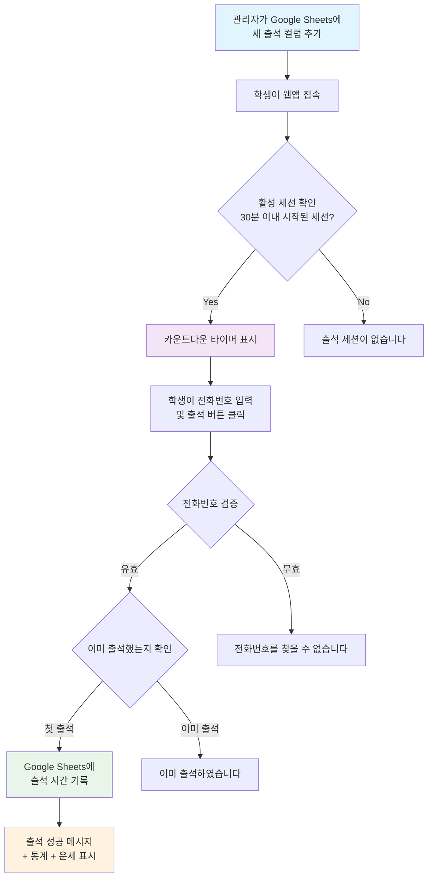

# CloudClub 출석체크 시스템

## 프로젝트 소개

CloudClub 출석체크 시스템은 Google Sheets와 Apps Script를 활용한 실시간 출석 관리 웹 애플리케이션입니다. 학생들이 휴대폰 번호를 통해 간편하게 출석 체크를 할 수 있으며, 관리자는 Google Sheets에서 모든 데이터를 실시간으로 확인하고 관리할 수 있습니다.

기술문서는 [이곳](https://github.com/cloud-club/CloudClubAttendanceSystem/blob/main/TECH_DOCS.md)을 참고하실 수 있습니다.

### 주요 특징
- **실시간 출석 체크**: 30분 제한 시간이 있는 출석 세션
- **자동 순위 시스템**: 출석률과 평균 체크인 시간 기반 랭킹
- **QR 코드 지원**: 빠른 접속을 위한 QR 코드 생성
- **운세 기능**: 출석 완료 시 재미있는 메시지 제공
- **모바일 최적화**: 반응형 웹 디자인으로 모든 기기 지원

## 시스템 동작 로직

## 프로젝트 구동을 위한 사전 설정

### 1. Google Sheets 테이블 구조 생성

Google Sheets에서 다음과 같은 구조로 테이블을 생성하세요:

| A열 (이름) | B열 (기수) | C열 (전화번호) | D열 (첫 번째 세션) | E열 (두 번째 세션) | ... |
|-----------|----------|-------------|-----------------|-----------------|-----|
| 홍길동 | 1기 | 010-1234-5678 | | | |
| 김철수 | 2기 | 010-9876-5432 | | | |
| 이영희 | 1기 | 010-1111-2222 | | | |

**중요 사항:**
- **A열**: 학생 이름
- **B열**: 기수 (예: "1기", "2기")
- **C열**: 전화번호 (출석 체크 시 사용되는 고유 식별자)
- **D열부터**: 각 출석 세션 컬럼 (헤더는 `YYYY-MM-DD-HH:MM` 형식으로 작성)

### 2. Google Apps Script 설정

0. Google Sheets에서, 아래 형식에 맞춘 테이블을 생성합니다.
- [Cloud Club User DB](https://docs.google.com/spreadsheets/d/1nEBZz96gm4F5YYnX_7y_9IIt0d3pBqBv6C--goZuJM8/edit?gid=753952759#gid=753952759)

1. Google Sheets에서 **확장 프로그램 > Apps Script** 메뉴를 클릭합니다.
    

2. 기본 생성된 `Code.gs` 파일의 내용을 모두 삭제하고, 저장소의 [Code.gs](https://github.com/cloud-club/CloudClubAttendanceSystem/blob/main/Code.gs) 파일 내용을 그대로 붙여넣습니다.

3. 새 파일을 추가합니다:
   - **파일 > 새로 만들기 > 스크립트 파일**을 클릭
   - 파일명을 `fortune`으로 입력
   - 저장소의 [fortune.gs](https://github.com/cloud-club/CloudClubAttendanceSystem/blob/main/fortune.gs) 파일 내용을 그대로 붙여넣습니다.

4. 새 파일을 추가합니다:
   - **파일 > 새로 만들기 > HTML 파일**을 클릭
   - 파일명을 `Index`로 입력
   - 저장소의 [Index.html](https://github.com/cloud-club/CloudClubAttendanceSystem/blob/main/Index.html) 파일 내용을 그대로 붙여넣습니다.
   - 이 과정까지 완료되면 Google Apps Script 편집기에서 `Code.gs`, `fortune.gs`, `Index.html` 파일이 모두 생성되어 있어야 합니다.
   

5. **배포 > 새 배포**를 클릭합니다:
   - 유형: **웹 앱**
   - 실행 권한: **나**
   - 액세스 권한: **모든 사용자**
   - **배포** 버튼 클릭
   

6. 권한 승인:
   - **권한 검토** 클릭
   - Google 계정으로 로그인
   - **고급** > **안전하지 않음으로 이동** 클릭
   - **허용** 클릭

7. 배포 완료 후 제공되는 **웹 앱 URL**을 복사해 두세요.

## 사용 방법

### 출석 세션 생성

출석 세션을 생성하는 과정은 Google Sheets에서 새로운 컬럼을 추가하는 것으로 간단히 완료됩니다.

**초기 상태 (세션 생성 전):**
| A열 (이름) | B열 (기수) | C열 (전화번호) |
|-----------|----------|-------------|
| 홍길동 | 1기 | 010-1234-5678 |
| 김철수 | 2기 | 010-9876-5432 |
| 이영희 | 1기 | 010-1111-2222 |

**첫 번째 세션 추가 후:**
| A열 (이름) | B열 (기수) | C열 (전화번호) | D열 (2024-03-15-14:00) |
|-----------|----------|-------------|-------------------|
| 홍길동 | 1기 | 010-1234-5678 | |
| 김철수 | 2기 | 010-9876-5432 | |
| 이영희 | 1기 | 010-1111-2222 | |

**여러 세션 추가 후:**
| A열 (이름) | B열 (기수) | C열 (전화번호) | D열 (2024-03-15-14:00) | E열 (2024-03-22-14:00) | F열 (2024-03-29-14:00) |
|-----------|----------|-------------|-------------------|-------------------|-------------------|
| 홍길동 | 1기 | 010-1234-5678 | 2024-03-15 14:05:23 | | |
| 김철수 | 2기 | 010-9876-5432 | | 2024-03-22 14:03:15 | |
| 이영희 | 1기 | 010-1111-2222 | 2024-03-15 14:02:10 | 2024-03-22 14:01:45 | |

**세션 생성 단계:**

1. **새 컬럼 추가**: Google Sheets에서 D열 오른쪽에 새로운 열을 삽입합니다.

2. **헤더 작성**: 새 컬럼의 첫 번째 행(헤더)에 세션 시작 시간을 `YYYY-MM-DD-HH:MM` 형식으로 입력합니다.
   - 올바른 형식 예시:
     - `2024-03-15-14:00` (2024년 3월 15일 오후 2시)
     - `2024-12-25-09:30` (2024년 12월 25일 오전 9시 30분)
     - `2025-01-10-13:15` (2025년 1월 10일 오후 1시 15분)

3. **자동 감지**: 저장하면 시스템이 새로운 세션을 자동으로 감지하고, 해당 시간부터 30분간 출석 세션이 활성화됩니다.

4. **출석 기록**: 학생들이 출석하면 해당 셀에 실제 출석 시간이 자동으로 기록됩니다.
   - 예: `2024-03-15 14:05:23` (2024년 3월 15일 오후 2시 5분 23초에 출석)

**중요 참고사항:**
- 헤더의 날짜/시간 형식을 정확히 지켜야 시스템이 올바르게 작동합니다.
- 세션은 지정된 시작 시간부터 정확히 30분간만 활성화됩니다.
- 과거 시간으로 헤더를 작성해도 되지만, 해당 세션은 이미 종료된 상태로 인식됩니다.

### 학생 출석 체크

1. 배포된 웹앱 URL에 접속합니다.
2. 출석 세션이 활성화되면 30분 카운트다운이 시작됩니다.
3. 전화번호를 입력하고 **출석하기** 버튼을 클릭합니다.
4. 출석 완료 시 개인 통계와 운세가 표시됩니다.

### 출석 현황 확인

1. **출석현황** 탭을 클릭합니다.
2. 전화번호를 입력하여 개인 출석 기록을 확인할 수 있습니다.
3. 상위 10명의 출석률 랭킹을 확인할 수 있습니다.

## 관리자 기능

### 기수별 시트 관리

1. **관리자** 탭에서 현재 활성화된 시트를 선택할 수 있습니다.
2. 여러 기수나 그룹을 위해 다른 시트를 생성하고 전환할 수 있습니다.

### QR 코드 생성

1. **관리자** 탭에서 QR 코드를 생성할 수 있습니다.
2. 학생들이 QR 코드를 스캔하여 빠르게 출석 페이지에 접속할 수 있습니다.

## 주요 기능 상세 설명

### 순위 시스템

시스템은 다음 기준으로 학생들의 순위를 매깁니다:

1. **1차 기준**: 출석률 (높은 순)
   - 출석률 = (출석한 세션 수 / 전체 진행된 세션 수) × 100
2. **2차 기준**: 평균 체크인 시간 (빠른 순)
   - 세션 시작 시간부터 실제 체크인까지의 평균 시간

### 운세 기능

출석 완료 시 다음과 같은 재미있는 메시지 중 하나가 랜덤으로 표시됩니다:
- 개발자 관련 유머
- 클라우드 컴퓨팅 농담
- 동기부여 메시지
- 일반적인 운세 메시지

### 실시간 출석 제한

- 각 출석 세션은 **30분 제한**이 있습니다.
- 세션 시작 시간은 Google Sheets의 컬럼 헤더에 정의됩니다.
- 제한 시간이 지나면 더 이상 출석 체크가 불가능합니다.

### 중복 출석 방지

- 같은 세션에 대해 한 번만 출석 체크가 가능합니다.
- 이미 출석한 학생이 다시 시도하면 안내 메시지가 표시됩니다.

### 자동 데이터 인식

- 새로운 출석 컬럼을 D열부터 우측으로 추가하면 시스템이 자동으로 감지합니다.
- 학생을 새로 추가하면 자동으로 출석 대상에 포함됩니다.
- 별도의 설정 변경 없이 Google Sheets에서 모든 관리가 가능합니다.

---

**문의 사항이나 버그 리포트는 저장소의 Issues 탭을 활용해 주세요.**