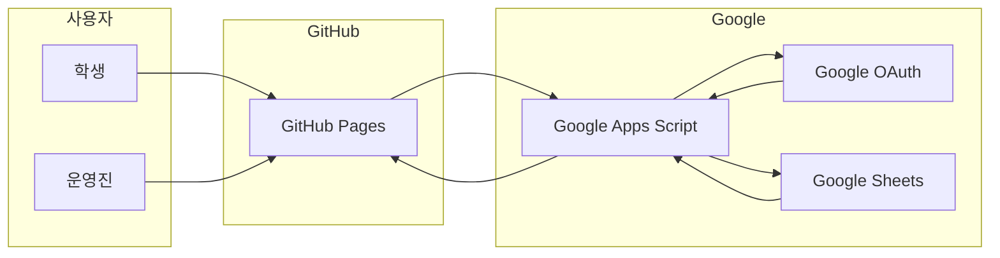

# CloudClub Attendance System

> CloudClub 출석 시스템을 가장 빠르게 이해하는 진입점입니다.

이 저장소는 CloudClub의 출석 시스템을 위해 만들어진 운영 정본입니다.
요즘은 AI 시대이니 길게 읽기 전에 아래 질문들로 구조를 빠르게 익히고, 필요한 문서와 코드로 바로 들어가는 흐름을 기본 진입점으로 사용합니다.

## 한눈에 보는 운영 아키텍처


## 3줄 구조 설명
- `web/*` = GitHub Pages UI
- `Appsscript/*` = Google Apps Script API / RBAC / Sheets 게이트웨이
- `Google Sheets` = 운영 데이터와 메타 시트

이 구조에서 `web/*`은 화면과 사용자 동선을 담당하고, `Appsscript/*`는 권한 판정과 출석 처리, 시트 반영을 담당합니다.
즉 화면은 GitHub Pages에, 운영 로직은 Apps Script에, 실제 데이터는 Google Sheets에 분리된 하이브리드 구조입니다.
그래서 문제를 볼 때도 `화면`, `운영 로직`, `데이터`를 나눠 이해하면 훨씬 빠르게 맥락을 잡을 수 있습니다.

## AI로 빠르게 구조 익히기
AI는 이 저장소의 구조 설명, 문서 길 안내, 수정 시작점 파악, 수동 작업 위치 확인에 가장 유용합니다.
먼저 아래 질문으로 큰 그림을 익힌 뒤, 필요한 문서와 코드로 들어가면 README를 처음부터 끝까지 길게 읽지 않아도 됩니다.
다만 실제 Secret 값이나 현재 Google Cloud, Apps Script 콘솔 상태 같은 운영 실체는 사람이 직접 확인해야 합니다.

## 프로젝트를 먼저 이해하기
```text
이 프로젝트가 어떤 문제를 해결하는지, 전체 구조와 함께 설명해줘.
CloudClub 출석 시스템에서 web, Appsscript, Google Sheets가 각각 무슨 역할인지 쉽게 설명해줘.
이 프로젝트의 핵심 아키텍처와 데이터 흐름을 한 번에 이해할 수 있게 설명해줘.
```

## 사용 흐름과 인수인계 이해하기
```text
학생과 운영진은 각각 이 시스템을 어떻게 사용하면 되는지 알려줘.
처음 인수인계받은 사람이면 어떤 순서로 문서와 코드를 보면 되는지 정리해줘.
현재 운영 기준은 Wiki, History, 코드 중 무엇을 우선 보면 되는지 알려줘.
```

## 수정과 운영 준비 이해하기
```text
기능을 수정해야 할 때 보통 어디부터 보면 되는지 큰 흐름부터 알려줘.
이 프로젝트에서 사람이 직접 해야 하는 수동 작업에는 뭐가 있는지 먼저 알려줘.
운영 중 외부 콘솔에서 직접 확인해야 하는 설정이 무엇인지 개괄적으로 알려줘.
```

## 에이전트별 진입
### Codex CLI
- 루트 [AGENTS.md](./AGENTS.md)를 공통 지침 정본으로 사용합니다.
- 먼저 `이 프로젝트가 어떤 문제를 해결하는지, 전체 구조와 함께 설명해줘.`처럼 구조 이해형 질문부터 시작하면 됩니다.

### Claude Code
- 루트 [CLAUDE.md](./CLAUDE.md)가 공통 코어인 [AGENTS.md](./AGENTS.md)와 `docs/agent/*`로 연결됩니다.
- 프로젝트 명령:
  - `/project-overview`
  - `/change-guide`
  - `/ops-guide`

### Gemini CLI
- 루트 [GEMINI.md](./GEMINI.md)와 [`.gemini/settings.json`](./.gemini/settings.json)이 공통 코어를 불러옵니다.
- 프로젝트 명령:
  - `/project:overview`
  - `/project:change`
  - `/project:ops`

## 한계 선언
- 에이전트는 레포 안의 구조, 정책, 코드, 문서, 절차를 설명할 수 있습니다.
- 에이전트는 실제 GitHub Secret 값, Google Cloud Console 현재 상태, Apps Script 배포 화면의 현재 선택값은 직접 볼 수 없습니다.
- 외부 설정은 항상 `레포가 설명하는 절차`와 `사람이 콘솔에서 확인해야 하는 값`을 분리해서 해석해야 합니다.

## 정본 우선순위
1. 현재 정책과 운영 절차: [AGENTS.md](./AGENTS.md) -> [`docs/agent`](./docs/agent/) -> [`docs/Wiki`](./docs/Wiki/)
2. 과거 배경과 결정 이유: [`docs/History`](./docs/History/)
3. 실제 계약과 런타임 사실: [`Appsscript/00_entry_api.gs`](./Appsscript/00_entry_api.gs), [`Appsscript/01_constants_access.gs`](./Appsscript/01_constants_access.gs), [`.github/workflows/deploy-gh-pages.yml`](./.github/workflows/deploy-gh-pages.yml), [`web/shared/env.js`](./web/shared/env.js)

## 빠른 운영 맵
- 프로젝트 구조와 설계 의도: [`docs/agent/00_Project_Map.md`](./docs/agent/00_Project_Map.md)
- 사용 흐름과 운영 URL: [`docs/agent/10_Usage_And_Operations.md`](./docs/agent/10_Usage_And_Operations.md)
- 수정 절차와 영향 범위 판정: [`docs/agent/20_Change_Workflow.md`](./docs/agent/20_Change_Workflow.md)
- Apps Script 수동 작업: [`docs/agent/30_Manual_Apps_Script_Work.md`](./docs/agent/30_Manual_Apps_Script_Work.md)
- Secret / OAuth / 외부 콘솔 위치: [`docs/agent/40_Secrets_Auth_And_External_Consoles.md`](./docs/agent/40_Secrets_Auth_And_External_Consoles.md)
- 반복 질문 모음: [`docs/agent/50_FAQ.md`](./docs/agent/50_FAQ.md)

## 사람이 직접 읽어야 할 문서
- 현재 운영 기준: [`docs/Wiki/README.md`](./docs/Wiki/README.md)
- 관리자 기능과 운영 흐름: [`docs/Wiki/02_Admin_Side_Guide.md`](./docs/Wiki/02_Admin_Side_Guide.md)
- 탭별 변경 지도: [`docs/Wiki/03_Admin_Tab_Change_Map.md`](./docs/Wiki/03_Admin_Tab_Change_Map.md)
- 운영 런북: [`docs/Wiki/04_Operations_Runbook.md`](./docs/Wiki/04_Operations_Runbook.md)
- 데이터 / RBAC 기준: [`docs/Wiki/05_Data_And_RBAC_Reference.md`](./docs/Wiki/05_Data_And_RBAC_Reference.md)

## 운영 URL
- 관리자: `https://cloud-club.github.io/CloudClubAttendanceSystem/web/admin/`
- 학생 Latest: `https://cloud-club.github.io/CloudClubAttendanceSystem/web/student/latest/`
- 랜딩: `https://cloud-club.github.io/CloudClubAttendanceSystem/web/`
