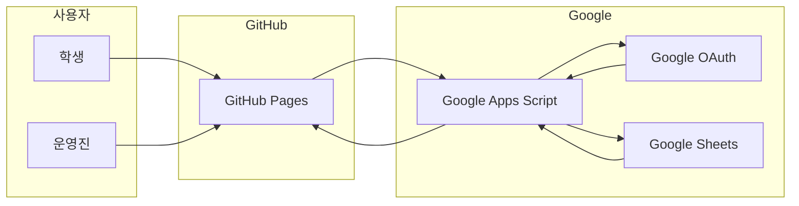

# CloudClub Attendance System

> 이 문서는 `main` 브랜치의 운영 기준 README입니다. 실 서비스 배포는 **`gh-pages` 브랜치 기준**으로 동작합니다.

## 한눈에 보는 운영 아키텍처


## 프로젝트 소개 및 구현 방식
CloudClub Attendance System은 세미나/스터디 출석을 운영진이 안정적으로 관리할 수 있도록 만든 **정적 프런트 + Apps Script API + Google Sheets** 구조입니다.

- 대상 사용자
  - 학생: 계절별 최신 시즌 출석 흐름 진입, 실시간 출석, 본인 현황 조회
  - 운영진: Google OAuth 인증 기반 관리자 화면으로 출석/현황/일정/변수/운세/시트 업로드까지 운영
- 구현 방식 핵심
  - 학생 경로: 랜딩 페이지에서 시즌/세션 상태를 확인하고, 출석/조회 API를 호출해 즉시 반영
  - 관리자 경로: 로그인 + 시즌 접근 가드 + 탭(출석, 현황, 일정, 업로드, 운세 등) 액션 호출 + 시트 반영 + 대시보드 확인
  - API 경계 분리: `web/*`은 화면 렌더링 전담, `Appsscript/*`는 권한/검증/시트 조작 전담
- 왜 2티어 구조인가
  - 장애가 발생했을 때 `프런트`/`백엔드`/`시트` 경계를 기준으로 원인 분리가 빠름
  - 배포 롤백이 명확하며, 운영 인수인계가 쉬움
  - 코드와 문서 체계를 분리해 운영 기준을 유지보수 가능하게 구성

## 기술 스택 및 인프라
- Frontend
  - HTML/CSS/Vanilla JS (ES5+), 모듈 미사용 멀티스크립트 로딩
  - 정적 호스팅: GitHub Pages (`gh-pages`)
  - API URL 런타임 주입: `web/shared/config.js`의 플레이스홀더를 배포 워크플로에서 주입
- Backend/API
  - Google Apps Script (`doGet` + `handleApiRequest`)
  - 액션 라우팅 기반 API (`action` 파라미터)
  - 인증/권한: OAuth + 역할(`user/admin/super`) + 시즌 접근 가드
- Data
  - Google Sheets(시즌 시트 + `_admins`, `_session_meta`, `_import_meta`, `/_fortune_*` 계열)
- 배포/검증 인프라
  - GitHub Actions: `.github/workflows/deploy-gh-pages.yml`
  - 시크릿: `APPS_SCRIPT_WEB_APP_URL`
  - 배포 전 가드: `apiInfo`/시트 구조/`auth` canary 정적 점검

## 핵심 동작 정리
1. 운영진은 `web/admin/index.html`에서 Google 로그인을 수행하고 시즌을 지정합니다.
2. 각 탭은 전용 모듈 스크립트가 API 액션을 호출해 변경을 수행합니다.
3. 모든 변경은 Apps Script에서 권한 검사 후 Sheets에 반영하고 결과를 JSON으로 응답합니다.
4. 프론트는 응답을 받아 화면 렌더링 및 후속 점검(런북/회귀 게이트)으로 이어갑니다.

> 기존 `main` 브랜치의 과거 수동 설치형 튜토리얼(예: `Code.gs`/`Index.html` 복붙형 가이드)은 기본 경로로 사용하지 않습니다. 기존 내용은 히스토리/위키에서 보관 기록으로 확인하세요.

## 운영·문서 네비게이션

### 기본 진입점
- 운영 전체 문맥: [docs/Wiki/README.md](./docs/Wiki/README.md)
- 기술 이슈 분기 가이드: [TECH_DOCS.md](./TECH_DOCS.md)

### 운영자(우선)
- 관리자 실행 가이드: [docs/Wiki/02_Admin_Side_Guide.md](./docs/Wiki/02_Admin_Side_Guide.md)
- 운영 런북: [docs/Wiki/04_Operations_Runbook.md](./docs/Wiki/04_Operations_Runbook.md)
- 회귀 더블체크: [docs/Wiki/06_Doublecheck_Regression_Gate.md](./docs/Wiki/06_Doublecheck_Regression_Gate.md)

### 개발/수정 담당
- 탭별 수정 맵: [docs/Wiki/03_Admin_Tab_Change_Map.md](./docs/Wiki/03_Admin_Tab_Change_Map.md)
- 데이터·권한 기준: [docs/Wiki/05_Data_And_RBAC_Reference.md](./docs/Wiki/05_Data_And_RBAC_Reference.md)
- 변경 이력 추적: [docs/History/README.md](./docs/History/README.md)

### 최근 변경 근거(권장 독서 순서)
- 구조 전환/마이그레이션 배경: [docs/History/003_구글시트에서_깃허브페이지스_마이그레이션_기록.md](./docs/History/003_구글시트에서_깃허브페이지스_마이그레이션_기록.md)
- 긴급 복구/인증 이슈 기록: [docs/History/019_구글인증_권한오류_트러블슈팅_검증_배포_런북_2026-02-20.md](./docs/History/019_구글인증_권한오류_트러블슈팅_검증_배포_런북_2026-02-20.md)
- 2026-02-20 운영기록: [docs/History/023_관리자백엔드_구조분할_및_출석인증불일치_긴급복구_운영기록_2026-02-20.md](./docs/History/023_관리자백엔드_구조분할_및_출석인증불일치_긴급복구_운영기록_2026-02-20.md)

## 파일 트리 (운영 기준)
```text
CloudClubAttendanceSystem
├─ .github/workflows/deploy-gh-pages.yml   # GitHub Pages 배포, URL 시크릿 주입, health/canary 검증
├─ Appsscript/                            # Apps Script 백엔드 SSOT
│  ├─ 00_entry_api.gs                    # API 엔트리: doGet, 라우팅, apiInfo
│  ├─ 01_constants_access.gs             # 권한 레벨(ACTION_ACCESS_LEVELS) 정의
│  ├─ 10_auth_admin.gs                    # OAuth 인증/계정/시즌 접근 체크
│  ├─ 20_season_sheet_resolver.gs         # 시즌 시트 해석/선택
│  ├─ 21_variables_sessionmeta.gs         # 운영 변수, 세션 메타 연동
│  ├─ 30_attendance_core.gs               # 출석 핵심 로직
│  ├─ 31_dashboard.gs                    # 현황/랭킹 집계
│  ├─ 32_schedule.gs                     # 회차 일정 처리
│  ├─ 33_graduation_manual_excused.gs     # 수료/유고 보정 로직
│  ├─ 34_season_import.gs                # 시즌 업로드 및 검증
│  ├─ 35_fortune_admin.gs                # 운세 관리 API
│  ├─ 90_common_utils.gs                 # 공통 유틸
│  ├─ 91_fortune.gs                      # 기본/폴백 운세 로직
│  └─ README.md                          # 백엔드 실행/배포 가이드
├─ docs/
│  ├─ Wiki/                              # 운영 기준(SSOT) 문서군
│  └─ History/                           # 정책/결정/런북 원문 저장소
├─ scripts/                               # 회귀 더블체크 스크립트(자동 점검)
│  ├─ run_doublecheck.sh                 # 정적+API 회귀 게이트 실행기
│  ├─ doublecheck_static_guard.js         # 정적 무결성 체크
│  ├─ doublecheck_api_snapshot.js         # API 응답 스냅샷
│  ├─ doublecheck_api_compare.js          # 변경 비교
│  └─ auth_canary_snapshot.sh             # OAuth canary 실행 보조
├─ web/
│  ├─ index.html                         # 랜딩 페이지(학생 최신 시즌 링크 제공)
│  ├─ index.js                           # 랜딩 페이지 초기 로직
│  ├─ shared/                            # API 클라이언트/환경/공통 스타일
│  ├─ admin/index.html                    # 관리자 화면 진입
│  ├─ admin/admin.js                     # 레거시 대비(참고용)
│  ├─ admin/scripts/00_namespace.js       # 관리자 모듈 진입
│  ├─ admin/scripts/01_state.js          # 관리자 상태
│  ├─ admin/scripts/10_auth.js           # 인증 흐름
│  ├─ admin/scripts/20_attendance.js     # 출석/예외 처리 탭
│  ├─ admin/scripts/21_dashboard.js      # 출석현황 탭
│  ├─ admin/scripts/22_schedule.js       # 일정 탭
│  ├─ admin/scripts/23_import.js         # 시즌 업로드 탭
│  ├─ admin/scripts/24_variables.js      # 변수 탭
│  ├─ admin/scripts/25_graduation_excused.js # 수료·유고 탭
│  ├─ admin/scripts/26_admin_users.js    # 관리자 계정 탭
│  ├─ admin/scripts/27_qr_links.js       # QR/링크 탭
│  ├─ admin/scripts/28_fortune.js        # 운세 탭
│  ├─ admin/scripts/90_bootstrap.js      # 초기화
│  └─ admin/scripts/99_compat_handlers.js# 이전 호환 핸들러 유지
│  └─ student/index.html                  # 학생 화면(일반)
│  └─ student/latest/index.html           # 시즌별 최신 경로
│  └─ student/student.js                  # 학생 출석/현황 API 연동
├─ TECH_DOCS.md                          # 기술 이슈 대응 가이드
├─ README.md                             # 본 문서(운영 기준 진입점)
└─ images/                               # 스크린샷/자료
```

## 컬럼/시트 기준 요약
- 멤버 헤더/세션 컬럼 규칙은 `docs/Wiki/05_Data_And_RBAC_Reference.md`의 최신 기준을 SSOT로 사용합니다.
- 핵심 원칙: 멤버 키는 `Phone`(고유키), 세션은 `YYYY-MM-DD-HH:MM` 계열 헤더(또는 운영 규격), 보조 시트는 정책/권한/업로드/운세 버전 메타 동시 관리.

## 운영 URL
- 관리자: `https://cloud-club.github.io/CloudClubAttendanceSystem/web/admin/`
- 학생(최신 시즌): `https://cloud-club.github.io/CloudClubAttendanceSystem/web/student/latest/`
- 랜딩: `https://cloud-club.github.io/CloudClubAttendanceSystem/web/`
