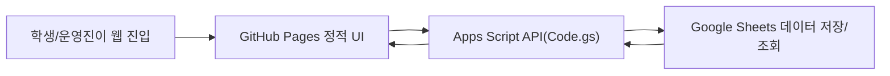
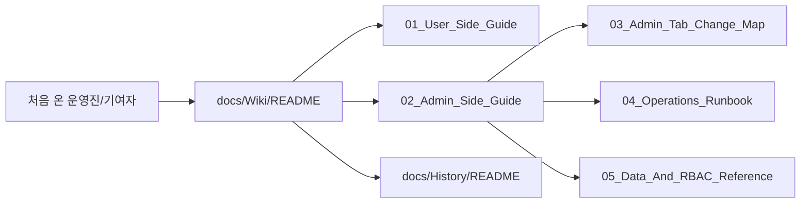

# CloudClub Attendance Documentation Hub

> 문서 링크: [README.md](./README.md) | [GitHub](https://github.com/cloud-club/CloudClubAttendanceSystem/blob/gh-pages/README.md)

## 빠른 흐름도

## 문서 네비게이션 흐름도

## 프로젝트 배경과 전환 이유
CloudClub 출석 시스템은 8기까지 Google Apps Script가 화면과 데이터 처리를 함께 담당하는 1티어 구조로 운영되었습니다. 이 방식은 시작이 빠르다는 장점이 있었지만, 운영 규모가 커질수록 문제 원인 분리가 어렵고 인수인계 난이도가 높아졌습니다.

특히 2026년 2월 17~18일 전후로 운영 이슈가 반복되면서, 화면 배포와 데이터/인증 로직을 분리해야 한다는 합의가 생겼습니다. 그 결과 현재는 **GitHub Pages(프런트) + Google OAuth 인증 + Apps Script/Google Sheets(API/DB)** 구조로 고도화되었고, 문서도 같은 시점부터 “교체 가능한 운영진”을 전제로 다시 설계되었습니다.

## 시스템 전체 흐름
현재 구조의 핵심은 기능 추가보다 책임 경계를 명확히 한 데 있습니다. 학생/관리자 화면은 GitHub Pages로 독립 배포하고, 출석 판정·권한 검사·시트 반영은 `Code.gs`에서 일관되게 처리합니다. 그래서 장애가 나더라도 UI 문제인지 API/데이터 문제인지 빠르게 분리해서 대응할 수 있습니다.

운영 관점에서 이 구조는 “누가 이어받아도 같은 기준으로 운영할 수 있는 시스템”을 만드는 데 목적이 있습니다. 문서에서 동일한 용어와 순서를 반복하는 이유도, 코드 지식이 없는 운영진까지 포함해 공통 의사결정 기준을 맞추기 위함입니다.

## 역할별 문서 진입 경로
각 역할은 필요한 문서가 다르기 때문에, 아래 순서로 읽으면 가장 빠르게 맥락을 잡을 수 있습니다.

- 신규 운영진: [docs/Wiki/README.md](./docs/Wiki/README.md) | [GitHub](https://github.com/cloud-club/CloudClubAttendanceSystem/blob/gh-pages/docs/Wiki/README.md) → [docs/Wiki/02_Admin_Side_Guide.md](./docs/Wiki/02_Admin_Side_Guide.md) | [GitHub](https://github.com/cloud-club/CloudClubAttendanceSystem/blob/gh-pages/docs/Wiki/02_Admin_Side_Guide.md) → [docs/Wiki/04_Operations_Runbook.md](./docs/Wiki/04_Operations_Runbook.md) | [GitHub](https://github.com/cloud-club/CloudClubAttendanceSystem/blob/gh-pages/docs/Wiki/04_Operations_Runbook.md)
- 사용자 안내 담당: [docs/Wiki/01_User_Side_Guide.md](./docs/Wiki/01_User_Side_Guide.md) | [GitHub](https://github.com/cloud-club/CloudClubAttendanceSystem/blob/gh-pages/docs/Wiki/01_User_Side_Guide.md)
- 개발/수정 담당: [docs/Wiki/03_Admin_Tab_Change_Map.md](./docs/Wiki/03_Admin_Tab_Change_Map.md) | [GitHub](https://github.com/cloud-club/CloudClubAttendanceSystem/blob/gh-pages/docs/Wiki/03_Admin_Tab_Change_Map.md) + [docs/Wiki/05_Data_And_RBAC_Reference.md](./docs/Wiki/05_Data_And_RBAC_Reference.md) | [GitHub](https://github.com/cloud-club/CloudClubAttendanceSystem/blob/gh-pages/docs/Wiki/05_Data_And_RBAC_Reference.md)

## 문서를 읽는 순서 (인수인계 기준)
인수인계 목적이라면 기능 설명만 읽는 것보다 “왜 이 순서인지”를 이해하는 것이 중요합니다. 먼저 위키 메인에서 현재 운영 기준을 잡고, 관리자 가이드로 실제 탭 운영 흐름을 익힌 뒤, 런북으로 복구 절차를 확인하면 운영 공백을 최소화할 수 있습니다.

그 다음에는 필요한 경우에만 History 원문을 열어 의사결정 배경을 추적합니다. 이렇게 하면 현재 운영 기준(SSOT)을 흔들지 않으면서도, 과거 변경 이유를 정확히 역추적할 수 있습니다.

## 시작 경로
- 위키 메인(현재 운영 기준): [docs/Wiki/README.md](./docs/Wiki/README.md) | [GitHub](https://github.com/cloud-club/CloudClubAttendanceSystem/blob/gh-pages/docs/Wiki/README.md)
- 히스토리 인덱스(과거 기록): [docs/History/README.md](./docs/History/README.md) | [GitHub](https://github.com/cloud-club/CloudClubAttendanceSystem/blob/gh-pages/docs/History/README.md)
- 기술 문서 진입점: [TECH_DOCS.md](./TECH_DOCS.md) | [GitHub](https://github.com/cloud-club/CloudClubAttendanceSystem/blob/gh-pages/TECH_DOCS.md)

## 운영 URL
- 관리자: `https://cloud-club.github.io/CloudClubAttendanceSystem/web/admin/`
- 학생(Latest): `https://cloud-club.github.io/CloudClubAttendanceSystem/web/student/latest/`
- 랜딩: `https://cloud-club.github.io/CloudClubAttendanceSystem/web/`

## 핵심 코드 경로
- 백엔드 API: [Code.gs](./Code.gs) | [GitHub](https://github.com/cloud-club/CloudClubAttendanceSystem/blob/gh-pages/Code.gs)
- 관리자 화면: [web/admin/index.html](./web/admin/index.html) | [GitHub](https://github.com/cloud-club/CloudClubAttendanceSystem/blob/gh-pages/web/admin/index.html)
- 관리자 스크립트: [web/admin/admin.js](./web/admin/admin.js) | [GitHub](https://github.com/cloud-club/CloudClubAttendanceSystem/blob/gh-pages/web/admin/admin.js)
- 학생 화면: [web/student/latest/index.html](./web/student/latest/index.html) | [GitHub](https://github.com/cloud-club/CloudClubAttendanceSystem/blob/gh-pages/web/student/latest/index.html)
- 학생 스크립트: [web/student/student.js](./web/student/student.js) | [GitHub](https://github.com/cloud-club/CloudClubAttendanceSystem/blob/gh-pages/web/student/student.js)
