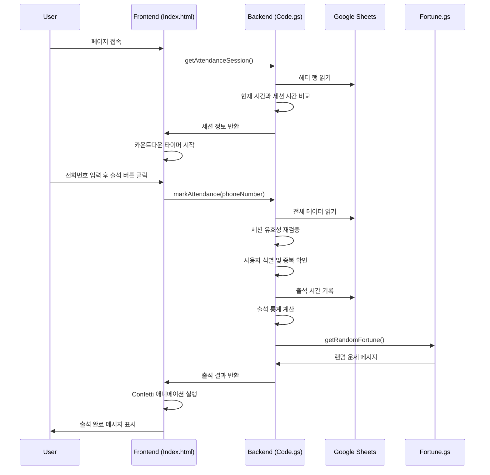

# CloudClub 출석체크 시스템 기술 문서

## 개요

CloudClub 출석체크 시스템은 Google Apps Script와 Google Sheets를 기반으로 한 서버리스 웹 애플리케이션입니다. 이 문서는 각 파일의 함수별 동작 로직과 기술적 구현 세부사항을 설명합니다.

## 시스템 아키텍처

```
┌─────────────────┐    ┌─────────────────┐    ┌─────────────────┐
│   Index.html    │◄──►│    Code.gs      │◄──►│ Google Sheets   │
│  (프론트엔드)     │    │  (백엔드 로직)    │    │   (데이터베이스)  │
└─────────────────┘    └─────────────────┘    └─────────────────┘
                              │
                              ▼
                       ┌─────────────────┐
                       │   fortune.gs    │
                       │   (유틸리티)      │
                       └─────────────────┘
```

---

## Code.gs - 백엔드 로직

### 1. 웹 애플리케이션 진입점

#### `doGet()`
**목적**: Google Apps Script 웹앱의 진입점 함수
**로직**:
- `HtmlService.createHtmlOutputFromFile('Index')`로 Index.html 파일을 웹페이지로 렌더링
- 메타태그와 XFrame 옵션을 설정하여 반응형 웹 지원 및 보안 설정
- 모든 HTTP GET 요청에 대해 자동으로 호출됨

**구현 이유**: Google Apps Script에서 웹앱을 배포할 때 반드시 필요한 표준 진입점

---

### 2. 시트 관리 시스템

#### `getAllSheets()`
**목적**: 사용 가능한 시트 목록을 반환하고 활성 시트를 관리
**로직**:
```javascript
1. SpreadsheetApp.getActiveSpreadsheet()로 현재 스프레드시트 접근
2. PropertiesService로 저장된 활성 시트명 조회
3. '설정', 'Settings' 시트는 필터링하여 제외
4. 시트명을 내림차순으로 정렬 (최신 시트가 위로)
5. 각 시트의 활성 상태를 boolean으로 표시
6. 활성 시트가 없으면 자동으로 첫 번째 시트를 활성화
```
**반환값**: `Array<{name: string, isActive: boolean}>`

**구현 이유**: 
- 여러 기수나 그룹을 관리하기 위한 멀티 시트 지원
- 관리자가 현재 작업 중인 시트를 명확히 구분
- PropertiesService를 사용하여 서버 재시작 시에도 설정 유지

#### `setActiveSheet(sheetName)`
**목적**: 관리자가 선택한 시트를 활성 시트로 설정
**로직**:
```javascript
1. 입력받은 시트명으로 실제 시트 존재 여부 확인
2. 존재하지 않으면 에러 메시지 반환
3. PropertiesService.setProperty()로 'activeSheet' 키에 시트명 저장
4. 성공/실패 메시지 반환
```

**구현 이유**: 
- 관리자 인터페이스에서 실시간 시트 전환 기능 제공
- 데이터 영속성을 위한 PropertiesService 활용

#### `getActiveAttendanceSheet()`
**목적**: 현재 활성화된 시트 객체를 반환하는 유틸리티 함수
**로직**:
```javascript
1. PropertiesService에서 활성 시트명 조회
2. 활성 시트가 설정되지 않은 경우 자동으로 첫 번째 유효 시트 선택
3. 시트 객체 반환
```

**구현 이유**: 
- 다른 함수들에서 공통으로 사용하는 시트 접근 로직을 중앙화
- 코드 중복 제거 및 일관성 있는 시트 접근 보장

---

### 3. 출석 세션 관리

#### `getAttendanceSession()`
**목적**: 현재 진행 중인 출석 세션 정보를 클라이언트에 제공
**로직**:
```javascript
1. 활성 시트의 헤더 행 (1행) 전체를 배열로 읽음
2. D열(4번째 컬럼)부터 순회하며 날짜 형식 헤더 검색
3. 정규표현식 /(\d{4})-(\d{2})-(\d{2})-(\d{2}):(\d{2})/로 헤더 파싱
4. 현재 시간이 [세션 시작시간, 세션 시작시간 + 30분] 범위 내인지 확인
5. 조건을 만족하는 세션이 있으면 종료 시간을 Unix 타임스탬프로 반환
6. 조건을 만족하는 세션이 없으면 비활성 상태 반환
```

**반환값**: 
```javascript
{
  active: boolean,
  endTime?: number,     // Unix timestamp (밀리초)
  currentSheet?: string,
  message?: string
}
```

**구현 이유**:
- 클라이언트에서 실시간 카운트다운 타이머 구현을 위한 정확한 종료 시간 제공
- 30분 제한 정책을 서버 사이드에서 엄격하게 관리
- Unix 타임스탬프 사용으로 클라이언트-서버 간 시간 동기화 문제 해결

---

### 4. 출석 처리 시스템

#### `markAttendance(phoneNumber)`
**목적**: 학생의 출석을 처리하는 핵심 비즈니스 로직
**로직**:

**1단계: 입력 검증**
```javascript
- 전화번호 입력 여부 확인
- 활성 시트 존재 여부 확인
```

**2단계: 세션 유효성 재검증**
```javascript
1. 모든 유효한 세션 헤더를 배열로 수집
2. 현재 시간이 활성 세션 조건을 만족하는지 서버 사이드에서 재확인
3. 클라이언트 조작 방지를 위한 이중 검증
```

**3단계: 사용자 식별**
```javascript
1. 입력받은 전화번호에서 하이픈(-) 제거
2. 시트의 C열(전화번호 컬럼)과 비교하여 사용자 찾기
3. 저장된 전화번호도 하이픈 제거 후 비교 (형식 무관 매칭)
```

**4단계: 중복 출석 방지**
```javascript
1. 해당 학생의 현재 세션 컬럼 값 확인
2. 이미 값이 있으면 중복 출석으로 판단하여 거부
```

**5단계: 출석 기록 및 통계 계산**
```javascript
1. 현재 시간을 'yyyy-MM-dd HH:mm:ss' 형식으로 포맷
2. 해당 셀에 출석 시간 기록
3. 현재까지의 출석률 계산 (현재 세션 포함)
4. 총 세션 수 대비 출석한 세션 수로 백분율 계산
```

**6단계: 응답 데이터 생성**
```javascript
1. 학생 정보 (이름, 기수) 추출
2. 출석 통계 정보 생성
3. getRandomFortune() 호출하여 운세 메시지 첨부
4. 종합적인 성공 응답 반환
```

**반환값**:
```javascript
{
  success: boolean,
  name?: string,
  grade?: string,
  time?: string,           // 출석 기록 시간
  attendanceInfo?: {
    attended: number,      // 총 출석 횟수
    total: number,         // 전체 세션 수
    currentSession: number, // 현재 세션 번호
    rate: number          // 출석률 (백분율)
  },
  fortune?: string,        // 운세 메시지
  message?: string         // 에러 메시지
}
```

**구현 이유**:
- 클라이언트-서버 간 시간 차이나 조작을 방지하기 위한 서버 사이드 재검증
- 전화번호 형식의 유연성을 위한 하이픈 제거 로직
- 실시간 통계 계산으로 즉시 피드백 제공
- 게이미피케이션 요소(운세)로 사용자 경험 향상

---

### 5. 출석 조회 시스템

#### `getAttendanceStatus(phoneNumber)`
**목적**: 특정 사용자의 출석 현황을 상세히 조회
**로직**:

**1단계: 사용자 식별**
- `markAttendance()`와 동일한 전화번호 매칭 로직 사용

**2단계: 세션별 출석 기록 수집**
```javascript
1. 모든 유효한 세션 헤더를 순회
2. 각 세션에 대해:
   - 세션 시작 시간 파싱
   - 현재 시간 이전 세션만 "완료된 세션"으로 분류
   - 해당 셀의 출석 기록 존재 여부 확인
   - 출석 시간이 있으면 실제 출석 시간도 함께 수집
```

**3단계: 통계 계산**
```javascript
1. 완료된 세션 대비 출석한 세션의 비율 계산
2. 미래 세션은 통계에서 제외 (아직 진행되지 않은 세션)
3. 백분율로 출석률 표시
```

**반환값**:
```javascript
{
  success: boolean,
  data?: {
    name: string,
    grade: string,
    attended: number,        // 출석한 세션 수
    total: number,          // 전체 세션 수
    currentSession: number,  // 완료된 세션 수
    rate: number,           // 출석률
    details: Array<{
      date: string,         // 세션 날짜/시간
      attended: boolean,    // 출석 여부
      attendTime: string,   // 실제 출석 시간
      isPast: boolean      // 과거 세션 여부
    }>
  }
}
```

**구현 이유**:
- 학생들이 자신의 출석 현황을 상세히 확인할 수 있는 기능
- 미래 세션은 통계에서 제외하여 정확한 출석률 계산
- 세션별 상세 정보 제공으로 투명성 확보

---

### 6. 순위 시스템

#### `getAttendanceRanking()`
**목적**: 모든 학생의 출석률 기반 순위를 계산하고 반환
**로직**:

**1단계: 유효한 세션 식별**
```javascript
1. 현재 시간 이전에 시작된 세션만 "유효한 세션"으로 분류
2. 미래 세션은 순위 계산에서 제외
3. 각 세션의 시작 시간을 정확히 파싱하여 Date 객체 생성
```

**2단계: 학생별 출석 데이터 수집**
```javascript
// 각 학생에 대해:
1. 유효한 세션들을 순회하며 출석 기록 확인
2. 출석한 세션 수 카운트
3. 각 출석 기록의 실제 시간과 세션 시작 시간의 차이 계산
4. 평균 출석 시간 계산 (세션 시작부터 실제 출석까지의 평균 시간)
```

**3단계: 시간 차이 계산 로직**
```javascript
1. parseAttendanceTime() 함수로 다양한 형식의 시간 데이터 파싱
2. 세션 시작 시간과 실제 출석 시간의 차이를 초 단위로 계산
3. 0초 이상 1800초(30분) 이하의 출석만 유효한 시간으로 인정
4. 유효하지 않은 시간 데이터는 기본값(30분)으로 처리
```

**4단계: 순위 정렬 알고리즘**
```javascript
1. 1차 정렬: 출석률 내림차순 (높은 출석률이 상위)
2. 2차 정렬: 평균 출석 시간 오름차순 (빠른 출석이 상위)
3. 한 번도 출석하지 않은 사용자는 최하위 배치
4. 순위 번호 부여 (1위부터 시작)
```

**5단계: 결과 제한**
- 상위 10명만 반환하여 성능 최적화 및 UI 간소화

**반환값**:
```javascript
{
  success: boolean,
  data?: Array<{
    rank: number,              // 순위
    name: string,             // 이름  
    grade: string,            // 기수
    attendedCount: number,    // 출석 횟수
    totalSessions: number,    // 총 세션 수
    attendanceRate: number,   // 출석률 (백분율)
    avgAttendTimeSeconds: number, // 평균 출석 시간 (초)
    avgAttendTime: string     // 평균 출석 시간 (mm:ss 형식)
  }>
}
```

**구현 이유**:
- 게이미피케이션을 통한 참여 동기 부여
- 공정한 순위 산정을 위한 다단계 정렬 기준
- 출석 속도도 고려하여 적극적인 참여 유도
- 복잡한 시간 데이터 파싱으로 다양한 형식 지원

---

### 7. 유틸리티 함수들

#### `getAllPhoneNumbers()`
**목적**: 클라이언트 사이드에서 전화번호 유효성 검증을 위한 데이터 제공
**로직**:
```javascript
1. 활성 시트의 C열(전화번호 컬럼) 전체 읽기
2. 하이픈 제거하여 정규화된 형태로 반환
3. 빈 값은 필터링하여 제외
```

**구현 이유**: 
- 클라이언트에서 실시간 입력 검증 및 자동완성 기능 지원
- 서버 요청 전에 기본적인 유효성 검사로 사용자 경험 향상

#### `getQRCodeUrl()`
**목적**: 현재 웹앱의 공개 URL을 반환
**로직**:
- `ScriptApp.getService().getUrl()`로 배포된 웹앱의 URL 반환

**구현 이유**: 
- 관리자 페이지에서 QR 코드 생성을 위한 URL 제공
- 모바일 기기에서 쉬운 접근을 위한 QR 코드 활용

#### `parseAttendanceTime(value)`
**목적**: 다양한 형식의 출석 시간 데이터를 표준 Date 객체로 변환
**로직**:
```javascript
1. 입력값의 타입 확인 (Date, string, number)
2. Date 객체면 그대로 반환
3. 문자열이면 정규표현식으로 "YYYY-MM-DD HH:mm:ss" 형식 파싱
4. 숫자면 Google Sheets의 날짜 시리얼 번호로 간주하여 변환
5. 파싱 실패 시 null 반환
```

**구현 이유**:
- Google Sheets의 셀 데이터는 다양한 형식으로 저장될 수 있음
- 순위 시스템에서 정확한 시간 계산을 위한 표준화
- 타입 안정성 확보 및 파싱 오류 방지

---

## Index.html - 프론트엔드

Index.html은 단일 파일로 구성된 SPA(Single Page Application)입니다.

### 구조 개요

1. **HTML 구조**: 기본 레이아웃과 탭 기반 네비게이션
2. **CSS 스타일**: 다크 테마 기반의 모던한 디자인
3. **JavaScript 로직**: 
   - 백엔드와의 통신 (google.script.run)
   - 실시간 카운트다운 타이머
   - 탭 전환 및 UI 상태 관리
   - 애니메이션 효과 (confetti)

### 주요 JavaScript 함수들

#### `checkAttendanceSession()`
**목적**: 페이지 로드 시 현재 출석 세션 상태 확인
**로직**:
```javascript
1. google.script.run.getAttendanceSession() 호출
2. 서버 응답에 따라 UI 상태 변경:
   - 활성 세션이 있으면 카운트다운 타이머 시작
   - 활성 세션이 없으면 대기 메시지 표시
3. 현재 활성 시트명 표시
```

#### `startCountdown(endTime)`
**목적**: 실시간 카운트다운 타이머 구현
**로직**:
```javascript
1. setInterval()로 1초마다 실행
2. 현재 시간과 종료 시간의 차이 계산
3. 분:초 형식으로 포맷하여 화면에 표시
4. 시간 종료 시 자동으로 페이지 새로고침
```

#### `markAttendance()`
**목적**: 출석 버튼 클릭 시 출석 처리
**로직**:
```javascript
1. 전화번호 입력값 검증
2. google.script.run.markAttendance() 호출
3. 성공 시:
   - confetti 애니메이션 실행
   - 출석 완료 메시지 및 통계 표시
   - 운세 메시지 표시
4. 실패 시 에러 메시지 표시
```

#### `showTab(tabName)`
**목적**: 탭 기반 네비게이션 시스템
**로직**:
```javascript
1. 모든 탭 컨텐츠 숨김
2. 선택된 탭만 표시
3. 탭 버튼 활성 상태 업데이트
4. 각 탭별 초기화 함수 호출
```

**구현 이유**:
- 단일 페이지에서 여러 기능을 효율적으로 제공
- 모바일 친화적인 탭 기반 인터페이스
- 실시간 데이터 업데이트를 위한 비동기 통신

---

## fortune.gs - 운세 시스템

### `getRandomFortune()`
**목적**: 출석 완료 시 표시할 랜덤 운세 메시지 제공
**로직**:
```javascript
1. 570여 개의 다양한 운세 메시지 배열 정의
2. Math.random()으로 랜덤 인덱스 생성
3. 해당 인덱스의 메시지 반환
```

### 메시지 카테고리
1. **기본 운세**: 일반적인 긍정적 메시지
2. **개발/클라우드 유머**: 개발자와 클라우드 관련 전문 용어를 활용한 재미있는 메시지
3. **인터넷 밈/신조어**: 최신 인터넷 문화를 반영한 메시지
4. **언더테일 밈**: 게임 언더테일의 요소를 활용한 메시지
5. **속담 패러디**: 전통 속담을 개발/IT 용어로 각색한 메시지

**구현 이유**:
- 사용자 경험 향상을 위한 게이미피케이션 요소
- 개발자 커뮤니티의 특성을 반영한 맞춤형 콘텐츠
- 출석 완료 후 즐거움을 주어 지속적인 참여 유도

---

## 데이터 흐름



---

## 보안 및 성능 최적화

### 보안 조치
1. **서버 사이드 검증**: 클라이언트 조작 방지를 위한 이중 검증
2. **시간 기반 세션 제한**: 30분 타임아웃으로 부정 출석 방지
3. **전화번호 기반 식별**: 익명성 보장하면서도 고유 식별 가능

### 성능 최적화
1. **배치 데이터 읽기**: `getDataRange().getValues()`로 한 번에 모든 데이터 읽기
2. **메모리 내 처리**: 데이터를 메모리에 로드 후 JavaScript로 처리
3. **결과 제한**: 순위는 상위 10명만 반환하여 응답 크기 최소화
4. **캐싱 활용**: PropertiesService로 설정값 캐싱

### 확장성 고려사항
1. **멀티 시트 지원**: 여러 기수/그룹 동시 관리 가능
2. **동적 컬럼 감지**: 새로운 세션 컬럼 자동 인식
3. **유연한 데이터 형식**: 다양한 시간 형식 지원으로 호환성 확보

이 시스템은 Google의 무료 서비스만을 활용하여 비용 효율적이면서도 안정적인 출석 관리 솔루션을 제공합니다.