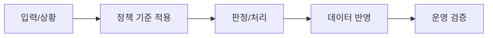

# 008 유고 처리, 수동 승인, 수료 판정 운영정책

> 문서 링크: [docs/History/008_유고처리_수동승인_수료판정_운영정책.md](./008_유고처리_수동승인_수료판정_운영정책.md) | [GitHub](https://github.com/cloud-club/CloudClubAttendanceSystem/blob/gh-pages/docs/History/008_유고처리_수동승인_수료판정_운영정책.md)

## 빠른 흐름도

## 1. 배경(어떤 이유로 추가됐는지)
행사 운영에서는 자동 출석만으로 해결되지 않는 예외가 반복된다.

- 실참여했지만 기기/네트워크 문제로 출석이 누락되는 경우
- 출석/지각이 이미 찍힌 사람을 사유 기반으로 유고 처리해야 하는 경우
- 수료 여부를 운영자가 즉시 판단해야 하는 경우

이 세 가지는 모두 “운영 책임”과 연결되는 이슈다. 자동 출석 시스템은 정상 경로에서는 강하지만, 예외 상황에서는 운영자의 판단이 반드시 개입된다. 문제는 개입 방식이 표준화되지 않으면 같은 상황에서도 담당자마다 다른 판단이 내려지고, 나중에 왜 그렇게 처리했는지 근거를 남기기 어려워진다는 점이었다.

그래서 관리자 페이지에 `수동 승인`, `유고 처리`, `수료 판정`을 별도 정책으로 도입했다.

## 2. 사용자 절차(어떻게 사용하는지)
### 2-1. 수동 승인
1. 관리자 탭에서 대상 시즌/회원/회차를 선택한다.
2. 수동 승인 실행 시 기록 시각은 실제 승인 시각으로 저장한다. 단, 회차 오픈 전/마감 후 승인 시에는 판정 일관성을 위해 `openTime`/`lateDeadline` 경계로 자동 보정한다.
3. 저장 후 출석현황/수료표를 새로고침해 반영을 확인한다.

수동 승인은 실제 운영 개입 시점을 반영하되, 회차 경계 밖 시간 기록이 결석 오판정을 만들지 않도록 경계 보정 규칙을 함께 적용한다. 따라서 Note에는 처리일시(실제 승인 시각), 기록시각(보정 반영), 보정 여부를 모두 남겨 추적 가능성을 확보한다.

### 2-2. 유고 처리
1. `유고 처리` 탭에서 회원 검색(이름/기수/전화번호) 또는 결석 필터를 건다.
2. 상태 셀 클릭 후 유고 사유를 입력한다.
3. 기존 기록이 `출석/지각`이면 2단계 확인을 거쳐야 최종 반영된다.
4. 반영 시 셀 값은 `유고`, 색상은 연파랑(`#d9e2f3`), Note에 사유/덮어쓰기 이력이 저장된다.

유고 2단계 확인은 UX를 복잡하게 만들기 위한 장치가 아니라, 데이터 덮어쓰기 사고를 막기 위한 안전장치다. 출석/지각이 이미 존재하는 셀을 유고로 바꾸는 행위는 판정 결과에 직접 영향을 주므로, 단일 클릭으로 끝나면 오작동이나 오클릭의 비용이 너무 크다.

### 2-3. 수료 판정
1. `수료 판정` 탭에서 시즌별 판정표를 조회한다.
2. 열 헤더 정렬로 출석/결석환산/판정 기준을 확인한다.
3. 판정 기준 변수(`required_attendance_count`, `late_to_absence_ratio` 등)는 `변수명 관리`에서 조정한다.

수료 판정 탭의 목적은 “결과 보여주기”보다 “기준을 설명 가능하게 만들기”다. 운영자는 특정 회원의 결과를 질문받았을 때, 회차별 상태와 변수 기준을 동시에 설명할 수 있어야 한다. 이 때문에 판정 계산은 하드코딩이 아니라 변수 기반으로 구성됐다.

## 3. 설계 의도(왜 이렇게 했는지)
### 운영 통제 우선
유고는 운영 판단이 개입되는 영역이므로 자동화보다 “강한 확인”이 중요했다. 그래서 서버에서 `forceOverride` 없는 덮어쓰기를 거부하도록 설계했다.

### 판정의 추적 가능성
수료 판정은 감으로 판단하면 분쟁이 발생한다. 따라서 필참/최소출석/결석환산 규칙을 변수화해, 계산 근거를 데이터로 남기도록 했다.

### 역할 분리
유고 매트릭스와 수료 판정표를 분리해, “예외 처리”와 “최종 판정”을 다른 화면 책임으로 나눴다.

결과적으로 이 정책의 핵심은 “예외를 허용하되, 예외를 기록 가능하게 만든다”이다. 운영자가 판단할 수 있어야 하지만, 판단 근거가 추적되지 않으면 다음 운영 주체가 같은 결정을 재현할 수 없다. 그래서 유고/승인/판정은 모두 흔적이 남는 형태로 구현했다.

## 4. API/데이터 영향
| API | 역할 | 주요 규칙 |
|---|---|---|
| `manualApprove` | 관리자 수동 승인 | 승인 시각은 실제 시각, 경계 밖은 회차 경계로 자동 보정 |
| `excusedSet` | 유고 지정/해제 | 기존 기록 존재 시 `EXCUSE_OVERRIDE_CONFIRM_REQUIRED` 반환 |
| `graduationReport` | 수료 판정표/규칙/연락처 조회 | 변수 기반 계산 + 정렬/페이징 지원 |
| `members` | 회원 목록 조회 | 유고 처리 검색/필터의 기준 데이터 |

데이터 표기 정책:

- 출석: `#d9ead3`
- 지각: `#fce5cd`
- 유고: `#d9e2f3`
- 결석(판정 표시): `#f4cccc`

## 5. 커밋 근거표(커밋 ID, 변경 파일, 핵심 diff 요약)
| 커밋 | 핵심 변경 | 주요 파일 |
|---|---|---|
| `f3533fd` | 수동 승인/유고/수료 판정 기능군 1차 도입 | `Code.gs`, `web/admin/index.html`, `web/admin/admin.js` |
| `afdc6ab` | 유고 2단계 확인 플로우 강화(서버/프런트 동시) | `Code.gs`, `web/admin/admin.js`, `web/admin/index.html` |
| `9b4f96e` | 유고 탭 분리, 수료표 정렬/20명 페이징 개선 | `web/admin/admin.js`, `web/admin/index.html` |
| `6001c66` | 유고 검색/결석 필터 및 변수 중심 수료 판정 정비 | `web/admin/admin.js`, `Code.gs` |

## 6. 운영상 주의점
- 유고 덮어쓰기는 실제 출석 기록을 변경하므로 사유를 반드시 Note로 남겨야 한다.
- 수동 승인 남용 시 출석 공정성이 흔들린다. 사유 기준을 내부 운영 규정으로 고정하는 것이 안전하다.
- 수료 기준 변수를 바꾸면 판정 결과가 즉시 바뀔 수 있으므로 변경 전후 스냅샷 기록이 필요하다.

## 7. 검증 시나리오
1. 기존 `출석` 셀에 유고 적용 시 2단계 확인 없이 저장되지 않는지 확인한다.
2. `forceOverride=true`로 저장 시 Note에 기존 기록 요약이 남는지 확인한다.
3. 수동 승인 시 기록 시간이 실제 승인 시각으로 반영되고, 경계 밖 승인 시 `openTime`/`lateDeadline`으로 보정되는지 확인한다.
4. 수료 판정에서 필참/최소출석/결석환산 조건이 변수 변경에 맞춰 재계산되는지 확인한다.
5. 유고 탭 검색 + 결석 필터를 동시에 걸어도 저장 후 필터 상태가 유지되는지 확인한다.

## 8. 실제 운영 사례(실패 예시/대응 예시)
### 사례 1. 출석된 회원이 클릭 한 번으로 유고 처리된 경우
실패 상황: 운영자가 유고 처리를 시도했는데 기존 출석 기록이 즉시 덮어써져 논란이 발생했다.  
원인: 초기 플로우에서 사전 충돌검사가 충분하지 않아 “기존 기록 있음” 확인이 약하게 동작했다.  
대응: 서버에서 `forceOverride=false`일 때 무조건 `EXCUSE_OVERRIDE_CONFIRM_REQUIRED`를 반환하도록 강화하고, 프런트는 `previewOnly -> 1차 경고 -> 확인문구 -> 최종반영` 순서로 고정했다.  
재발 방지: 유고 적용 교육 시 “기존 기록 덮어쓰기 여부 확인” 단계를 운영자가 말로 재확인하도록 절차화했다.

### 사례 2. 수동 승인 시간 논란이 생긴 경우
실패 상황: 특정 회원 승인 시간이 운영자 임의 시각으로 보이면서 공정성 문의가 들어왔다.  
원인: 수동 승인 시각 정책이 문서화되어 있지 않아 해석이 달랐다.  
대응: 수동 승인 저장 시각을 실제 승인 시각으로 전환하고, 회차 경계 밖 승인에 대한 자동 보정 규칙을 서버에 고정했다.  
재발 방지: 수동 승인 이력 검토 시 “처리일시 + 기록시각 + 보정여부 + 사유”를 함께 확인하도록 검토 양식을 유지한다.

## 9. 남은 리스크/차기 개선 포인트
- 유고 사유는 현재 Note 기반이므로 장기 감사 로그(작성자, 수정 이력)가 부족하다.
- 수료 판정의 시점 스냅샷(학기 종료 시점 고정본)을 별도로 보관하는 기능이 있으면 분쟁 대응이 쉬워진다.

## 관련 문서
- [docs/History/007_variable_단일테이블정책_정규화_템플릿운영.md](./007_variable_단일테이블정책_정규화_템플릿운영.md) | [GitHub](https://github.com/cloud-club/CloudClubAttendanceSystem/blob/gh-pages/docs/History/007_variable_단일테이블정책_정규화_템플릿운영.md)
- [docs/History/012_운영자_개발자_통합_검증체크리스트.md](./012_운영자_개발자_통합_검증체크리스트.md) | [GitHub](https://github.com/cloud-club/CloudClubAttendanceSystem/blob/gh-pages/docs/History/012_운영자_개발자_통합_검증체크리스트.md)
- [docs/History/017_관리자_수동출석_배치승인_및_실승인시각_경계보정_운영정책.md](./017_관리자_수동출석_배치승인_및_실승인시각_경계보정_운영정책.md) | [GitHub](https://github.com/cloud-club/CloudClubAttendanceSystem/blob/gh-pages/docs/History/017_관리자_수동출석_배치승인_및_실승인시각_경계보정_운영정책.md)
