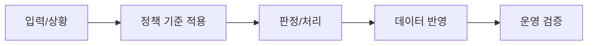

# 010 출석현황 랭킹규칙, 카운트다운 정책

> 문서 링크: [docs/History/010_출석현황_랭킹규칙_카운트다운정책.md](./010_출석현황_랭킹규칙_카운트다운정책.md) | [GitHub](https://github.com/cloud-club/CloudClubAttendanceSystem/blob/gh-pages/docs/History/010_출석현황_랭킹규칙_카운트다운정책.md)

## 빠른 흐름도

## 1. 배경(어떤 이유로 추가됐는지)
출석 현황 화면에서 두 가지 운영 불만이 반복됐다.

- 출석횟수가 적은데 평균 오프셋이 짧다는 이유로 상위권에 오는 문제
- KST 기준 현재 시각과 다른 카운트다운이 표시되는 문제

두 문제 모두 신뢰성에 직접 영향을 준다. 랭킹 기준이 직관과 다르면 운영자는 결과를 설명하기 어려워지고, 카운트다운이 실제 시간과 다르면 출석 참여자는 시스템 자체를 불신하게 된다. 따라서 이 영역은 “보기 좋은 화면”보다 “정책을 명확히 전달하는 화면”으로 정비해야 했다.

이 문제는 신뢰성 이슈로 직결되기 때문에 UI 문구 변경이 아니라 정렬 기준/시간 계산 로직 자체를 수정했다.

## 2. 사용자 절차(어떻게 사용하는지)
### 관리자/학생 공통 랭킹 해석
1. 랭킹 표의 `출석 횟수`를 최우선 지표로 본다.
2. 출석횟수가 같으면 `평균 출석 오프셋`이 빠른 사람이 상위다.
3. 최종 동률은 이름 오름차순으로 안정 정렬한다.

### 카운트다운 확인
1. 출석 카드에서 표시되는 문구(`출석 오픈까지`, `정시 마감까지`, `지각 마감까지`)를 확인한다.
2. 현재 시간이 이미 오픈 이후면 “오픈까지”가 아니라 마감 기준 카운트다운이 나와야 정상이다.

운영 점검 시에는 반드시 관리자 페이지와 학생 페이지를 함께 비교해야 한다. 한쪽만 맞고 다른 쪽이 틀리면 로직 자체보다 캐시/배포 버전 불일치 가능성이 높다. 이 비교 절차를 표준화하면 시간 관련 장애를 빠르게 분리할 수 있다.

## 3. 설계 의도(왜 이렇게 했는지)
### 랭킹의 공정성
출석률 100%라도 4/4와 6/6은 운영 기여도가 다르다. 그래서 정렬 기준에서 출석률을 보조 지표로 내리고 출석횟수를 최상위로 고정했다.

### 시간 표시의 일관성
카운트다운은 사용자 체감에 매우 민감하므로, 서버 계산값과 프런트 표시값의 기준 시각(KST)을 맞추고 세션 상태 전환 조건을 명확히 했다.

즉, 정책의 핵심은 “순위를 어떻게 보여줄지”가 아니라 “순위를 왜 그렇게 계산하는지 설명 가능하게 만드는 것”이다. 정렬 기준을 코드와 문구에 동시에 명시하면 운영자 문의 대응 속도가 빨라지고, 사용자 입장에서도 결과를 납득하기 쉬워진다.

## 4. API/데이터 영향
| 항목 | 변경 내용 | 영향 |
|---|---|---|
| `ranking` 계산 | `attendedCount desc -> avgOffset asc -> name asc` | 6/6이 4/4보다 항상 우선 |
| 랭킹 표시 문구 | 정렬 기준 안내 문구 명시 | 사용자 해석 혼선 감소 |
| 카운트다운 계산 | 세션 오픈/정시/지각 구간 분기 보정 | KST 체감과 표시 불일치 감소 |

## 5. 커밋 근거표(커밋 ID, 변경 파일, 핵심 diff 요약)
| 커밋 | 핵심 변경 | 주요 파일 |
|---|---|---|
| `d8cd67b` | 랭킹 정렬 강제 적용(출석횟수 > 평균오프셋 > 이름), 안내문구 보강 | `Code.gs`, `web/admin/admin.js`, `web/admin/index.html`, `web/student/student.js` |
| `86f47cc` | 카운트다운 잔여시간 표시 오류 수정 | `web/admin/admin.js`, `web/student/student.js` |

## 6. 운영상 주의점
- 랭킹은 완료된 회차 기준으로 계산되므로 진행 중 회차의 중간 상태가 즉시 반영되지 않을 수 있다.
- 시즌 선택이 잘못되어 있으면 랭킹 오해가 발생한다. 상단 참조 시즌을 먼저 확인해야 한다.
- 카운트다운 이상이 다시 보이면 변수값(`attendance_open_offset_min`, `late_threshold_min`, `absence_threshold_min`)과 회차 시작/종료시각을 동시에 점검해야 한다.

## 7. 검증 시나리오
1. `6/6` 사용자와 `4/4` 사용자가 함께 있을 때 `6/6`이 상위인지 확인한다.
2. 출석횟수 동률에서 평균 오프셋이 빠른 사용자가 상위인지 확인한다.
3. 카운트다운이 오픈 전/오픈 후/정시마감 후 상태별로 올바른 문구를 표시하는지 확인한다.
4. 관리자/학생 페이지에서 같은 시즌의 카운트다운 값이 일치하는지 확인한다.

## 8. 실제 운영 사례(실패 예시/대응 예시)
### 사례 1. 4/4 사용자가 6/6 사용자보다 높은 순위로 보인 경우
실패 상황: 출석률이 둘 다 100%일 때 평균 오프셋이 빠른 4/4가 6/6보다 상위에 노출됐다.  
원인: 과거 정렬에서 출석률 우선 기준이 남아 있어 참여 횟수 차이가 반영되지 않았다.  
대응: 정렬 기준을 `attendedCount desc -> avgAttendOffsetSeconds asc -> name asc`로 고정하고, 화면 문구도 동일 기준으로 수정했다.  
재발 방지: 랭킹 변경 시 UI 문구와 백엔드 정렬 함수를 동시에 검증하는 회귀 테스트를 체크리스트에 추가했다.

### 사례 2. KST 21:44인데 “출석 오픈까지 45분”으로 보인 경우
실패 상황: 실제 세션은 이미 진행 중인데 오픈 대기 카운트다운이 표시됐다.  
원인: 세션 상태 전환 분기에서 오픈/정시/지각 구간 판단이 엇갈려 잘못된 문구가 노출됐다.  
대응: 관리자/학생 공통 카운트다운 계산 로직을 보정하고, 상태별 표시 문구를 재정렬했다.  
재발 방지: 시간 오류 신고 시 즉시 확인할 수 있도록 “현재 시각, 세션 시작/마감, 계산 상태”를 한 화면에서 비교하는 디버그 절차를 운영화했다.

## 9. 남은 리스크/차기 개선 포인트
- 현재 평균 오프셋만 사용하므로, 회차 수가 적은 사용자에 대한 통계 편향 보정이 필요할 수 있다.
- 랭킹에 필터(최근 N회차, 공식 행사만 등)가 추가되면 운영 의사결정에 더 유용해진다.

## 관련 문서
- [docs/History/007_variable_단일테이블정책_정규화_템플릿운영.md](./007_variable_단일테이블정책_정규화_템플릿운영.md) | [GitHub](https://github.com/cloud-club/CloudClubAttendanceSystem/blob/gh-pages/docs/History/007_variable_단일테이블정책_정규화_템플릿운영.md)
- [docs/History/012_운영자_개발자_통합_검증체크리스트.md](./012_운영자_개발자_통합_검증체크리스트.md) | [GitHub](https://github.com/cloud-club/CloudClubAttendanceSystem/blob/gh-pages/docs/History/012_운영자_개발자_통합_검증체크리스트.md)
