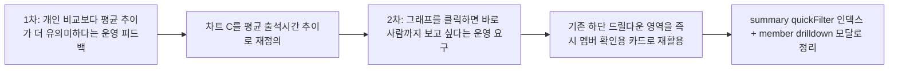

# 025 관리자 출석현황 평균 출석시간 추이 전환 운영 기록 (2026-03-10, 2026-03-11 후속 개선 통합)

> 문서 링크: [docs/History/025_관리자_출석현황_평균출석시간추이_전환_운영기록_2026-03-10.md](./025_관리자_출석현황_평균출석시간추이_전환_운영기록_2026-03-10.md) | [GitHub](https://github.com/cloud-club/CloudClubAttendanceSystem/blob/gh-pages/docs/History/025_%EA%B4%80%EB%A6%AC%EC%9E%90_%EC%B6%9C%EC%84%9D%ED%98%84%ED%99%A9_%ED%8F%89%EA%B7%A0%EC%B6%9C%EC%84%9D%EC%8B%9C%EA%B0%84%EC%B6%94%EC%9D%B4_%EC%A0%84%ED%99%98_%EC%9A%B4%EC%98%81%EA%B8%B0%EB%A1%9D_2026-03-10.md)

> 후속 변경 메모: 이 문서는 평균 출석시간 추이 전환과 그래프 클릭형 빠른 필터까지를 다룹니다. 진행 중 회차의 `pending(미확정)` 실시간 표시, 상태 비율의 `회` 기준 해석, 30초 자동 갱신은 [026_관리자_출석현황_실시간_pending표시_및_출석상태비율_회기준_운영기록_2026-03-31.md](./026_관리자_출석현황_실시간_pending표시_및_출석상태비율_회기준_운영기록_2026-03-31.md)를 우선 참고하세요.

## 빠른 흐름도

## 1. 배경
기존 관리자 `출석현황` 탭은 통계를 보는 용도로는 충분했지만, 실제 운영 흐름에서는 한 가지 단절이 남아 있었다. 그래프를 보다 보면 자연스럽게 클릭하게 되는데, 막상 클릭했을 때 **그 시점에 누가 왔고 누가 안 왔는지 바로 보이지 않았다.** 운영진 입장에서는 차트 수치 자체보다, 그 수치에 해당하는 실제 사람을 곧바로 확인할 수 있어야 화면의 가치가 커진다.

그렇다고 해서 이 요구를 해결하기 위해 새로운 패널을 계속 추가하는 방식은 적절하지 않았다. 화면은 더 복잡해지고, 남에게 보여줄 때 정보의 초점이 흐려지며, 단순 출석 확인용으로는 현재 대시보드 하단 영역의 효율이 오히려 더 낮아질 수 있었다. 그래서 이번 후속 개선은 새 UI를 하나 더 만드는 대신, **기존 하단 드릴다운 영역을 즉시 멤버 확인과 상태별 랭킹 확인에 쓰는 방향**으로 정리했다.

이 작업의 목적은 결국 두 가지였다. 하단 리스트 출력 방식을 더 유의미하게 바꾸는 것, 그리고 데이터 활용도와 접근 속도를 함께 끌어올리는 것이다. 이 변화 이후 대시보드는 단순히 통계를 바라보는 화면이 아니라, 그래프에서 이상 징후를 보자마자 사람까지 바로 확인하는 운영 도구로 해석하는 것이 맞다.

## 2. 이번 변경에서 정리한 것
### 2-1. 1차 변경: 차트 C 의미 전환
상단 세 번째 차트는 원래 개인별 출석 시간 비교에 가까운 성격을 가지고 있었지만, 운영 관점에서 더 유의미한 기준은 “지금 필터에 걸린 사람들 전체가 회차별로 얼마나 빨리 오고 늦게 오는가”였다. 그래서 이 차트의 의미를 `개인별 출석 시간 추이`에서 **`필터 대상 평균 출석 시간 추이`**로 전환했다.

이제 멤버를 선택하지 않으면 전체 평균으로 해석하고, 1명만 선택하면 사실상 개인 추이처럼 볼 수 있으며, 2명 이상을 선택하면 선택된 집합의 평균값 1개 라인으로 읽는다. 기본 3명 자동 선택도 제거해, 진입 직후부터 빈 차트가 아니라 **전체 평균을 기본 상태로 보여주는 구조**로 정리했다.

### 2-2. 2차 변경: 그래프 클릭형 빠른 멤버 필터
후속 개선의 핵심은 하단 영역의 역할을 바꾼 것이다. 예전에는 이 영역이 행사 drilldown 또는 개인 drilldown 표를 보여주는 공간이었다면, 지금은 그래프 클릭 결과를 즉시 보여주는 **대시보드 드릴다운 카드**가 되었다. 이 카드는 어떤 그래프를 눌렀는지에 따라 멤버 목록을 보여주기도 하고, 상태별 랭킹을 보여주기도 한다.

`행사별 출석/지각/결석/유고 분포`의 stacked bar를 누르면 해당 회차와 상태에 맞는 멤버 목록이 바로 내려오고, `OB/YB 구성 비율`과 `출석 횟수 분포`도 같은 방식으로 하단 멤버 목록과 연결된다. 반면 `출석 상태 비율` 도넛은 단순히 사람 목록을 보여주는 대신, 그 상태를 가장 많이 만든 멤버가 누구인지 하단에서 바로 확인할 수 있도록 **상태별 랭킹**으로 연결된다.

이 흐름에서 공통점은 모두 같다. 클릭한 순간 하단 결과가 바로 바뀌고, 같은 slice를 다시 누르면 해제되며, 동시에 여러 상태를 붙잡아 두지 않고 마지막으로 클릭한 하나만 유지한다. `출석일 확인`은 그 하단 결과에서 개인 회차 이력이 필요할 때만 여는 보조 동작으로 남겨 두었다.

### 2-3. 백엔드/프런트 계약 정리
이번 개선은 새 API를 만드는 방식으로 풀지 않았다. `attendanceDashboardSummary`는 기존 계약을 유지한 채 `meta.quickFilter`만 additive field로 확장했고, 하단 멤버 목록과 상태별 랭킹은 이 인덱스를 사용해 **프런트에서 즉시 계산**하도록 분리했다. 덕분에 사용자는 그래프를 누른 뒤 별도의 대기 없이 결과를 바로 보게 된다.

반대로 `attendanceDashboardDrilldown(member)`는 그대로 유지했다. 이 API는 하단 결과를 만들기 위한 용도가 아니라, `출석일 확인` 모달에서 개인의 회차별 이력을 보여주는 상세 조회로 역할을 한정했다. 즉 이번 구조는 “summary는 즉시 반응용 인덱스”, “member drilldown은 필요할 때만 여는 상세”로 역할을 나눈 설계라고 보는 편이 정확하다.

## 3. 운영상 의미
이번 후속 개선으로 대시보드의 사용 방식 자체가 달라졌다. 운영자는 수치를 본 뒤 다시 다른 검색 UI로 이동하지 않아도 되고, 그래프에서 바로 멤버나 상태별 랭킹을 확인할 수 있어 현장 대응 속도가 빨라진다. 무엇보다 새로운 화면을 늘리지 않고 기존 하단 영역을 재활용했기 때문에, 화면 밀도는 유지하면서도 설명력은 더 높아졌다.

운영자가 기억해야 할 해석 기준도 더 분명해졌다. 멤버를 비워 둔 상태는 오류가 아니라 `전체 평균` 기본 상태이고, 멤버 선택은 여전히 차트 C 전용 부분집합 필터다. 하단 카드는 이제 기본 drilldown 표가 아니라 그래프 클릭 결과를 보여주는 드릴다운 카드이며, 개인 회차 이력이 정말 필요할 때만 `출석일 확인` 모달을 여는 구조로 이해하면 된다.

## 4. 바꾸지 않은 것
이번 통합 변경에서도 바꾸지 않은 축은 분명하다. 학생 페이지 동작, 기존 전화번호 기반 출석현황 조회, 시즌 전체 공통 랭킹 규칙, `attendanceDashboardDrilldown(member)` 응답 계약, 그리고 다른 관리자 탭 동작은 그대로 유지했다. 다시 말해 이번 변화는 기존 계약을 깨는 작업이 아니라, **summary에 빠른 필터 인덱스를 보강하고 하단 렌더 방식만 더 운영 친화적으로 바꾼 작업**으로 보는 것이 맞다.

## 5. 검증 기준
### 자동 검증
1. `git diff --check`
2. 프런트 문법 체크
3. Apps Script 문법 체크(임시 `.js` 복사 방식)
4. `node scripts/doublecheck_static_guard.js`
5. API 스냅샷 정규화 기준에서 `attendanceDashboardSummary.meta.quickFilter`는 비교 무시, 기존 필드 변화는 계속 실패

### 수동 검증
1. 관리자 `출석현황` 탭 진입 시 차트 C가 전체 평균으로 보이는지 확인
2. 멤버 1명 선택 시 차트가 개인 추이처럼 해석 가능한지 확인
3. 멤버 2명 이상 선택 시 차트가 평균값 1개 라인인지 확인
4. stacked bar segment 클릭 시 하단 멤버 목록이 즉시 갱신되는지 확인
5. 출석 상태 비율 donut 클릭 시 하단 상태별 랭킹이 즉시 갱신되는지 확인
6. OB/YB donut 클릭 시 하단 멤버 목록이 즉시 갱신되는지 확인
7. 출석 횟수 분포 donut의 exact bucket과 `기타`가 모두 올바른 멤버 목록을 보여주는지 확인
8. `출석일 확인` 모달만 API 호출을 사용하고, 같은 멤버 재호출 시 60초 캐시가 적용되는지 확인
9. `행사별 출석률`, `평균 출석 시간 추이` 차트는 클릭 반응 없이 hover-only인지 확인
10. 학생 페이지 `출석현황/랭킹`이 기존과 동일한지 확인

## 6. 배포 메모
이번 기능 기준으로 Apps Script에 올릴 파일은 아래 하나면 된다.

1. [Appsscript/31_dashboard.gs](../../Appsscript/31_dashboard.gs)

이번 변경 때문에 다시 올릴 필요 없는 Apps Script 파일은 아래와 같다.

1. [Appsscript/00_entry_api.gs](../../Appsscript/00_entry_api.gs)
2. [Appsscript/01_constants_access.gs](../../Appsscript/01_constants_access.gs)
3. [Appsscript/30_attendance_core.gs](../../Appsscript/30_attendance_core.gs)

프런트/GitHub Pages 반영 대상은 아래다.

1. [web/admin/index.html](../../web/admin/index.html)
2. [web/admin/scripts/01_state.js](../../web/admin/scripts/01_state.js)
3. [web/admin/scripts/20_attendance.js](../../web/admin/scripts/20_attendance.js)
4. [web/admin/scripts/21_dashboard.js](../../web/admin/scripts/21_dashboard.js)

권장 반영 순서는 아래를 따른다.

1. Apps Script에 `31_dashboard.gs` 반영 후 새 버전 배포
2. GitHub Pages 반영
3. 관리자 수동 스모크
4. 전체 doublecheck

## 7. 문서 상태 메모
이 문서는 원래 2026-03-10 기준의 평균 추이 전환 기록이었고, 현재는 2026-03-11 후속 개선까지 **같은 운영 흐름의 연장선**으로 통합 정리한 상태다.

즉 이 문서를 읽을 때는 아래 순서로 해석하면 된다.

1. 차트 C를 평균 추이로 바꿨다
2. 그 다음 단계에서, 그래프 클릭 결과를 하단 멤버 빠른 필터로 연결했다

## 관련 문서
- [docs/Wiki/02_Admin_Side_Guide.md](../Wiki/02_Admin_Side_Guide.md) | [GitHub](https://github.com/cloud-club/CloudClubAttendanceSystem/blob/gh-pages/docs/Wiki/02_Admin_Side_Guide.md)
- [docs/Wiki/03_Admin_Tab_Change_Map.md](../Wiki/03_Admin_Tab_Change_Map.md) | [GitHub](https://github.com/cloud-club/CloudClubAttendanceSystem/blob/gh-pages/docs/Wiki/03_Admin_Tab_Change_Map.md)
- [docs/Wiki/06_Doublecheck_Regression_Gate.md](../Wiki/06_Doublecheck_Regression_Gate.md) | [GitHub](https://github.com/cloud-club/CloudClubAttendanceSystem/blob/gh-pages/docs/Wiki/06_Doublecheck_Regression_Gate.md)
- [docs/History/016_출석현황_대시보드_필터UX_및_도넛확장_운영정책.md](./016_출석현황_대시보드_필터UX_및_도넛확장_운영정책.md) | [GitHub](https://github.com/cloud-club/CloudClubAttendanceSystem/blob/gh-pages/docs/History/016_%EC%B6%9C%EC%84%9D%ED%98%84%ED%99%A9_%EB%8C%80%EC%8B%9C%EB%B3%B4%EB%93%9C_%ED%95%84%ED%84%B0UX_%EB%B0%8F_%EB%8F%84%EB%84%9B%ED%99%95%EC%9E%A5_%EC%9A%B4%EC%98%81%EC%A0%95%EC%B1%85.md)
- [docs/History/mission-attendance-dashboard-plan.md](./mission-attendance-dashboard-plan.md) | [GitHub](https://github.com/cloud-club/CloudClubAttendanceSystem/blob/gh-pages/docs/History/mission-attendance-dashboard-plan.md)

## 관련 구현 파일
- [web/admin/index.html](../../web/admin/index.html) | [GitHub](https://github.com/cloud-club/CloudClubAttendanceSystem/blob/gh-pages/web/admin/index.html)
- [web/admin/scripts/21_dashboard.js](../../web/admin/scripts/21_dashboard.js) | [GitHub](https://github.com/cloud-club/CloudClubAttendanceSystem/blob/gh-pages/web/admin/scripts/21_dashboard.js)
- [Appsscript/31_dashboard.gs](../../Appsscript/31_dashboard.gs) | [GitHub](https://github.com/cloud-club/CloudClubAttendanceSystem/blob/gh-pages/Appsscript/31_dashboard.gs)
