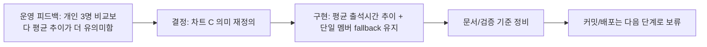

# 025 관리자 출석현황 평균 출석시간 추이 전환 운영 기록 (2026-03-10)

> 문서 링크: [docs/History/025_관리자_출석현황_평균출석시간추이_전환_운영기록_2026-03-10.md](./025_관리자_출석현황_평균출석시간추이_전환_운영기록_2026-03-10.md) | [GitHub](https://github.com/cloud-club/CloudClubAttendanceSystem/blob/gh-pages/docs/History/025_%EA%B4%80%EB%A6%AC%EC%9E%90_%EC%B6%9C%EC%84%9D%ED%98%84%ED%99%A9_%ED%8F%89%EA%B7%A0%EC%B6%9C%EC%84%9D%EC%8B%9C%EA%B0%84%EC%B6%94%EC%9D%B4_%EC%A0%84%ED%99%98_%EC%9A%B4%EC%98%81%EA%B8%B0%EB%A1%9D_2026-03-10.md)

## 빠른 흐름도

## 1. 배경
기존 관리자 `출석현황` 탭의 상단 세 번째 차트는 기본적으로 선택된 몇 명의 개인 출석시간 추이를 비교하는 구조였습니다.  
하지만 실제 운영 관점에서는 “누가 조금 더 빨리 왔는가”보다, **현재 필터 대상 전체가 회차별로 얼마나 이르게/늦게 오는가**가 더 중요한 지표로 작동했습니다.

특히 다음 문제가 반복됐습니다.

1. 기본 3명 자동 선택 상태가 왜 그 3명인지 설명하기 어려웠다.
2. 개인 시계열이 많아질수록 비교선은 늘어나지만 운영 판단은 오히려 어려워졌다.
3. 무선택 상태에서는 차트 의미가 약해지고, 운영진이 필터 전체의 경향을 한눈에 보기 어려웠다.

이 변경의 목적은 새 기능을 많이 추가하는 것이 아니라, **기존 관리자 대시보드의 세 번째 차트를 운영 의사결정에 더 직접적인 지표로 바꾸는 것**이었다.

## 2. 이번 변경에서 바꾼 것
### 2-1. 프런트 동작
상단 세 번째 차트의 의미를 `개인별 출석 시간 추이`에서 **`필터 대상 평균 출석 시간 추이`**로 전환했다.

현재 해석 기준은 다음과 같다.

1. 멤버 미선택: 전체 평균
2. 멤버 1명 선택: 그 사람의 값이 곧 평균이므로 사실상 개인 추이
3. 멤버 2명 이상 선택: 선택된 집합만의 평균값 1개 라인

또한 기본 3명 자동 선택을 제거해, 진입 직후에도 차트가 비지 않고 **전체 평균**을 기본 상태로 보여주도록 바꿨다.

### 2-2. 백엔드 동작
`attendanceDashboardDrilldown`에 `memberAverage` 경로를 추가해, 현재 대시보드 필터 + 선택 멤버 집합 기준으로 회차별 평균 출석시간을 계산하도록 정리했다.

평균 계산 규칙은 다음과 같다.

1. `출석`, `지각` 중 실제 출석시각이 파싱되는 데이터만 포함
2. `유고`, `결석`, 실제 출석시각 없음은 평균 모수에서 제외
3. 종료된 회차만 평균 추이 대상에 포함
4. 기준값은 절대 시각이 아니라 `행사 시작 시각 대비 오프셋 평균`

추가로 `attendanceDashboardSummary.meta.defaultMemberKeys` 필드는 응답에 남아 있지만, 현재 프런트는 이를 기본 선택값으로 사용하지 않는다. 즉 **응답 호환 필드는 남겨 두고, 실제 기본 UX만 전체 평균 기준으로 전환한 상태**다.

### 2-3. 드릴다운 해석
세 번째 차트의 점 클릭은 더 이상 개인 drilldown이 아니라 **해당 회차 행사 drilldown**으로 본다.

개인 상세가 필요할 때는 멤버를 1명만 선택하면 된다. 이 경우 차트는 개인 추이처럼 해석 가능하고, 드릴다운 표도 개인 단위 상세와 연결된다.

## 3. 바꾸지 않은 것
이번 변경은 관리자 페이지의 특정 차트 의미만 교체한 작업이며, 다음은 바꾸지 않았다.

1. 학생 페이지 동작
2. 기존 개인 출석현황 조회 흐름
3. 랭킹 규칙
4. KPI/도넛/이벤트 Top 테이블의 집계 기준
5. 다른 관리자 탭 동작

즉 멤버 선택은 **차트 C 전용 부분집합 필터**이며, 대시보드 전체를 다시 계산하는 전역 유저 필터로 승격하지 않았다.

## 4. 운영상 주의점
1. 멤버를 선택하지 않은 상태가 “선택 안 됨”이 아니라 **전체 평균 기본 상태**라는 점을 운영자에게 안내해야 한다.
2. 멤버를 여러 명 선택해도 KPI/랭킹/도넛이 바뀌지 않는 것은 정상이다.
3. 개인 상세가 필요하면 멤버를 1명만 선택해야 한다.
4. 세 번째 차트 클릭 결과가 행사 드릴다운으로 바뀌었기 때문에, 기존 설명 자료가 있다면 같이 갱신해야 한다.

## 5. 검증 기준
### 자동 검증
1. `git diff --check`
2. 프런트 문법 체크
3. Apps Script 문법 체크(임시 `.js` 복사 방식)
4. `doublecheck_static_guard.js`

### 수동 검증
1. 관리자 `출석현황` 탭 진입 시 차트 C가 전체 평균으로 보이는지 확인
2. 멤버 1명 선택 시 차트가 개인 추이처럼 해석 가능한지 확인
3. 멤버 2명 이상 선택 시 차트가 평균값 1개 라인인지 확인
4. 차트 점 클릭 시 행사 drilldown이 열리는지 확인
5. 학생 페이지 `출석현황/랭킹`이 기존과 동일한지 확인

## 6. 배포/롤백 메모
이번 변경은 프런트와 Apps Script를 함께 수정하므로, 반영 순서는 아래를 따른다.

1. Apps Script 배포
2. GitHub Pages 반영
3. 관리자 페이지 강력 새로고침 후 수동 스모크

이상 시에는 다음 순서로 롤백한다.

1. Apps Script 이전 배포 버전으로 롤백
2. 필요 시 프런트도 직전 커밋 기준으로 복귀

## 7. 문서 상태 메모
이 문서는 **커밋/푸시 전에 먼저 작성한 운영 기록**이다.  
따라서 실제 커밋 ID, 배포 시각, 배포 로그 링크는 다음 단계에서 추가하거나 별도 운영 기록에 연결한다.

## 관련 문서
- [docs/Wiki/02_Admin_Side_Guide.md](../Wiki/02_Admin_Side_Guide.md) | [GitHub](https://github.com/cloud-club/CloudClubAttendanceSystem/blob/gh-pages/docs/Wiki/02_Admin_Side_Guide.md)
- [docs/Wiki/03_Admin_Tab_Change_Map.md](../Wiki/03_Admin_Tab_Change_Map.md) | [GitHub](https://github.com/cloud-club/CloudClubAttendanceSystem/blob/gh-pages/docs/Wiki/03_Admin_Tab_Change_Map.md)
- [docs/Wiki/06_Doublecheck_Regression_Gate.md](../Wiki/06_Doublecheck_Regression_Gate.md) | [GitHub](https://github.com/cloud-club/CloudClubAttendanceSystem/blob/gh-pages/docs/Wiki/06_Doublecheck_Regression_Gate.md)
- [docs/History/016_출석현황_대시보드_필터UX_및_도넛확장_운영정책.md](./016_출석현황_대시보드_필터UX_및_도넛확장_운영정책.md) | [GitHub](https://github.com/cloud-club/CloudClubAttendanceSystem/blob/gh-pages/docs/History/016_%EC%B6%9C%EC%84%9D%ED%98%84%ED%99%A9_%EB%8C%80%EC%8B%9C%EB%B3%B4%EB%93%9C_%ED%95%84%ED%84%B0UX_%EB%B0%8F_%EB%8F%84%EB%84%9B%ED%99%95%EC%9E%A5_%EC%9A%B4%EC%98%81%EC%A0%95%EC%B1%85.md)
- [docs/History/mission-attendance-dashboard-plan.md](./mission-attendance-dashboard-plan.md) | [GitHub](https://github.com/cloud-club/CloudClubAttendanceSystem/blob/gh-pages/docs/History/mission-attendance-dashboard-plan.md)

## 관련 구현 파일
- [web/admin/index.html](../../web/admin/index.html) | [GitHub](https://github.com/cloud-club/CloudClubAttendanceSystem/blob/gh-pages/web/admin/index.html)
- [web/admin/scripts/21_dashboard.js](../../web/admin/scripts/21_dashboard.js) | [GitHub](https://github.com/cloud-club/CloudClubAttendanceSystem/blob/gh-pages/web/admin/scripts/21_dashboard.js)
- [Appsscript/31_dashboard.gs](../../Appsscript/31_dashboard.gs) | [GitHub](https://github.com/cloud-club/CloudClubAttendanceSystem/blob/gh-pages/Appsscript/31_dashboard.gs)
