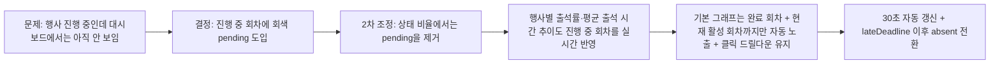

# 026 관리자 출석현황 실시간 pending 표시 및 출석상태비율 회기준 운영기록 (2026-03-31)

> 문서 링크: [docs/History/026_관리자_출석현황_실시간_pending표시_및_출석상태비율_회기준_운영기록_2026-03-31.md](./026_관리자_출석현황_실시간_pending표시_및_출석상태비율_회기준_운영기록_2026-03-31.md) | [GitHub](https://github.com/cloud-club/CloudClubAttendanceSystem/blob/gh-pages/docs/History/026_%EA%B4%80%EB%A6%AC%EC%9E%90_%EC%B6%9C%EC%84%9D%ED%98%84%ED%99%A9_%EC%8B%A4%EC%8B%9C%EA%B0%84_pending%ED%91%9C%EC%8B%9C_%EB%B0%8F_%EC%B6%9C%EC%84%9D%EC%83%81%ED%83%9C%EB%B9%84%EC%9C%A8_%ED%9A%8C%EA%B8%B0%EC%A4%80_%EC%9A%B4%EC%98%81%EA%B8%B0%EB%A1%9D_2026-03-31.md)

## 빠른 흐름도

## 1. 배경
기존 관리자 `출석현황` 대시보드는 그래프를 누르면 바로 멤버를 확인할 수 있다는 점에서 운영 도구로 충분히 유용했지만, 실제 행사 진행 중에는 한 가지 단절이 남아 있었다. **행사가 끝나기 전까지는 아직 출석하지 않은 사람이 대시보드에 드러나지 않았다**는 점이다.

즉 운영진은 그래프를 보고도 “지금 누가 안 왔는지”를 직관적으로 파악하기 어려웠고, 결국 종료 후 최종 결석 상태가 계산된 뒤에야 결과를 읽을 수 있었다. 현장 운영에서는 바로 이 시간이 가장 중요하므로, 이 공백은 화면의 해석 가치를 떨어뜨리는 요소였다.

이번 후속 변경은 새로운 차트를 많이 추가하는 작업이 아니라, **이미 존재하는 대시보드가 실제 행사 시간대에도 의미 있게 읽히도록 만드는 작업**이었다.

## 2. 무엇이 문제였는가
문제는 크게 세 가지였다.

1. 진행 중 회차가 대시보드 집계에서 빠져 실시간 운영 감각이 약했다.
2. “아직 안 왔다”와 “최종 결석이다”가 같은 방식으로 보이지 않았고, 운영자가 중간 상태를 읽을 수 없었다.
3. `출석 상태 비율`에 `pending`까지 넣으면, 현장 중간 상태와 최종 상태가 한 원형 차트에서 섞여 오히려 해석이 무거워질 수 있었다.
4. 그래프를 클릭해 하단 드릴다운을 열어둔 상태에서 자동 새로고침이 돌면 선택이 풀려 기본 안내 문구로 돌아가는 문제가 있었다.
5. 행사 일정을 미리 여러 개 등록해 두면, 기본 그래프가 현재 활성 출석이 아니라 미래 일정까지 함께 보여 운영 해석을 흐릴 수 있었다.

즉 운영자는 현장에서 “누가 아직 안 왔는지”, “이 상태를 언제 결석으로 봐야 하는지”, “도넛 숫자를 명으로 읽어야 하는지 회로 읽어야 하는지”를 한 번 더 머릿속에서 보정해야 했다.

## 3. 이번에 한 결정
이번 변경에서 기준을 아래처럼 고정했다.

### 3-1. 진행 중 회차의 미기록은 `pending(미확정)`으로 본다
- 회차가 실제로 열려 있는 동안(`openTime <= now < lateDeadline`)
- 아직 셀 값이 비어 있으면
- 회색 `pending` 상태로 대시보드에 반영한다.

이 상태는 최종 결과가 아니라, **행사 진행 중 운영 판단용 중간 상태**다.

### 3-2. `lateDeadline` 이후에는 `pending -> absent`
중간 상태를 끝없이 유지하지 않기 위해, 출석 마감 기준인 `lateDeadline`이 지나면 `pending`은 그대로 남지 않고 결석으로 확정되게 했다.

### 3-3. 실시간화 범위를 다시 나눈다
후속 운영 피드백을 반영해 실시간 반영 범위를 한 번 더 조정했다.

- **계속 반영**: `행사별 출석/지각/결석/유고/미확정 분포`
- **추가 반영**: `행사별 출석률`, `평균 출석 시간 추이`
- **제외**: `출석 상태 비율`의 `pending` slice

즉 실시간 상태를 더 넓게 보여주되, 원형 차트 하나에 `pending`까지 넣어 해석을 무겁게 만들지는 않겠다는 쪽으로 기준을 고정했다.

### 3-4. 상태 비율은 `명`보다 `회/번` 기준으로 읽되 `pending`은 노출하지 않는다
`출석 상태 비율`과 상태 분포는 사람 수가 아니라 **상태 발생 횟수**를 보여주는 쪽이 더 정확했다. 다만 상태 비율 도넛에서는 `pending`을 따로 보이지 않고, 진행 중 회차의 `출석/지각/유고`만 실시간 반영한다. 결석은 여전히 `lateDeadline` 이후에만 잡히고, 하단 멤버 목록과 상태별 랭킹은 계속 실제 사람 수(`명`) 기준이다.

### 3-5. 기본 그래프는 완료 회차 + 현재 활성 회차까지 보여준다
실제 운영에서는 같은 날 미래 일정까지 미리 등록하는 경우가 많다. 그래서 기본 그래프가 “선택된 시즌의 모든 회차”를 그대로 보여주면, 지금 당장 읽어야 하는 현재 시점의 흐름이 묻혀 버린다. 이번 기준에서는 **처음 회차부터 오늘 기준 완료 회차 + 현재 활성 회차까지만** 기본 그래프 대상으로 자동 고정하고, 운영자가 날짜/회차 필터를 직접 건드렸을 때만 그 선택을 우선한다.

### 3-6. 실시간 새로고침이 돌아와도 클릭한 드릴다운은 유지한다
진행 중 회차를 bar로 눌러 하단 멤버 목록을 보고 있는 상황은, 실시간 운영에서 가장 중요한 순간 중 하나다. 이때 자동 새로고침 때문에 선택이 풀려 기본 안내 문구로 돌아가면, 실시간성은 생겨도 운영자는 다시 같은 slice를 눌러야 한다. 그래서 이번 기준은 **클릭한 slice를 유지한 채 최신 데이터로 갱신**하는 쪽으로 고정했다.

## 4. 구현에서 실제로 바뀐 것
### 4-1. 백엔드 집계
- 진행 중 회차를 `ongoing`으로 분리하고, 대시보드 전용 상태 `pending`을 계산한다.
- `attendanceDashboardSummary`에 `pendingCount`, `ongoingSessionCount`, `statusSessionKeys` 같은 실시간 해석용 메타를 추가한다.
- `attendanceDashboardDrilldown`에서도 진행 중 무기록 상태를 `future` 대신 `pending`으로 내려, 하단 모달/드릴다운 해석이 summary와 어긋나지 않게 맞춘다.

### 4-2. 프런트 해석
- `행사별 상태 분포` stacked bar에 회색 `pending` segment를 추가했다.
- `출석 상태 비율` 도넛은 최종 4상태(`출석/지각/결석/유고`)만 유지하고, 진행 중 회차의 `출석/지각/유고`만 실시간 반영한다.
- `행사별 출석률`은 진행 중 회차에서 `현재 반영 인원 / 전체 대상` 기준의 임시 진행률로 갱신한다.
- `평균 출석 시간 추이`는 진행 중 회차에서 `현재까지 기록된 출석자 평균`으로 갱신한다.
- 도넛과 상태 분포 수치는 `회` 기준으로 보여주고, 멤버 목록은 `명` 기준으로 유지했다.

### 4-3. 갱신 방식
- 출석현황 탭이 열려 있는 동안 30초 간격으로 자동 새로고침한다.
- 탭을 벗어나거나 문서가 hidden 상태가 되면 polling을 정리한다.
- 진행 중 회차를 눌러 하단 드릴다운을 열어둔 경우, 새로고침 이후에도 같은 slice를 유지한 채 멤버 목록/랭킹이 최신화된다.
- 기본 그래프는 처음 회차부터 오늘 기준 완료 회차 + 현재 활성 회차를 우선 보여주고, 사용자가 날짜/회차 필터를 직접 바꾸면 수동 선택을 유지한다.
- 진행 중 회차가 마감되면 다음 갱신에서 `pending`이 `absent`로 전환된다.

## 5. 운영상 무엇이 좋아졌는가
이번 변경 이후 운영자는 더 이상 행사 종료 후 결과만 보는 것이 아니라, **진행 중인 상태 자체를 그래프에서 읽을 수 있게 됐다.**

이 변화의 장점은 아래처럼 정리할 수 있다.

- 실시간으로 아직 안 온 사람을 바로 볼 수 있다.
- 그래프에서 이상 징후를 보면 바로 멤버 목록으로 연결된다.
- 행사별 출석률과 평균 출석 시간 추이도 행사 중에 같이 움직여, “지금 진행률”과 “현재까지의 평균 도착 패턴”을 바로 볼 수 있다.
- `pending`과 `absent`를 분리해 읽을 수 있어, 현장 운영과 사후 회고를 같은 화면에서 다룰 수 있다.
- 미래 일정이 미리 등록되어 있어도 기본 그래프는 “지금 활성화된 출석”에 집중할 수 있다.
- 하단 드릴다운을 열어둔 채로도 실시간 변화를 계속 볼 수 있어, 같은 그래프를 반복 클릭하는 수고가 줄어든다.

즉 이번 변경은 차트를 하나 더 만든 것이 아니라, **출석현황 탭을 “행사 끝난 뒤 보는 대시보드”에서 “행사 중에도 읽히는 운영 도구”로 확장한 것**에 가깝다.

## 6. 검증 / 배포 메모
### 자동 검증
- `node --check`로 수정한 프런트/Appsscript 문법 확인
- `git diff --check`
- `node scripts/doublecheck_static_guard.js`

### 수동 검증
- 진행 중 회차에서 회색 `pending` segment가 실제로 보이는지
- `pending` 클릭 시 하단 멤버 목록이 즉시 바뀌는지
- `행사별 출석률`이 진행 중 회차에서 `현재 반영 인원 / 전체 대상` 기준으로 실시간 갱신되는지
- `평균 출석 시간 추이`가 진행 중 회차에서 `현재까지 기록된 출석자 평균`으로 실시간 갱신되는지
- `출석 상태 비율`에는 `pending`이 보이지 않고, 대신 진행 중 회차의 `출석/지각/유고`만 실시간 반영되는지
- 미래 일정이 미리 등록되어 있어도 기본 그래프는 처음 회차부터 오늘 기준 완료 회차 + 현재 활성 회차까지만 보여주는지
- 진행 중 회차의 bar slice를 눌러 하단 드릴다운을 열어둔 상태에서 자동 새로고침이 돌아와도 선택이 풀리지 않는지
- `lateDeadline` 이후 `pending -> absent` 전환이 일어나는지
- 출석현황 탭이 열려 있을 때 30초 내 자동 갱신이 동작하는지

### 배포 메모
- Apps Script 반영 대상: [Appsscript/31_dashboard.gs](../../Appsscript/31_dashboard.gs)
- GitHub Pages 반영 대상:
  - [web/admin/index.html](../../web/admin/index.html)
  - [web/admin/scripts/01_state.js](../../web/admin/scripts/01_state.js)
  - [web/admin/scripts/10_auth.js](../../web/admin/scripts/10_auth.js)
  - [web/admin/scripts/20_attendance.js](../../web/admin/scripts/20_attendance.js)
  - [web/admin/scripts/21_dashboard.js](../../web/admin/scripts/21_dashboard.js)
  - [web/admin/scripts/90_bootstrap.js](../../web/admin/scripts/90_bootstrap.js)

## 7. 남은 리스크 / 차기 포인트
- 현재 `pending`은 관리자 대시보드 전용 해석이다. 관리자 전화번호 조회(`status`) 화면까지 같은 중간 상태를 보여줄지는 별도 결정이 필요하다.
- 30초 polling은 운영 친화성과 호출량의 절충안이다. 현장 운영 피드백이 쌓이면 더 짧거나 긴 주기로 조정할 수 있다.
- 이후에도 “실시간 상태”와 “확정 지표”를 섞지 않는 원칙은 유지해야 한다. 이 원칙이 흐려지면 차트 의미가 다시 불명확해질 수 있다.

## 8. 후속 UI 개선: 이벤트 상태 막대의 출석 시간 표시
추가 운영 피드백에서, `행사별 출석/지각/결석/유고 분포`의 막대를 눌렀을 때 “누가 그 상태인지”만 보이고 **몇 시에 왔는지**는 바로 보이지 않는 점이 다시 불편하다는 의견이 나왔다. 특히 지각/출석 구간에서는 같은 상태 안에서도 실제 입장 시각 차이가 중요했기 때문에, 하단 멤버 목록에 `출석 시간` 컬럼을 함께 보여주는 것이 더 자연스럽다는 판단이 붙었다.

이번 후속은 AppsScript를 새로 확장하지 않고, 이미 존재하던 `attendanceDashboardDrilldown(event)` 응답의 `attendTime`을 프런트가 재사용하는 방향으로 정리했다. 즉 이벤트 상태 막대 클릭 경로는 기존 quickFilter 멤버 목록만 쓰는 것이 아니라, 해당 회차 event drilldown 응답을 받아 현재 statusKey에 맞는 멤버만 필터링하고, 이메일 옆에 `출석 시간(HH:MM)`을 함께 렌더한다. 날짜는 이미 회차/일시 영역에 있으므로 시간만 보이게 하고, `결석/유고/미확정`처럼 기록 시각이 없는 상태는 `-`로 고정하는 쪽으로 해석 기준을 맞춘다.

## 9. 후속 안정화: 활성 회차만 실시간 재조회하고 과거 회차는 고정
그 다음 운영 피드백에서는, 실시간 드릴다운을 넣은 뒤 **30초 자동 새로고침이 너무 자주 전체 드릴다운을 다시 치고, timeout이 나면 표가 비어 보이는 문제**가 더 크게 드러났다. 특히 이미 지난 회차의 slice를 열어둔 경우는 사실상 불변 데이터인데도 매 refresh마다 다시 불러오려는 흐름이 생기면서, 운영자가 체감상 “계속 다시 불러오다가 가끔 실패하는 화면”으로 느끼게 되었다.

그래서 후속 안정화 기준을 아래처럼 다시 고정했다.

1. **이미 지난 회차의 드릴다운은 불변으로 보고 캐시 유지**
2. **오늘 현재 활성 회차 slice만 실시간 재조회**
3. **재조회 중에도 기존 표는 지우지 않고 유지**
4. **timeout / 실패가 나도 직전 데이터는 남기고 안내만 보여줌**

이 기준의 핵심은 “실시간”보다 “운영자가 보고 있던 표를 잃지 않는 것”이 더 중요하다는 점이다. 즉 실시간 새로고침의 범위를 활성 회차 slice 1개로 줄이고, 과거 회차는 고정된 표로 남겨 운영자가 반복 클릭과 빈 화면을 겪지 않도록 정리하는 것이 최종 방향이 되었다.

## 관련 문서
- [docs/Wiki/02_Admin_Side_Guide.md](../Wiki/02_Admin_Side_Guide.md) | [GitHub](https://github.com/cloud-club/CloudClubAttendanceSystem/blob/gh-pages/docs/Wiki/02_Admin_Side_Guide.md)
- [docs/Wiki/03_Admin_Tab_Change_Map.md](../Wiki/03_Admin_Tab_Change_Map.md) | [GitHub](https://github.com/cloud-club/CloudClubAttendanceSystem/blob/gh-pages/docs/Wiki/03_Admin_Tab_Change_Map.md)
- [docs/Wiki/06_Doublecheck_Regression_Gate.md](../Wiki/06_Doublecheck_Regression_Gate.md) | [GitHub](https://github.com/cloud-club/CloudClubAttendanceSystem/blob/gh-pages/docs/Wiki/06_Doublecheck_Regression_Gate.md)
- [docs/History/025_관리자_출석현황_평균출석시간추이_전환_운영기록_2026-03-10.md](./025_관리자_출석현황_평균출석시간추이_전환_운영기록_2026-03-10.md) | [GitHub](https://github.com/cloud-club/CloudClubAttendanceSystem/blob/gh-pages/docs/History/025_%EA%B4%80%EB%A6%AC%EC%9E%90_%EC%B6%9C%EC%84%9D%ED%98%84%ED%99%A9_%ED%8F%89%EA%B7%A0%EC%B6%9C%EC%84%9D%EC%8B%9C%EA%B0%84%EC%B6%94%EC%9D%B4_%EC%A0%84%ED%99%98_%EC%9A%B4%EC%98%81%EA%B8%B0%EB%A1%9D_2026-03-10.md)

## 관련 구현 파일
- [Appsscript/31_dashboard.gs](../../Appsscript/31_dashboard.gs) | [GitHub](https://github.com/cloud-club/CloudClubAttendanceSystem/blob/gh-pages/Appsscript/31_dashboard.gs)
- [web/admin/index.html](../../web/admin/index.html) | [GitHub](https://github.com/cloud-club/CloudClubAttendanceSystem/blob/gh-pages/web/admin/index.html)
- [web/admin/scripts/21_dashboard.js](../../web/admin/scripts/21_dashboard.js) | [GitHub](https://github.com/cloud-club/CloudClubAttendanceSystem/blob/gh-pages/web/admin/scripts/21_dashboard.js)
