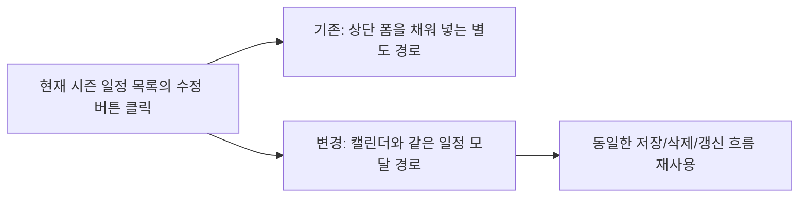

# 027 관리자 일정관리 목록수정버튼 캘린더모달 동일흐름 운영기록 (2026-03-31)

> 문서 링크: [docs/History/027_관리자_일정관리_목록수정버튼_캘린더모달_동일흐름_운영기록_2026-03-31.md](./027_관리자_일정관리_목록수정버튼_캘린더모달_동일흐름_운영기록_2026-03-31.md) | [GitHub](https://github.com/cloud-club/CloudClubAttendanceSystem/blob/gh-pages/docs/History/027_%EA%B4%80%EB%A6%AC%EC%9E%90_%EC%9D%BC%EC%A0%95%EA%B4%80%EB%A6%AC_%EB%AA%A9%EB%A1%9D%EC%88%98%EC%A0%95%EB%B2%84%ED%8A%BC_%EC%BA%98%EB%A6%B0%EB%8D%94%EB%AA%A8%EB%8B%AC_%EB%8F%99%EC%9D%BC%ED%9D%90%EB%A6%84_%EC%9A%B4%EC%98%81%EA%B8%B0%EB%A1%9D_2026-03-31.md)

## 빠른 흐름도

## 1. 배경
일정 관리는 이미 상단 폼과 하단 캘린더라는 두 UI를 함께 운영하고 있었다. 이 구조 자체는 운영자 습관을 보존하는 데 유리했지만, `현재 시즌 일정 목록`의 `수정` 버튼만은 여전히 상단 폼을 채워 넣는 과거 흐름을 타고 있었다.

반면 캘린더 쪽은 날짜 기반 모달에서 시작 시간, 종료 시간, 삭제 버튼 노출, 저장 후 목록/캘린더 재동기화까지 하나의 흐름으로 정리돼 있었다. 그래서 같은 “기존 일정 수정” 작업인데도 어디에서 진입했느냐에 따라 편집 표면이 달라지는 불일치가 남아 있었다.

## 2. 문제
운영자가 기대한 것은 “목록에서 수정 버튼을 눌러도 캘린더에서 일정 수정을 눌렀을 때와 같은 팝업이 떠야 한다”는 일관성이다. 하지만 실제 동작은 다음처럼 갈라져 있었다.

- 목록 `수정`: 상단 `시즌 일정 등록/수정` 폼으로 값 주입
- 캘린더 `+` 또는 기존 일정 수정: 별도 일정 모달 오픈

이 차이 때문에 사용자는 같은 수정 작업을 두 번 학습해야 했고, 삭제는 모달에만 있어 목록 수정 흐름에서는 시야가 나뉘었다.

## 3. 변경 결정
이번 변경에서는 **목록의 `수정` 버튼을 캘린더와 완전히 같은 모달 진입점으로 통일**하기로 했다.

기준은 아래와 같다.

1. 목록 `수정`은 더 이상 상단 폼을 편집 표면으로 사용하지 않는다.
2. 캘린더 모달의 상태 구성, 시간 프리필, 삭제 버튼 노출, 저장/삭제 후 갱신 흐름을 그대로 재사용한다.
3. 상단 폼과 드롭다운 기반 수정 기능은 이번 단계에서 제거하지 않는다.

즉 “기존 기능 삭제”보다 “목록 버튼의 UX 의미를 캘린더와 일치시키는 것”을 우선했다.

## 4. 구현에서 실제로 바뀐 것
### 4-1. 프런트 진입점 통합
- `scheduleItems`에서 `sessionKey`로 현재 회차를 찾는 헬퍼를 추가했다.
- 목록 `수정` 버튼은 더 이상 `scheduleSessionSelect`를 바꾸지 않고, 해당 회차를 찾아 일정 모달을 연다.

### 4-2. 모달 초기화 공통화
- 기존 `openScheduleCalendarModal(dateKey)` 내부에 있던 모달 상태 구성 로직을 공통 함수로 분리했다.
- 이 공통 함수는 `dateKey`만 알고 있을 때도, 특정 `item/sessionKey`를 알고 있을 때도 같은 모달 상태를 만들 수 있다.

### 4-3. 저장/삭제 후처리 재사용 유지
- `submitScheduleCalendarModal()`, `deleteFromCalendarModal()`의 저장/삭제 API 호출 및 후속 갱신 흐름은 그대로 유지했다.
- 따라서 목록 경로와 캘린더 경로가 모두 같은 후처리를 사용하게 됐다.

## 5. 검증 / 회귀 체크
### 자동 검증
- `node --check web/admin/scripts/22_schedule.js`
- `node scripts/doublecheck_static_guard.js`
- `git diff --check`

### 수동 검증
1. `현재 시즌 일정 목록`의 `수정` 버튼 클릭 시 상단 폼이 아니라 일정 모달이 열리는지
2. 같은 회차를 목록에서 열었을 때와 캘린더에서 열었을 때 제목/날짜/시간/삭제 버튼 노출이 같은지
3. 모달 저장 후 목록과 캘린더가 함께 새 값으로 갱신되는지
4. 모달 삭제 시 기존 확인 절차와 동일하게 동작하는지
5. 상단 드롭다운 기반 수정 기능은 회귀 없이 계속 동작하는지

## 6. 남은 리스크 / 후속 포인트
- 상단 폼 기반 수정과 모달 기반 수정이 함께 남아 있으므로, 장기적으로는 어떤 편집 표면을 표준으로 삼을지 더 정리할 필요가 있다.
- 현재는 목록 버튼의 UX만 통일했기 때문에, 향후에는 “캘린더 셀 클릭도 직접 수정 모달을 열어야 하는지” 같은 상호작용 확장이 다시 논의될 수 있다.
- `scheduleByDateMap`은 날짜당 1회차 정책을 전제로 하므로, 동일 날짜 다회차 요구가 다시 생기면 모달 진입 기준을 재설계해야 한다.

## 관련 문서
- [docs/Wiki/02_Admin_Side_Guide.md](../Wiki/02_Admin_Side_Guide.md) | [GitHub](https://github.com/cloud-club/CloudClubAttendanceSystem/blob/gh-pages/docs/Wiki/02_Admin_Side_Guide.md)
- [docs/Wiki/06_Doublecheck_Regression_Gate.md](../Wiki/06_Doublecheck_Regression_Gate.md) | [GitHub](https://github.com/cloud-club/CloudClubAttendanceSystem/blob/gh-pages/docs/Wiki/06_Doublecheck_Regression_Gate.md)
- [docs/History/009_일정관리_GUI_캘린더_일자유일성정책.md](./009_일정관리_GUI_캘린더_일자유일성정책.md) | [GitHub](https://github.com/cloud-club/CloudClubAttendanceSystem/blob/gh-pages/docs/History/009_%EC%9D%BC%EC%A0%95%EA%B4%80%EB%A6%AC_GUI_%EC%BA%98%EB%A6%B0%EB%8D%94_%EC%9D%BC%EC%9E%90%EC%9C%A0%EC%9D%BC%EC%84%B1%EC%A0%95%EC%B1%85.md)

## 관련 구현 파일
- [web/admin/scripts/22_schedule.js](../../web/admin/scripts/22_schedule.js) | [GitHub](https://github.com/cloud-club/CloudClubAttendanceSystem/blob/gh-pages/web/admin/scripts/22_schedule.js)
