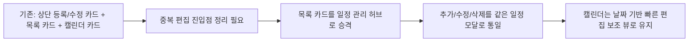

# 028 관리자 일정관리 목록중심통합 및 모달단일편집흐름 운영기록 (2026-04-04)

> 문서 링크: [docs/History/028_관리자_일정관리_목록중심통합_및_모달단일편집흐름_운영기록_2026-04-04.md](./028_관리자_일정관리_목록중심통합_및_모달단일편집흐름_운영기록_2026-04-04.md) | [GitHub](https://github.com/cloud-club/CloudClubAttendanceSystem/blob/gh-pages/docs/History/028_%EA%B4%80%EB%A6%AC%EC%9E%90_%EC%9D%BC%EC%A0%95%EA%B4%80%EB%A6%AC_%EB%AA%A9%EB%A1%9D%EC%A4%91%EC%8B%AC%ED%86%B5%ED%95%A9_%EB%B0%8F_%EB%AA%A8%EB%8B%AC%EB%8B%A8%EC%9D%BC%ED%8E%B8%EC%A7%91%ED%9D%90%EB%A6%84_%EC%9A%B4%EC%98%81%EA%B8%B0%EB%A1%9D_2026-04-04.md)

## 빠른 흐름도

## 1. 배경
이전 단계에서 `현재 시즌 일정 목록`의 `수정` 버튼은 이미 캘린더와 같은 일정 모달을 열도록 맞춰졌지만, 탭 전체로 보면 아직 구조가 과했다. 상단에는 `시즌 일정 등록/수정` 폼이 따로 있고, 아래에는 목록 카드가 있고, 다시 그 아래에 캘린더 카드가 있어 사용자가 같은 일을 세 군데에서 다르게 배우는 상태가 남아 있었다.

특히 운영자가 실제로 많이 하는 일은 “목록에서 확인하고, 추가하거나 수정한다”는 패턴에 가깝다. 이 기준으로 보면 상단 폼은 핵심 허브라기보다 과거 방식의 잔존 UI에 더 가까웠다.

## 2. 문제
기존 구조의 문제는 세 가지였다.

1. 상단 폼과 목록 카드가 같은 역할을 나눠 가지고 있어 시선이 분산됐다.
2. 삭제는 상단 폼의 별도 버튼과 모달 내부 버튼으로 나뉘어 있어 편집 표면이 일관되지 않았다.
3. `입력 초기화`는 실사용 가치가 크지 않은데도 핵심 액션 영역을 차지하고 있었다.

즉 일정 관리 탭은 기능상 완성에 가까웠지만, 구조상으로는 아직 “기존 방식 + 새 방식”이 겹쳐 있는 상태였다.

## 3. 변경 결정
이번 변경에서는 **일정 관리 탭을 목록 중심 구조로 재정리**하기로 했다.

기준은 아래처럼 고정했다.

- 상단 `시즌 일정 등록/수정` 폼 카드는 제거한다.
- `현재 시즌 일정 목록` 카드를 `현재 시즌 일정 관리` 카드로 승격한다.
- 추가는 카드 헤더의 `새 일정` 버튼으로 시작한다.
- 수정은 각 행의 `수정` 버튼으로 시작한다.
- 추가/수정/삭제는 모두 같은 일정 모달에서 처리한다.
- 삭제는 편집 모달 내부에서만 노출한다.
- `입력 초기화`는 제거한다.
- 캘린더 카드는 유지하고, 날짜 기준 빠른 편집 보조 뷰 역할로 둔다.

## 4. 구현에서 실제로 바뀐 것
### 4-1. 레이아웃 통합
- 상단 입력 폼 전체를 제거했다.
- 목록 카드 헤더에 `새 일정` 버튼을 추가했다.
- `scheduleActionResult` 메시지 영역은 목록 카드 내부에 유지했다.

### 4-2. 편집 흐름 단일화
- 목록 `새 일정`은 오늘 날짜 기준 새 일정 모달을 연다.
- 목록 `수정`은 기존 일정 모달의 편집 모드를 연다.
- 캘린더 `+` 버튼은 기존처럼 같은 모달을 사용한다.

### 4-3. 프런트 코드 정리
- 상단 폼 전용 상태/미리보기/이벤트 바인딩 로직을 제거했다.
- `scheduleSessionSelect`, 날짜/시간 입력, 저장/삭제/초기화 버튼에 의존하던 코드 경로를 제거했다.
- 변수 탭에서 일정 미리보기 갱신이 필요할 때는 상단 폼 대신 모달 미리보기를 갱신하도록 맞췄다.

## 5. 검증 / 회귀 체크
### 자동 검증
- `node --check`로 수정한 프런트 파일 문법 확인
- `node scripts/doublecheck_static_guard.js`
- `git diff --check`

### 수동 검증
1. 일정 관리 탭에 `현재 시즌 일정 관리`, `캘린더 보기` 2개 카드만 남았는지 확인
2. 목록 카드 헤더의 `새 일정` 버튼이 오늘 날짜 기준 새 일정 모달을 여는지 확인
3. 목록 `수정` 버튼이 같은 모달을 편집 모드로 여는지 확인
4. 삭제가 편집 모달 안에서만 보이고, 별도 삭제/초기화 버튼은 사라졌는지 확인
5. 목록/캘린더 어느 쪽에서 저장해도 둘 다 함께 갱신되는지 확인
6. 캘린더 `+` 버튼 동작이 회귀 없이 유지되는지 확인

## 6. 남은 리스크 / 후속 포인트
- 지금 구조는 `목록 중심 + 캘린더 보조`로 정리됐지만, 장기적으로는 캘린더 셀 클릭 상호작용을 더 적극적으로 쓸지 별도 판단이 필요하다.
- `새 일정` 기본 날짜는 오늘 날짜로 고정했으므로, 향후 운영 피드백에 따라 `현재 달력 선택 날짜 우선` 같은 미세 조정이 생길 수 있다.
- 동일 날짜 1회차 정책은 그대로이므로, 다회차 요구가 생기면 캘린더/목록/UI 흐름을 다시 설계해야 한다.

## 관련 문서
- [docs/Wiki/02_Admin_Side_Guide.md](../Wiki/02_Admin_Side_Guide.md) | [GitHub](https://github.com/cloud-club/CloudClubAttendanceSystem/blob/gh-pages/docs/Wiki/02_Admin_Side_Guide.md)
- [docs/Wiki/03_Admin_Tab_Change_Map.md](../Wiki/03_Admin_Tab_Change_Map.md) | [GitHub](https://github.com/cloud-club/CloudClubAttendanceSystem/blob/gh-pages/docs/Wiki/03_Admin_Tab_Change_Map.md)
- [docs/Wiki/06_Doublecheck_Regression_Gate.md](../Wiki/06_Doublecheck_Regression_Gate.md) | [GitHub](https://github.com/cloud-club/CloudClubAttendanceSystem/blob/gh-pages/docs/Wiki/06_Doublecheck_Regression_Gate.md)
- [docs/History/027_관리자_일정관리_목록수정버튼_캘린더모달_동일흐름_운영기록_2026-03-31.md](./027_관리자_일정관리_목록수정버튼_캘린더모달_동일흐름_운영기록_2026-03-31.md) | [GitHub](https://github.com/cloud-club/CloudClubAttendanceSystem/blob/gh-pages/docs/History/027_%EA%B4%80%EB%A6%AC%EC%9E%90_%EC%9D%BC%EC%A0%95%EA%B4%80%EB%A6%AC_%EB%AA%A9%EB%A1%9D%EC%88%98%EC%A0%95%EB%B2%84%ED%8A%BC_%EC%BA%98%EB%A6%B0%EB%8D%94%EB%AA%A8%EB%8B%AC_%EB%8F%99%EC%9D%BC%ED%9D%90%EB%A6%84_%EC%9A%B4%EC%98%81%EA%B8%B0%EB%A1%9D_2026-03-31.md)

## 관련 구현 파일
- [web/admin/index.html](../../web/admin/index.html) | [GitHub](https://github.com/cloud-club/CloudClubAttendanceSystem/blob/gh-pages/web/admin/index.html)
- [web/admin/scripts/10_auth.js](../../web/admin/scripts/10_auth.js) | [GitHub](https://github.com/cloud-club/CloudClubAttendanceSystem/blob/gh-pages/web/admin/scripts/10_auth.js)
- [web/admin/scripts/22_schedule.js](../../web/admin/scripts/22_schedule.js) | [GitHub](https://github.com/cloud-club/CloudClubAttendanceSystem/blob/gh-pages/web/admin/scripts/22_schedule.js)
