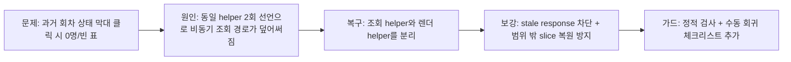

# 028 관리자 출석현황 과거회차 드릴다운 회귀복구 운영기록 (2026-04-04)

> 문서 링크: [docs/History/028_관리자_출석현황_과거회차_드릴다운_회귀복구_운영기록_2026-04-04.md](./028_관리자_출석현황_과거회차_드릴다운_회귀복구_운영기록_2026-04-04.md) | [GitHub](https://github.com/cloud-club/CloudClubAttendanceSystem/blob/gh-pages/docs/History/028_%EA%B4%80%EB%A6%AC%EC%9E%90_%EC%B6%9C%EC%84%9D%ED%98%84%ED%99%A9_%EA%B3%BC%EA%B1%B0%ED%9A%8C%EC%B0%A8_%EB%93%9C%EB%A6%B4%EB%8B%A4%EC%9A%B4_%ED%9A%8C%EA%B7%80%EB%B3%B5%EA%B5%AC_%EC%9A%B4%EC%98%81%EA%B8%B0%EB%A1%9D_2026-04-04.md)

## 빠른 흐름도

## 1. 배경
3월 31일 후속 안정화에서는, 진행 중 회차만 30초 자동 새로고침 대상으로 두고 과거 회차는 고정된 표로 유지하도록 출석현황 드릴다운을 정리했다. 운영 목표는 “실시간성”보다 “운영자가 보고 있던 표를 잃지 않는 것”을 우선하는 것이었다.

하지만 그 직후 운영 사용 중, 과거 회차 상태 막대를 눌렀을 때 하단 드릴다운이 `0명` 또는 `선택한 조건에 해당하는 멤버가 없습니다.`로 비어 보이는 새 회귀가 확인되었다. 의도는 “과거 회차는 고정 조회”였는데, 실제로는 가장 기본적인 조회 자체가 깨진 셈이었다.

## 2. 증상
실제 보고된 증상은 아래와 같았다.

- 과거 회차 상태 막대를 클릭하면 하단 카드 제목/회차는 맞게 바뀐다.
- 하지만 멤버 수가 `0명`으로 보이거나, 본문이 `선택한 조건에 해당하는 멤버가 없습니다.`로 비어 있다.
- 진행 중 회차만 실시간으로 갱신되어야 하는데, 과거 회차도 정상 멤버 목록을 보여주지 못해 드릴다운 자체의 신뢰가 무너진다.

즉 이 장애는 “30초 polling이 과하다” 수준이 아니라, **과거 회차 drilldown이라는 핵심 운영 기능이 사실상 unusable해진 장애**였다.

## 3. 원인 분석
원인은 프런트 `web/admin/scripts/21_dashboard.js` 내부 회귀였다.

### 3-1. 동일 이름 helper가 두 번 선언되었다
안정화 작업 과정에서 `updateAttendanceDashboardEventStatusSlice`가 아래 두 역할로 모두 쓰이기 시작했다.

1. event drilldown API를 호출해 최신 멤버 목록을 가져오는 **비동기 갱신 helper**
2. 이미 확보한 멤버 목록을 화면에 넣는 **순수 렌더 helper**

문제는 이 둘이 같은 이름으로 선언되었다는 점이다. JavaScript에서는 뒤쪽 함수 선언이 앞쪽 선언을 덮어쓴다. 그 결과, 클릭 경로와 ongoing refresh 경로가 “조회 helper” 대신 “렌더 helper”를 타게 되었고, 이때 멤버 배열이 전달되지 않으면 결국 빈 배열을 렌더하게 되었다.

### 3-2. 그래서 왜 과거 회차가 특히 비어 보였는가
과거 회차는 원래 polling 대상이 아니므로, 클릭 시 최초 조회 1번이 가장 중요하다. 그런데 그 최초 조회 경로가 함수 충돌로 사라지면서, 실제 API 응답을 읽지 못한 채 빈 배열이 바로 렌더되었다.

즉 “과거 회차는 고정”이라는 계약 자체는 맞았지만, **고정하기 전에 필요한 최초 조회가 깨져 버린 것**이 핵심이었다.

### 3-3. 진행 중 회차도 잠재적으로 같은 위험을 안고 있었다
운영 피드백은 과거 회차 빈 표로 먼저 나타났지만, 같은 함수 충돌은 진행 중 회차의 부분 갱신 경로에도 영향을 줄 수 있었다. 따라서 이번 복구는 past-session 클릭 복구만이 아니라, ongoing refresh 경로도 함께 안전하게 다시 고정해야 했다.

## 4. 이번에 변경한 내용
### 4-1. helper 역할을 분리했다
- `updateAttendanceDashboardEventStatusSlice(...)`
  event drilldown API 호출 + stale response 검사 + 실패 처리까지 맡는 유일한 **비동기 갱신 경로**로 고정했다.
- `renderAttendanceDashboardEventStatusSliceMembers(...)`
  이미 확보한 멤버 목록을 하단 카드에 넣는 **순수 렌더 경로**로 분리했다.

이렇게 해서 동일 이름 선언으로 비동기 조회가 덮어써지는 회귀 가능성을 제거했다.

### 4-2. stale response가 최신 클릭 결과를 덮지 못하게 했다
30초 polling과 운영자의 수동 클릭이 동시에 엇갈리면, 느린 응답이 더 최신 상태를 덮어쓸 수 있다. 이를 막기 위해 event-status 요청마다 sequence를 발급하고, 응답 시점에 “지금도 가장 최신 요청인가”를 검사하도록 보강했다.

즉 아래 상황을 모두 막는 것이 목표였다.

- 사용자가 A 회차를 눌렀다가 바로 B 회차를 누른 경우
- 자동 새로고침이 돌아가는 중에 사용자가 다른 slice를 누른 경우
- 사용자가 filter를 바꿔 기존 slice가 유효하지 않게 된 경우

### 4-3. 범위 밖 slice 복원을 막았다
summary를 새로 불러온 뒤에도 이전 slice snapshot을 복원하는 로직은 유지하되, 이제는 그 sessionKey가 새 summary의 status scope에 실제로 포함되는지 먼저 확인한다. 범위 밖이면 복원하지 않고 정리하는 쪽으로 고정했다.

### 4-4. 정적 가드와 수동 게이트를 보강했다
- `scripts/doublecheck_static_guard.js`에 event-status helper 중복 선언 금지 검사를 추가했다.
- `docs/Wiki/06_Doublecheck_Regression_Gate.md`에 아래 시나리오를 더 명시했다.
  - 과거 회차 클릭 직후 빈 표가 아닌 실제 멤버 목록이 보이는지
  - 과거 회차는 자동 새로고침이 돌아와도 재조회/비움 없이 유지되는지
  - filter 변경 후 범위 밖 slice가 잘못 복원되지 않는지

## 5. 잠재 리스크와 대응
이번 복구 후에도 주의할 리스크는 남아 있다.

1. **과거 회차 stable cache의 stale 가능성**
   수동 승인/유고 처리처럼 운영자가 과거 기록을 직접 바꾼 직후에는, 해당 변경이 local cache invalidation 경로를 제대로 타는지 계속 확인해야 한다.
2. **lateDeadline 경계 전환**
   진행 중 회차가 마감 시점을 넘는 순간, `pending -> absent` 전환 후에는 더 이상 live refresh 대상이 아니라 past-session 고정 대상으로 자연스럽게 넘어가야 한다.
3. **response ordering**
   이번에는 sequence guard를 넣었지만, 이후에도 비동기 응답이 UI를 바꾸는 경로를 추가할 때는 “응답 순서가 사용자 최신 의도와 일치하는가”를 반드시 같이 검토해야 한다.

## 6. 검증
### 자동 검증
- `node --check web/admin/scripts/21_dashboard.js`
- `node scripts/doublecheck_static_guard.js`
- `git diff --check`

### 수동 검증 포인트
- 과거 회차 상태 막대 클릭 시 멤버 목록이 즉시 보이고 `0명`/빈 표로 떨어지지 않는지
- 과거 회차 slice를 열어둔 상태에서 30초 polling이 돌아와도 표가 다시 비워지지 않는지
- 진행 중 회차 slice는 30초마다 같은 slice를 유지한 채 최신 데이터로 갱신되는지
- refresh 실패/timeout 시 기존 표가 유지되는지
- 날짜/회차 filter 변경 후 범위 밖 slice가 잘못 복원되지 않는지

## 7. 배포 영향 범위
이번 변경은 책임 경계상 **프런트 코드 + 문서 + 정적 가드** 수정이다.

- 코드 수정: `web/*`, `scripts/*`
- 운영 기록: `docs/History/*`
- 수동 회귀 체크 기준: `docs/Wiki/*`

현재 기준으로는 Apps Script API 계약이나 외부 콘솔 설정을 바꾸지 않았으므로, 배포 영향은 기본적으로 **GitHub Pages 반영**만 예상한다.

사람이 별도로 확인해야 하는 외부 상태는 이번 수정 범위에 포함되지 않는다.

- GitHub Secret 값
- Apps Script deployment 선택 상태
- Google Cloud OAuth / consent 설정
- Script Properties 값

## 관련 문서
- [docs/History/026_관리자_출석현황_실시간_pending표시_및_출석상태비율_회기준_운영기록_2026-03-31.md](./026_관리자_출석현황_실시간_pending표시_및_출석상태비율_회기준_운영기록_2026-03-31.md) | [GitHub](https://github.com/cloud-club/CloudClubAttendanceSystem/blob/gh-pages/docs/History/026_%EA%B4%80%EB%A6%AC%EC%9E%90_%EC%B6%9C%EC%84%9D%ED%98%84%ED%99%A9_%EC%8B%A4%EC%8B%9C%EA%B0%84_pending%ED%91%9C%EC%8B%9C_%EB%B0%8F_%EC%B6%9C%EC%84%9D%EC%83%81%ED%83%9C%EB%B9%84%EC%9C%A8_%ED%9A%8C%EA%B8%B0%EC%A4%80_%EC%9A%B4%EC%98%81%EA%B8%B0%EB%A1%9D_2026-03-31.md)
- [docs/Wiki/03_Admin_Tab_Change_Map.md](../Wiki/03_Admin_Tab_Change_Map.md) | [GitHub](https://github.com/cloud-club/CloudClubAttendanceSystem/blob/gh-pages/docs/Wiki/03_Admin_Tab_Change_Map.md)
- [docs/Wiki/06_Doublecheck_Regression_Gate.md](../Wiki/06_Doublecheck_Regression_Gate.md) | [GitHub](https://github.com/cloud-club/CloudClubAttendanceSystem/blob/gh-pages/docs/Wiki/06_Doublecheck_Regression_Gate.md)

## 관련 구현 파일
- [web/admin/scripts/01_state.js](../../web/admin/scripts/01_state.js) | [GitHub](https://github.com/cloud-club/CloudClubAttendanceSystem/blob/gh-pages/web/admin/scripts/01_state.js)
- [web/admin/scripts/20_attendance.js](../../web/admin/scripts/20_attendance.js) | [GitHub](https://github.com/cloud-club/CloudClubAttendanceSystem/blob/gh-pages/web/admin/scripts/20_attendance.js)
- [web/admin/scripts/21_dashboard.js](../../web/admin/scripts/21_dashboard.js) | [GitHub](https://github.com/cloud-club/CloudClubAttendanceSystem/blob/gh-pages/web/admin/scripts/21_dashboard.js)
- [scripts/doublecheck_static_guard.js](../../scripts/doublecheck_static_guard.js) | [GitHub](https://github.com/cloud-club/CloudClubAttendanceSystem/blob/gh-pages/scripts/doublecheck_static_guard.js)
