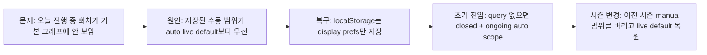

# 030 관리자 출석현황 실시간기본뷰 복구 운영기록 (2026-04-04)

> 문서 링크: [docs/History/030_관리자_출석현황_실시간기본뷰_복구_운영기록_2026-04-04.md](./030_관리자_출석현황_실시간기본뷰_복구_운영기록_2026-04-04.md) | [GitHub](https://github.com/cloud-club/CloudClubAttendanceSystem/blob/gh-pages/docs/History/030_%EA%B4%80%EB%A6%AC%EC%9E%90_%EC%B6%9C%EC%84%9D%ED%98%84%ED%99%A9_%EC%8B%A4%EC%8B%9C%EA%B0%84%EA%B8%B0%EB%B3%B8%EB%B7%B0_%EB%B3%B5%EA%B5%AC_%EC%9A%B4%EC%98%81%EA%B8%B0%EB%A1%9D_2026-04-04.md)

## 빠른 흐름도

## 1. 배경
출석현황 탭의 핵심 가치는 과거 집계 확인이 아니라, **오늘 진행 중인 출석을 실시간으로 읽는 운영 도구**라는 점이다. 따라서 기본 진입 상태는 항상 “완료 회차 + 현재 활성 회차”를 우선 보여주고, 진행 중 회차에서는 회색 `미기록(pending)`이 실시간으로 줄어드는 흐름을 확인할 수 있어야 한다.

그런데 최근 운영 화면에서는 과거 회차 그래프만 남고, 오늘 진행 중인 회차가 기본 뷰에서 사라진 것처럼 보이는 사례가 확인되었다. 현상 자체는 “실시간 기능이 사라졌다”처럼 보였지만, 실제로는 프런트 상태 우선순위가 꼬이면서 live default가 눌려 버린 문제에 가까웠다.

## 2. 무엇이 문제였는가
원인은 기능 삭제가 아니라 **state persistence 우선순위**였다.

- `attendanceDashboardSummary`는 여전히 진행 중 회차, `pending`, `ongoingSessionCount`, `availableSessions.isOngoing` 같은 정보를 정상 제공한다.
- 프런트도 원래는 `closed + ongoing`를 기본 범위로 auto hydration 하도록 되어 있다.
- 하지만 localStorage에 예전 날짜/회차 수동 필터가 남아 있으면, 페이지를 다시 열 때 그 상태가 기본값처럼 먼저 적용되면서 auto live default가 실행되지 않는다.

즉 운영자가 예전에 “최근 2회”나 특정 날짜 범위를 보고 나간 뒤 다시 접속하면, 오늘 진행 중 회차가 있어도 여전히 그 과거 수동 범위 안에 갇혀 버릴 수 있었다.

## 3. 이번에 고정한 기준
이번 복구에서는 아래 우선순위를 명확히 다시 고정했다.

1. **명시적 query/share URL**이 있으면 그 뷰를 최우선으로 따른다.
2. 그 외 일반 진입에서는 **현재 시즌의 closed + ongoing auto scope**를 기본값으로 쓴다.
3. localStorage는 더 이상 날짜/회차/manual scope를 기본값처럼 강하게 복원하지 않고, 보기 선호만 저장한다.

이 기준의 핵심은 “수동 범위를 영구 고정하는 편의”보다, **오늘 진행 중인 출석을 기본으로 보여주는 운영성**을 우선하는 것이다.

## 4. 구현에서 실제로 바뀐 것
### 4-1. localStorage는 display prefs만 저장
이제 출석현황 storage에는 아래 값만 남긴다.

- 그룹 필터(`group`)
- 정렬/Top-N/차트 타입
- 멤버 부분집합 선택/검색
- 세션 검색어

반대로 아래 값은 더 이상 reload 기본값으로 저장하지 않는다.

- `dateFrom`
- `dateTo`
- `sessionKeys`
- `sessionScopeMode`

즉 localStorage는 “최근 UI 취향”만 기억하고, live default를 덮는 범위 상태는 기억하지 않게 정리했다.

### 4-2. query 없는 첫 진입은 auto scope로 강제 복원
페이지 초기화 시 `dash_from`, `dash_to`, `dash_sessions`, `dash_scope=manual` 같은 **명시적 query**가 없으면, 저장된 예전 scope를 버리고 `auto`로 시작하게 바꿨다.

그 결과 첫 진입 시에는 다시 summary meta가 계산한 `closed + ongoing` 범위가 살아난다.

### 4-3. 시즌 변경 시 이전 시즌 manual 범위를 끊는다
운영상 더 위험한 경로는 시즌 전환이었다. 이전 시즌에서 특정 날짜/회차 manual 범위를 본 뒤 시즌을 바꾸면, 그 범위가 새 시즌에도 남아 live default를 가리는 문제가 생길 수 있다.

이번에는 시즌 변경 직후 출석현황 scope를 auto로 되돌리고, 새 시즌 기준으로 다시 대시보드를 읽게 정리했다.

### 4-4. auto 상태의 공유 링크는 live default를 박제하지 않는다
기존에는 auto 상태에서도 자동 주입된 날짜/회차 정보가 공유 URL에 그대로 실려, 링크를 다시 열면 수동 범위처럼 굳는 부작용이 있었다.

이제는 `manual`일 때만 `dash_from`/`dash_to`/`dash_sessions`/`dash_scope=manual`을 URL에 넣고, auto 상태의 링크는 live default를 그대로 유지하도록 바꿨다.

## 5. 무엇이 유지되는가
이번 복구는 실시간 기능 자체를 다시 새로 만든 것이 아니라, **이미 있던 기능이 기본 뷰에서 다시 보이도록 상태 우선순위를 바로잡는 작업**이다. 아래 항목은 유지된다.

- 진행 중 회차는 `pending(미기록)`을 실시간으로 표시
- 출석현황 탭이 열려 있는 동안 30초 자동 갱신
- 진행 중 회차의 열린 slice만 부분 재조회
- 과거 회차는 조회 가능하지만 자동 갱신 대상은 아님
- `lateDeadline` 이후 `pending -> absent`
- Apps Script summary/drilldown 계약 불변

## 6. 검증 포인트
### 자동 검증
- `node scripts/doublecheck_static_guard.js`
- `git diff --check`
- 수정 파일 문법 체크

### 수동 검증
- query 없이 출석현황 탭 첫 진입 시 `완료 회차 + 현재 활성 회차`가 기본 표시되는지
- 진행 중 회차가 있으면 상태 분포 차트에 회색 `미기록`이 보이는지
- 진행 중 회차 slice 클릭 시 아직 안 한 사람/이미 출석한 사람이 바로 보이는지
- 30초 후 진행 중 회차 숫자와 드릴다운이 함께 갱신되는지
- 시즌을 바꿔도 이전 시즌의 수동 날짜/회차 범위가 남지 않는지
- auto 상태에서 복사한 링크를 다시 열어도 live default가 유지되는지

## 7. 남은 리스크
- localStorage에 수동 범위를 영구 보존하던 과거 UX에 익숙한 운영자는 “새로고침 후 예전 필터가 남지 않는다”고 느낄 수 있다. 하지만 이번 기준에서는 이것이 의도된 변화다.
- 공유 URL은 explicit manual일 때만 강하게 유지되므로, 운영자가 특정 수동 뷰를 정말 고정해서 전달하려면 `필터 적용` 후 복사한 링크를 써야 한다.
- 시즌별로 멤버 부분집합 선택을 더 정교하게 기억할 필요가 있으면, 이후에는 scope와 별개로 member display prefs만 season-scoped storage로 분리하는 후속이 가능하다.

## 관련 문서
- [docs/History/026_관리자_출석현황_실시간_pending표시_및_출석상태비율_회기준_운영기록_2026-03-31.md](./026_관리자_출석현황_실시간_pending표시_및_출석상태비율_회기준_운영기록_2026-03-31.md) | [GitHub](https://github.com/cloud-club/CloudClubAttendanceSystem/blob/gh-pages/docs/History/026_%EA%B4%80%EB%A6%AC%EC%9E%90_%EC%B6%9C%EC%84%9D%ED%98%84%ED%99%A9_%EC%8B%A4%EC%8B%9C%EA%B0%84_pending%ED%91%9C%EC%8B%9C_%EB%B0%8F_%EC%B6%9C%EC%84%9D%EC%83%81%ED%83%9C%EB%B9%84%EC%9C%A8_%ED%9A%8C%EA%B8%B0%EC%A4%80_%EC%9A%B4%EC%98%81%EA%B8%B0%EB%A1%9D_2026-03-31.md)
- [docs/Wiki/03_Admin_Tab_Change_Map.md](../Wiki/03_Admin_Tab_Change_Map.md) | [GitHub](https://github.com/cloud-club/CloudClubAttendanceSystem/blob/gh-pages/docs/Wiki/03_Admin_Tab_Change_Map.md)
- [docs/Wiki/06_Doublecheck_Regression_Gate.md](../Wiki/06_Doublecheck_Regression_Gate.md) | [GitHub](https://github.com/cloud-club/CloudClubAttendanceSystem/blob/gh-pages/docs/Wiki/06_Doublecheck_Regression_Gate.md)

## 관련 구현 파일
- [web/admin/scripts/20_attendance.js](../../web/admin/scripts/20_attendance.js) | [GitHub](https://github.com/cloud-club/CloudClubAttendanceSystem/blob/gh-pages/web/admin/scripts/20_attendance.js)
- [web/admin/scripts/21_dashboard.js](../../web/admin/scripts/21_dashboard.js) | [GitHub](https://github.com/cloud-club/CloudClubAttendanceSystem/blob/gh-pages/web/admin/scripts/21_dashboard.js)
- [scripts/doublecheck_static_guard.js](../../scripts/doublecheck_static_guard.js) | [GitHub](https://github.com/cloud-club/CloudClubAttendanceSystem/blob/gh-pages/scripts/doublecheck_static_guard.js)
