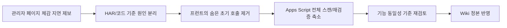

# 031 관리자 응답속도 최적화 및 기능동일성 재검증 운영 기록 (2026-04-05)

> 문서 링크: [docs/History/031_관리자_응답속도_최적화_및_기능동일성_재검증_운영기록_2026-04-05.md](./031_%EA%B4%80%EB%A6%AC%EC%9E%90_%EC%9D%91%EB%8B%B5%EC%86%8D%EB%8F%84_%EC%B5%9C%EC%A0%81%ED%99%94_%EB%B0%8F_%EA%B8%B0%EB%8A%A5%EB%8F%99%EC%9D%BC%EC%84%B1_%EC%9E%AC%EA%B2%80%EC%A6%9D_%EC%9A%B4%EC%98%81%EA%B8%B0%EB%A1%9D_2026-04-05.md) | [GitHub](https://github.com/cloud-club/CloudClubAttendanceSystem/blob/gh-pages/docs/History/031_%EA%B4%80%EB%A6%AC%EC%9E%90_%EC%9D%91%EB%8B%B5%EC%86%8D%EB%8F%84_%EC%B5%9C%EC%A0%81%ED%99%94_%EB%B0%8F_%EA%B8%B0%EB%8A%A5%EB%8F%99%EC%9D%BC%EC%84%B1_%EC%9E%AC%EA%B2%80%EC%A6%9D_%EC%9A%B4%EC%98%81%EA%B8%B0%EB%A1%9D_2026-04-05.md)

## 빠른 흐름도

## 1. 배경
이번 변경은 새로운 기능 추가가 아니라, 관리자 페이지의 느린 체감을 실제 병목 기준으로 정리하고 기존 기능을 유지한 채 응답 속도를 개선하기 위한 작업이었다. 구조는 그대로 `GitHub Pages UI + Apps Script API/RBAC + Google Sheets`를 유지하며, 인프라 자체를 바꾸지 않고 호출 수와 시트 스캔 범위를 줄이는 것이 목표였다.

직접 제공받은 HAR 기준으로, 정적 페이지 자체는 빨랐다. `DOMContentLoaded`는 약 `126ms` 수준이었지만 `onLoad`는 약 `20.3s`까지 늘어났다. 즉 브라우저 렌더가 아니라 로그인 이후 따라붙는 관리자 API 체인이 전체 체감을 지배하고 있었다.

HAR에서 반복적으로 느렸던 요청은 `authSession`, `adminSeasonList`, `session`, `ranking`, `scheduleList`, `attendanceDashboardSummary`, `attendanceDashboardDrilldown`, `graduationReport`, `fortuneVersionGet`, `fortuneVersionList`, `adminUrl`, `adminUsersList`였다. 공통점은 모두 `script.google.com/macros/.../exec` 단계의 `wait` 시간이 길고, 실제 JSONP 응답 본문을 내려주는 `script.googleusercontent.com/macros/echo`는 상대적으로 짧았다는 점이다.

## 2. 원인 분리
### 2-1. 프런트 원인
초기 관리자 진입은 `authSession -> adminSeasonList -> session/ranking/sheetLink`의 흐름을 거친 뒤, 기본 활성 탭이 `attend`이면 다시 `scheduleList -> members -> graduationReport`까지 이어졌다. 사용자는 아직 수동 승인 상세나 수료 판정 정보를 보지 않았는데도, 초기 화면에서 무거운 보고서가 함께 호출되고 있었다.

`status` 탭도 한 번의 진입으로 끝나지 않았다. 기본 범위를 서버 응답에서 다시 계산하면서 `attendanceDashboardSummary`가 재호출되고, summary 렌더 직후 평균 추이용 `attendanceDashboardDrilldown(memberAverage)`가 추가로 붙었다. 즉 사용자는 차트가 한 번 보이기 전에 summary와 drilldown을 연속으로 기다리게 되는 구조였다.

또한 `sheetLinkInfo`는 초기 진입 때마다 네트워크로 시트 링크를 조회했는데, 실제로 화면에 필요한 정보는 이미 프런트가 알고 있는 현재 선택 시즌/시트 값만으로 충분했다.

### 2-2. Apps Script 원인
`requireAdmin()`는 거의 모든 관리자 API 요청마다 관리자 세션을 재검증한 뒤, 최신 시즌 운영진 동기화와 `_admins` 재조회까지 수행했다. 이 작업은 권한 안전성에는 유리하지만, 가벼운 액션(`authSession`, `adminSeasonList`, `sheetLink`, `adminUrl`)에도 동일하게 들어가 바닥 지연을 키웠다.

무거운 통계 API는 시트 전체를 읽는 구조였다. `attendanceDashboardSummary`, `attendanceDashboardDrilldown`, `graduationReport`, `members`, `fortuneVersionGet/List`는 공통적으로 `getDataRange().getValues()` 또는 전체 버전/엔트리 시트를 매번 다시 읽는 패턴이 있었고, 대시보드 drilldown은 note가 필요한 소수 회차만 보더라도 광범위한 note 읽기를 수행하고 있었다.

## 3. 이번 변경에서 실제로 바꾼 것
### 3-1. 프런트 초기화 경량화
- `sheetLinkInfo`는 초기 API 호출 대신 현재 선택 시즌/시트 상태를 즉시 표시하도록 바꿨다.
- 초기 `initializeDashboard()`는 기본 활성 탭에 필요한 호출만 우선 처리하고, 비가시 탭 데이터는 실제 탭 진입 시점으로 늦췄다.
- `status` 탭은 `scheduleList`로 이미 알고 있는 회차 정보가 있으면 기본 기간/회차 범위를 먼저 확정한 뒤 summary를 요청하도록 바꿨다.
- `attendanceDashboardSummary`의 하이드레이션은 세션 범위와 날짜 범위를 따로따로 재호출하지 않고, 1회 재호출로 정리했다.

### 3-2. `attend` 탭의 수동 승인 체인 축소
- 기본 `attend` 탭 진입 시 `scheduleList`까지만 우선 로드하도록 바꿨다.
- 수동 승인 패널은 첫 상호작용 또는 유휴 시점에서만 `members`와 상태 데이터를 읽는다.
- 수동 승인 상태 계산은 더 이상 `graduationReport` 전체를 재사용하지 않고, `manualApproveStatus` 전용 API를 사용한다.

### 3-3. Apps Script 경량 API/캐시 추가
- `manualApproveStatus` API를 추가해, 선택한 회차의 한 열과 note만 읽어서 `statusByPhone`을 반환하도록 분리했다.
- `_admins` 조회는 Script Cache를 사용해 재활용하도록 바꿨다.
- 시즌 시트 후보(`season_nn`, legacy alias)도 Script Cache에 저장해 가벼운 시즌/시트 조회의 바닥 비용을 줄였다.
- 운세 버전/엔트리도 Script Cache를 추가해 `fortuneVersionGet`, `fortuneVersionList`의 재조회 비용을 줄였다.

### 3-4. 대시보드/보고서 스캔 축소
- `attendanceDashboardSummary`는 summary 자체에 필요 없는 note 전체 조회를 제거했다.
- `attendanceDashboardDrilldown`은 필요한 회차의 note 컬럼만 읽도록 바꿨다.
- 진행 중 회차가 있어도 아주 짧은 TTL(`15s`)의 서버 캐시를 허용하도록 조정했다.

## 4. 기능 동일성 재검증에서 중점으로 본 것
이번 성능 최적화는 “기능 변경”이 아니어야 했기 때문에, 중간에 동작 의미가 달라질 수 있는 부분은 다시 원래 해석으로 맞췄다.

1. `status` 탭의 평균 추이
- 멤버 미선택 시 기본은 여전히 `전체 평균`이어야 한다.
- 이 기준이 깨지면 기존 탭 해석이 달라지므로 최적화 중 한 차례 바뀐 동작을 다시 복구했다.

2. 관리자 권한 최신 시즌 동기화
- `requireAdmin()`에서 아예 동기화를 빼 버리면 운영진 추가/비활성 반영 시점이라는 기존 의미가 달라진다.
- 따라서 “매 요청 수행”은 유지하되, `_admins` 자체는 별도 캐시를 두는 방향으로 정리했다.

3. 수동 승인 패널
- 초기 진입 시 즉시 전체 데이터를 다 끌어오던 동작은 줄였지만, 사용자가 `attend` 탭에 들어왔을 때 수동 승인 패널이 계속 빈 상태로 남지 않도록 유휴 시점 자동 로드를 넣었다.
- 즉 기능은 유지하되, 메인 인터랙션을 막지 않는 방식으로 로딩 시점만 조정했다.

## 5. 바꾼 파일
### 프런트
- [web/admin/scripts/01_state.js](../../web/admin/scripts/01_state.js)
- [web/admin/scripts/10_auth.js](../../web/admin/scripts/10_auth.js)
- [web/admin/scripts/20_attendance.js](../../web/admin/scripts/20_attendance.js)
- [web/admin/scripts/21_dashboard.js](../../web/admin/scripts/21_dashboard.js)
- [web/admin/scripts/22_schedule.js](../../web/admin/scripts/22_schedule.js)
- [web/admin/scripts/27_qr_links.js](../../web/admin/scripts/27_qr_links.js)
- [web/admin/scripts/28_fortune.js](../../web/admin/scripts/28_fortune.js)

### Apps Script
- [Appsscript/00_entry_api.gs](../../Appsscript/00_entry_api.gs)
- [Appsscript/01_constants_access.gs](../../Appsscript/01_constants_access.gs)
- [Appsscript/10_auth_admin.gs](../../Appsscript/10_auth_admin.gs)
- [Appsscript/20_season_sheet_resolver.gs](../../Appsscript/20_season_sheet_resolver.gs)
- [Appsscript/31_dashboard.gs](../../Appsscript/31_dashboard.gs)
- [Appsscript/33_graduation_manual_excused.gs](../../Appsscript/33_graduation_manual_excused.gs)
- [Appsscript/34_season_import.gs](../../Appsscript/34_season_import.gs)
- [Appsscript/35_fortune_admin.gs](../../Appsscript/35_fortune_admin.gs)

## 6. 이번 변경으로 기대하는 효과
- 초기 관리자 진입에서 숨은 `graduationReport`, `members` 호출 제거
- `status` 탭 첫 진입 시 summary 재호출 횟수 축소
- 수동 승인 상태 계산을 `graduationReport` 전체 대신 경량 API로 대체
- 시즌/관리자/운세 메타의 재사용으로 가벼운 액션의 바닥 지연 감소

다만 Apps Script Web App의 `script.google.com -> script.googleusercontent.com` 리다이렉트와 서버리스 지연 자체는 남는다. 따라서 이 작업은 “느림 완전 제거”가 아니라 “불필요한 호출과 스캔 제거”에 해당한다.

## 7. 검증 결과
자동 검증 기준으로 아래 항목을 통과했다.

1. 변경 파일 구문 파싱 확인
- 프런트/Apps Script 주요 변경 파일 parse 통과

2. diff 형식 검증
- `git diff --check` 통과

3. 기능 동일성 기준으로 다시 맞춘 항목
- `status` 탭의 기본 평균 추이 해석 유지
- 관리자 시즌 동기화 의미 유지
- `attend` 탭 수동 승인 기능 유지

아직 수행하지 못한 것은 배포 후 실브라우저 재검증이다. 이건 레포 안에서 확인할 수 없는 외부 배포 상태가 포함되기 때문에, 실제 운영 HAR 재측정과 탭별 수동 확인이 추가로 필요하다.

## 8. 배포 후 더블체크 포인트
1. 첫 로그인 복구 후 기본 `attend` 탭 진입
- `scheduleList`는 보여야 하고, 수동 승인 패널은 약간 늦게 채워져도 기능은 동일해야 한다.

2. `status` 탭 진입
- 평균 추이는 기본적으로 `전체 평균`
- summary가 과도하게 2~3번 이상 연쇄 호출되지 않는지 확인

3. 수동 승인
- 회차 변경 시 상태 배지가 정상인지
- 수동 승인 실행 후 결과 표와 후속 새로고침이 유지되는지

4. 운세/QR/관리자/변수 탭
- 탭 진입 시 기능은 그대로 동작하되, 불필요한 초기 선로딩이 줄었는지 확인

## 9. 관련 문서
- [docs/Wiki/07_Admin_Performance_Optimization_Guide.md](../Wiki/07_Admin_Performance_Optimization_Guide.md)
- [docs/Wiki/04_Operations_Runbook.md](../Wiki/04_Operations_Runbook.md)
- [docs/Wiki/03_Admin_Tab_Change_Map.md](../Wiki/03_Admin_Tab_Change_Map.md)
- [docs/History/025_관리자_출석현황_평균출석시간추이_전환_운영기록_2026-03-10.md](./025_관리자_%EC%B6%9C%EC%84%9D%ED%98%84%ED%99%A9_%ED%8F%89%EA%B7%A0%EC%B6%9C%EC%84%9D%EC%8B%9C%EA%B0%84%EC%B6%94%EC%9D%B4_%EC%A0%84%ED%99%98_%EC%9A%B4%EC%98%81%EA%B8%B0%EB%A1%9D_2026-03-10.md)
- [docs/History/026_관리자_출석현황_실시간_pending표시_및_출석상태비율_회기준_운영기록_2026-03-31.md](./026_%EA%B4%80%EB%A6%AC%EC%9E%90_%EC%B6%9C%EC%84%9D%ED%98%84%ED%99%A9_%EC%8B%A4%EC%8B%9C%EA%B0%84_pending%ED%91%9C%EC%8B%9C_%EB%B0%8F_%EC%B6%9C%EC%84%9D%EC%83%81%ED%83%9C%EB%B9%84%EC%9C%A8_%ED%9A%8C%EA%B8%B0%EC%A4%80_%EC%9A%B4%EC%98%81%EA%B8%B0%EB%A1%9D_2026-03-31.md)
