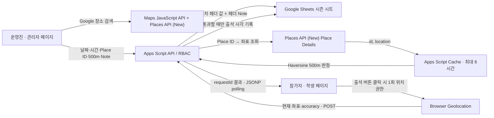

# 출석 GPS 장소 검증 · Google Maps Place ID · 서버리스 도입 기록

- 결정일: 2026-07-13
- 구현 구조: GitHub Pages + Apps Script + Google Sheets
- 현재 운영 절차: [Wiki 08 GPS·Place ID 출석 운영 가이드](../Wiki/08_GPS_Place_ID_Attendance_Guide.md)

## 1. 이 기능이 나오게 된 계기

기존 출석은 회차의 날짜와 시간만 맞으면 전화번호로 처리할 수 있었다. 실제 행사장에 오지 않은 사람도 출석 가능 시간대를 알면 원격으로 요청할 수 있다는 뜻이다. 이번 기능은 출석 시스템을 단순한 시간 확인에서 한 단계 고도화해, 일반적인 원격 출석을 어렵게 하고 실제 행사장에 온 사람만 출석하도록 유도하기 위해 시작됐다.

목표는 다음 세 가지였다.

1. 실제 출석 여부에 대한 신뢰도를 높인다.
2. 별도 서버와 데이터베이스를 추가하지 않는다.
3. 기존 Google 계정, Apps Script, Sheets, GitHub Pages 운영 모델을 유지한다.

GPS는 브라우저 개발자 도구나 가짜 위치 앱으로 조작될 수 있으므로 물리적 참석을 암호학적으로 증명하지는 않는다. 이 기능의 보안 목표는 일반적인 원격 출석과 기존 API 직접 호출 우회를 차단하는 것이다. 예외 상황은 기존 관리자 수동 승인으로 처리한다.

## 2. 왜 위도·경도 대신 Place ID를 저장하는가

관리자가 장소를 선택하면 Google Places가 그 장소를 식별하는 Place ID를 반환한다. 시트에는 이 ID만 장기 저장하고, Google이 제공한 장소 좌표는 영구 저장하지 않는다.

- Place ID는 장기 저장할 수 있는 장소 식별자다.
- 좌표를 운영자가 직접 입력하는 실수를 줄인다.
- 장소 좌표는 출석 판정 시 Apps Script가 Google Places API로 조회한다.
- 조회한 좌표는 Apps Script `CacheService`에 최대 6시간만 임시 보관하고, 만료되면 Place ID로 다시 조회한다.
- 참가자의 현재 좌표와 정확도도 판정에만 사용하고 Sheets, 셀 Note, 브라우저 저장소에 남기지 않는다.

여기서 6시간은 행사나 일정의 유효기간이 아니다. 한두 달 전에 만든 일정도 시트 헤더에 Place ID가 계속 남으므로 정상 동작한다. 6시간은 동일 Place ID의 좌표를 Google에 반복 조회하지 않기 위한 짧은 성능·비용 캐시일 뿐이다. 캐시가 없거나 일찍 사라져도 Apps Script가 다시 Google에서 좌표를 조회한다.

Google은 Place ID가 바뀔 수 있으므로 12개월 이상 지난 ID를 갱신하도록 권고한다. 오래된 ID 조회가 실패하면 운영자가 관리자 화면에서 장소를 다시 선택한다. 관련 기준은 [Google Place ID 문서](https://developers.google.com/maps/documentation/places/web-service/place-id)와 [Places 정책](https://developers.google.com/maps/documentation/places/web-service/policies)을 따른다.

## 3. 시트 구조 결정

시즌 시트는 회원 프로필 열 뒤에 회차별 출석 열이 붙는 구조다. 회차마다 장소 정책이 다르므로 별도의 공통 장소 열을 만들지 않고, 각 회차의 헤더 셀 문자열에 기계 판독 정책을 넣는다. 사람이 읽는 안내는 같은 헤더 셀의 Note에 저장한다.

| 구분 | 헤더 셀 값 | 헤더 셀 Note | 회원 행의 같은 열 |
|---|---|---|---|
| 과거 회차 | `2026-09-20-14:00~16:00` | 비어 있음 또는 기존 메모 | 출석 시각 |
| 장소 제한 없음 | `2026-09-20-14:00~16:00\|v=1\|gps=0` | 선택적 회차 메모 | 출석 시각 |
| 장소 제한 필수 | `2026-09-20-14:00~16:00\|v=1\|gps=1\|pid=...\|r=500` | 학생에게 보여 줄 장소 안내 | 출석 시각 |

`sessionKey`는 항상 날짜·시각 부분인 `2026-09-20-14:00`에서 만든다. 장소, 반경, Note를 바꿔도 기존 출석 데이터와 세션 키가 유지된다. 기존 헤더에 위치 suffix가 없으면 `gps=0`으로 해석해 과거 데이터와 호환한다.

잘못된 `gps=1` 문자열은 세션 자체를 숨기지 않는다. 대시보드와 과거 기록에서는 계속 회차로 보이지만, 새 출석은 실패 폐쇄해 운영자가 정책을 다시 저장하도록 한다. `_session_meta`는 기존 시간 임계값 전용 7열 구조를 그대로 유지한다.

## 4. 최종 아키텍처

학생 좌표를 기존 JSONP GET URL에 넣으면 브라우저 기록, 중간 로그, 오류 URL에 남을 수 있다. 따라서 위치 출석만 `text/plain` POST로 보내고, 브라우저는 128-bit 임시 `requestId`로 결과를 짧게 조회한다. Apps Script 결과 캐시에는 좌표, 전화번호, 토큰을 넣지 않는다.

클라이언트만 500m를 비교하면 사용자가 JavaScript를 건너뛰고 공개 `attendance` API를 직접 호출할 수 있다. 최종 거리 계산과 출석 셀 쓰기 여부는 Apps Script가 결정한다. 제한 회차의 기존 GET 출석 요청은 위치 누락으로 실패한다.

## 5. 운영 정책

- 관리자만 일정의 장소 정책을 생성·수정한다.
- 위치 제한은 회차마다 켜거나 끌 수 있다.
- 현재 허용 반경은 회차 헤더에 명시적으로 `500m`를 저장한다.
- 위치 필수 회차에서 학생 좌표 정확도가 100m보다 나쁘면 재시도를 요구한다.
- 위치 권한 거부, 위치 서비스 불가, 시간 초과, 반경 밖, Place ID 조회 실패는 출석을 기록하지 않는다.
- 장소 제한이 없는 회차는 위치 권한을 요청하지 않고 기존 흐름을 유지한다.
- GPS 사용이 어려운 참가자는 운영진이 기존 수동 승인 기능과 감사 Note를 사용한다.
- Place ID가 12개월 이상 됐거나 `GOOGLE_PLACE_NOT_FOUND`가 발생하면 장소를 다시 선택한다.

## 6. Google 계정 하나로 운영하는 이유

새 플랫폼 계정을 늘리지 않고 기존 Google 운영 계정 아래의 표준 Google Cloud 프로젝트를 사용한다. 한 프로젝트에서 결제, Maps JavaScript API, Places API (New), 두 개의 제한 키를 관리한다.

- 브라우저 키: GitHub Pages 관리자 화면에 주입한다. 배포 후 사용자에게 보이므로 비밀성 대신 HTTP referrer와 API 제한으로 보호한다.
- 서버 키: Apps Script Script Property에만 저장하고 Places API (New)로 제한한다.
- GitHub에는 브라우저 키와 Apps Script URL만 Actions Secret으로 보관한다.

브라우저 GPS는 `navigator.geolocation`을 사용하므로 Google Geolocation API는 필요하지 않다. Maps/Places 키 보안은 [Google Maps API 보안 권고](https://developers.google.com/maps/api-security-best-practices)를 따른다.

## 7. 배포 순서를 고정한 이유

새 프런트가 구버전 Apps Script에 연결되면 관리자는 GPS 정책이 저장됐다고 오해할 수 있다. 그래서 백엔드를 먼저 배포하고 `apiInfo.capabilities.locationAttendanceV1=true`를 확인한 뒤 Pages를 배포한다. Pages 워크플로도 이 capability가 없으면 실패하도록 했다.

1. GCP API·키·결제 준비
2. Apps Script 파일 및 Script Property 반영
3. 기존 Apps Script deployment를 새 버전으로 갱신
4. `apiInfo` capability와 Places 서버 설정 확인
5. GitHub Actions Secret 추가
6. GitHub Pages 배포
7. 테스트 시즌에서 실제 Google 장소를 저장·재열기·삭제하는 통합 canary 수행
8. 실제 모바일에서 제한 없음, 반경 안, 반경 밖, 권한 거부, 수동 승인 검증

최초 도입의 Place 저장 canary는 새 관리자 UI가 Pages에 배포된 뒤에만 실행할 수 있다. 따라서 배포 전 capability 확인과 배포 후 실제 Place 검증을 구분한다. canary가 실패하면 운영 GPS 회차를 만들지 않고 Pages를 직전 artifact/commit으로 즉시 롤백한다.

구체적인 수동 작업은 [Wiki 08 가이드](../Wiki/08_GPS_Place_ID_Attendance_Guide.md)를 현재 정본으로 사용한다.

## 8. 배포 전 의무와 남은 위험

Google Places를 사용하는 서비스는 공개 이용약관과 개인정보 처리 안내를 제공하고, 지도 없이 Place 데이터를 표시할 때 Google Maps attribution을 함께 보여야 한다. 이 요구를 후속 과제로 남기지 않고 다음처럼 배포 구성에 포함했다.

- `web/privacy.html`: 현재 위치의 처리 목적, Apps Script 전송, 참가자 좌표 미저장, 문의 절차 공개
- `web/terms.html`: Google Maps 관련 약관 적용과 위치 판정의 한계 공개
- 관리자 장소 요약: 같은 컨테이너 안에 `Google Maps`와 반환된 제3자 attribution 표시
- 학생·관리자 페이지: 개인정보 처리 안내와 이용약관 링크 제공
- Pages workflow: 두 정책 페이지와 attribution 표면이 없으면 배포 중단

운영진은 실제 배포 전에 조직의 최신 개인정보·이용약관 정책과 위 페이지 내용을 다시 검토해야 한다. 기준은 [Google Places 정책과 attribution 요구사항](https://developers.google.com/maps/documentation/places/web-service/policies)이다.

- GPS 위조는 완전히 막을 수 없다. 더 강한 보장이 필요하면 현장 단기 코드나 운영진 승인 같은 두 번째 요소를 추가한다.
- 실내에서는 위치 정확도가 나쁠 수 있다. 실제 행사장에서 100m 정확도 기준과 500m 반경을 사전 시험한다.
- Places API에는 결제·할당량·정책이 적용된다. GCP 예산 알림과 사용량 모니터링이 필요하다.
- 학생 현재 위치 확인은 브라우저 `navigator.geolocation`이라 Maps 과금 대상이 아니지만, 관리자 자동완성·장소 상세조회와 Apps Script Place Details는 Billing이 필요한 종량제 호출이다. 현재 예상 운영량은 월간 무료 한도보다 매우 작지만 무료 전용 구조는 아니며, 특히 `displayName`을 포함한 신규 장소 선택은 현행 세션 가격 정책상 월 1,000건 무료인 상위 SKU로 처리될 수 있다. 세부 한도와 운영 조치는 [Wiki 08 무료 사용량과 과금 경고](../Wiki/08_GPS_Place_ID_Attendance_Guide.md#무료-사용량과-과금-경고)를 따른다.
- Apps Script Cache는 조기에 비워질 수 있다. 출석 셀 기록 직후 결과 캐시가 사라지면 학생 화면이 타임아웃을 보일 수 있으므로, 사용자는 출석현황을 확인한 뒤 재시도한다. 별도 결과 데이터베이스는 두지 않는다는 제약 때문에 수용한 잔여 위험이다.
- 레포는 실제 GCP 결제 상태, 활성 API, 키 값·제한, GitHub Secret 값, 현재 deployment 버전을 확인할 수 없다. 이 값들은 운영자가 외부 콘솔에서 직접 확인한다.
