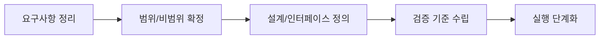

# Mission 2 Plan (Draft) - 출석 현황 대시보드 확장

> 문서 링크: [docs/History/mission-2-plan.md](./mission-2-plan.md) | [GitHub](https://github.com/cloud-club/CloudClubAttendanceSystem/blob/gh-pages/docs/History/mission-2-plan.md)

## 빠른 흐름도

## 1) 목표
- 기존 조회/랭킹을 유지한 상태에서 시즌 대시보드 추가.
- KPI + 인터랙티브 차트 + 필터 + 드릴다운 제공.
- v2 스키마(A~L + M+)를 기본으로 집계하되 v1 fallback 유지.

## 2) 범위
1. KPI 카드
- 전체 인원, OB, YB
- 평균 출석률/지각률/결석률(선택)

2. 차트
- 행사별 출석률 (bar/line 전환)
- 행사별 상태 분포 (stacked)
- 사용자별 출석 시간 추이 (line, multi-select)

3. 필터
- 시즌
- OB/YB
- 행사 다중 선택
- 기간(시즌 내)
- Top-N/정렬

4. 드릴다운
- 행사 클릭 -> 해당 행사 멤버 상태 목록
- 멤버 클릭 -> 시계열 상세

5. 기존 기능 유지
- 개인 출석 조회
- 출석률 순위

## 3) API 설계 초안
- `attendanceDashboardSummary`
  - in: `season`, `filters`, `adminToken`
  - out: KPI + 차트 집계
- `attendanceDashboardDrilldown`
  - in: `season`, `type(event|member)`, `key`, `adminToken`
  - out: 상세 행 데이터

원칙:
- 필터 반영된 집계는 서버 계산.
- 드릴다운은 on-demand 호출.

## 4) 데이터 주의사항
- `member_role`(현직자/학생)는 아직 미구현.
- 코드/문서에 `TODO(member_role)`만 남기고 실제 분기 로직은 보류.

## 5) 테스트 초안
1. 동일 필터에서 KPI/차트/테이블 일관 반응
2. hover/click 인터랙션 정상
3. 드릴다운 결과 합계가 상위 집계와 일치
4. 기존 조회/랭킹 regression 없음
5. v1/v2 시즌 탭 혼합 상태에서도 오류 없음

## 6) 롤백
- 대시보드 API/탭을 feature flag(또는 탭 비활성)로 즉시 숨길 수 있게 구현.
- 기존 조회/랭킹 코드는 분리 유지하여 장애 시 즉시 fallback.
