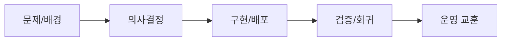

# Mission Auth Result - OAuth 관리자 전용 전환 구현 기록

> 문서 링크: [docs/History/mission-auth-result.md](./mission-auth-result.md) | [GitHub](https://github.com/cloud-club/CloudClubAttendanceSystem/blob/gh-pages/docs/History/mission-auth-result.md)

## 빠른 흐름도

## 1) 구현 완료 항목
- Google OAuth 관리자 로그인(`authGoogleConfig`, `authGoogleLogin`, `authSession`, `authLogout`) 적용
- 관리자 화이트리스트 `_admins` 도입 및 Super/Season Admin 권한 모델 적용
- 고정 Super Admin(`cloudclub2022@gmail.com`) 정책 적용
- Super Admin 전용 관리자 CRUD(`adminUsersList`, `adminUsersUpsert`, `adminUsersDelete`) 적용
- 시즌 권한 가드 단일 지점 적용(`requireAdmin`, `requireSuperAdmin`, `requireSeasonAccess`)
- 최신 시즌 운영진 기반 자동 동기화 적용:
  - 최신 시즌 `운영진 여부=TRUE` + Gmail -> `season_admin` 자동 등록/업데이트
  - 최신 시즌 운영진 목록 미포함 `season_admin` -> 자동 비활성화(`is_active=false`)
  - 수동 비활성 계정은 자동 재활성화하지 않음
- 관리자 프런트 OAuth 게이트 적용(인증 전 `adminApp` 숨김)
- role 기반 탭 노출/차단(super 전용 탭 분리)
- 관리자 CRUD 탭 UI/동작 추가
- 공통 API URL sanitize에 `idToken`, `credential` 마스킹 추가

## 2) 레거시 제거
- 삭제:
  - `AdminInterface.html`
  - `StudentInterface.html`
  - `Index.html`
- `Code.gs`에서 레거시 HTML fallback 렌더링 제거
- `generateStudentQRCodeUrl`/`getAdminAccessUrl`의 legacy `mode` fallback 제거

## 3) 문서 반영
- `docs/History/mission-auth-plan.md` 신규 작성
- OAuth 전환/레거시 제거 반영:
  - `docs/History/baseline.md`
  - `docs/History/001_프로젝트_개요_및_운영_가이드.md`
  - `docs/History/002_시스템_기술_레퍼런스.md`
  - `docs/History/003_구글시트에서_깃허브페이지스_마이그레이션_기록.md`
  - `docs/History/004_세션_리다이렉트_ORB_이슈_해결_기록.md`
  - `docs/History/012_운영자_개발자_통합_검증체크리스트.md`

## 4) 검증 결과
- `cp Code.gs /tmp/Code_gs_check.js && node --check /tmp/Code_gs_check.js` 통과
- `node --check web/admin/admin.js` 통과
- `node --check web/shared/api-jsonp.js` 통과
- `node --check web/student/student.js` 통과

## 5) 운영 후속 체크
1. Apps Script Script Properties에 `GOOGLE_OAUTH_CLIENT_ID` 설정 여부 확인
2. `_admins` 시트 초기 관리자 데이터 입력 + `is_active` 점검
3. Super/Season Admin 계정별 로그인/권한 스모크 테스트
4. 레거시 URL 404 확인 및 `/web/*` 동작 확인
