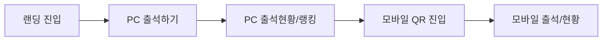

# User Video Script (2min)

> 문서 링크: [docs/Video/UserVideoScript_2min.md](./UserVideoScript_2min.md) | [GitHub](https://github.com/cloud-club/CloudClubAttendanceSystem/blob/gh-pages/docs/Video/UserVideoScript_2min.md)

## 빠른 흐름도

## 영상 목적
이 영상은 학생 관점에서 “어떻게 접속하고, 어떻게 출석/조회하는지”를 2분 안에 보여주는 사용자 안내용 스크립트입니다.

## 고정 촬영 조건
- 언어: 한국어
- 러닝타임: 2분
- 시청자: 학생/운영 공지 수신자
- URL 기준:
  - 랜딩: `https://cloud-club.github.io/CloudClubAttendanceSystem/web/`
  - 학생: `https://cloud-club.github.io/CloudClubAttendanceSystem/web/student/latest/`
- 데이터 노출 정책: 실데이터 노출 허용(내부 공유 전제)

## 프리프로덕션 (사용자 영상)
1. PC 브라우저에서 `web/` 랜딩, `web/student/latest/`를 미리 열어둡니다.
2. 모바일 기기에서 QR 스캔 앱을 준비합니다.
3. 출석 가능한 테스트 전화번호 1개와 조회용 전화번호 1개를 메모합니다.
4. 브라우저 확대/축소를 100%로 맞춰 텍스트 가독성을 고정합니다.

## 씬별 대본 (2:00)

### Scene 1 (00:00-00:15) - 진입 경로 소개
- 화면 목표: 사용자 진입 경로를 단번에 이해시키기
- 화면 조작문:
1. PC 브라우저 주소창에 `.../web/` 입력 후 랜딩 진입
2. `출석하기` 버튼이 보이도록 중앙 배치
- 내레이션:
"웹사이트에 직접 접속하거나 노션, GitHub에 있는 링크를 눌러도 모두 이 랜딩 화면으로 들어옵니다."
- 컷 전환 기준:
`출석하기` 버튼을 마우스로 가리킨 뒤 바로 컷

### Scene 2 (00:15-00:45) - PC 출석 시연
- 화면 목표: 학생의 핵심 행동(전화번호 입력 → 출석 완료) 전달
- 화면 조작문:
1. `출석하기` 버튼 클릭
2. 학생 페이지 `출석하기` 탭에서 전화번호 입력
3. `지금 출석하기` 클릭
4. 결과 카드가 보이도록 잠시 정지
- 내레이션:
"학생은 전화번호만 입력하면 출석이 처리되고, 정시인지 지각인지 결과를 바로 확인할 수 있습니다."
- 컷 전환 기준:
출석 결과가 렌더링된 시점에서 1초 홀드 후 컷

### Scene 3 (00:45-01:10) - PC 출석현황/랭킹 시연
- 화면 목표: 조회와 랭킹 확인 흐름 전달
- 화면 조작문:
1. 상단 `출석현황` 탭 클릭
2. 전화번호 입력 후 `조회하기` 클릭
3. `출석률 순위` 영역까지 스크롤
- 내레이션:
"같은 페이지에서 누적 출석 현황을 조회하고, 하단에서 시즌 순위를 함께 확인할 수 있습니다."
- 컷 전환 기준:
랭킹 카드가 화면 중앙에 들어오면 컷

### Scene 4 (01:10-01:35) - 모바일 QR 진입 시연
- 화면 목표: 모바일 진입이 QR 중심임을 명확히 전달
- 화면 조작문:
1. 운영진이 준비한 학생용 QR 코드를 카메라로 스캔
2. 링크를 눌러 `.../web/student/latest/` 접속
3. 모바일 화면에서 탭 네비(`출석하기/출석현황`) 노출
- 내레이션:
"모바일은 운영진이 제공한 QR 코드를 스캔하면 최신 시즌 학생 페이지로 바로 연결됩니다."
- 컷 전환 기준:
모바일에서 페이지 로딩 완료 후 컷

### Scene 5 (01:35-02:00) - 모바일 사용 마무리
- 화면 목표: PC와 모바일 동작 동일성 강조
- 화면 조작문:
1. 모바일 `출석하기`에서 전화번호 입력(또는 직전 입력값 재사용)
2. `출석현황` 탭으로 이동
3. 조회 버튼만 짧게 시연
- 내레이션:
"PC와 모바일 모두 사용 방법은 동일합니다. 운영 공지는 항상 latest URL 기준으로 안내됩니다."
- 컷 전환 기준:
`출석현황` 탭 화면에서 페이드아웃

## 촬영 체크포인트
1. 2분 이내 편집이 가능하도록 각 씬 원본은 20~40초로 촬영합니다.
2. 탭 이름은 화면 표기 그대로 노출합니다: `출석하기`, `출석현황`.
3. URL 안내 문구는 `latest` 고정 원칙과 충돌하지 않게 유지합니다.
4. 출석 실패 메시지가 뜨면 재촬영 대신 성공 케이스가 있는 take를 사용합니다.

## 검증 기준
1. PC 진입 → 출석 → 현황/랭킹 흐름이 모두 포함되어야 합니다.
2. 모바일 QR 진입 컷이 반드시 1회 이상 포함되어야 합니다.
3. 학생 안내 문구가 운영 정책(`latest 고정`)과 일치해야 합니다.
