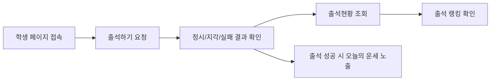

# User Side Guide

> 문서 링크: [docs/Wiki/01_User_Side_Guide.md](./01_User_Side_Guide.md) | [GitHub](https://github.com/cloud-club/CloudClubAttendanceSystem/blob/gh-pages/docs/Wiki/01_User_Side_Guide.md)

## 빠른 흐름도

## 사용자 관점 시나리오
학생 입장에서는 복잡한 기술 구조보다 “오늘 출석이 정상 처리됐는지”가 가장 중요합니다. 그래서 사용자 흐름은 접속 → 출석 요청 → 결과 확인 → 누적 현황 확인으로 단순하게 유지되어 있습니다.

운영 측에서도 이 단순 흐름을 유지해야 안내 비용이 줄어듭니다. 아래 절차는 실제 학생 안내 메시지와 동일한 순서로 정리했습니다.

### 1) 출석하기 및 출석 현황 확인
1. 학생은 기본 진입 경로인 `/web/student/latest/`로 접속합니다.
2. `출석하기` 탭에서 전화번호(숫자 10~11자리)를 입력하고 출석을 요청합니다.
3. 성공 시 `정시/지각` 판정과 현재 출석 통계를 바로 확인합니다.
4. `출석현황` 탭에서 같은 전화번호로 누적 현황(출석/지각/결석/유고)을 조회합니다.

### 2) 출석 랭킹 확인
랭킹은 단순 재미 요소가 아니라, 학생이 자신의 시즌 참여 상태를 빠르게 파악하는 지표입니다. 그래서 출석현황 조회 흐름과 같은 화면에서 자연스럽게 이어지도록 배치되어 있습니다.

1. `출석현황` 탭 하단 랭킹 보드에서 시즌 랭킹을 확인합니다.
2. 정렬 규칙은 `출석 횟수` 우선, 동률 시 `평균 출석 오프셋`, 최종 동률은 이름 순입니다.

### 3) 오늘의 운세 확인
오늘의 운세는 독립 탭이 아니라 출석 성공 결과 카드의 일부입니다. 이 설계는 학생이 별도 액션 없이 출석 완료 맥락 안에서 메시지를 확인하도록 하기 위한 것입니다.

1. 서버(`Code.gs`)는 출석 성공 응답에 `fortune` 값을 포함합니다.
2. 학생 화면(`web/student/student.js`)은 같은 결과 카드에서 운세를 렌더링합니다.

## 왜 latest 진입 경로를 고정했는가
시즌별 URL을 직접 안내하면 공지 누락이나 이전 시즌 북마크 때문에 잘못된 페이지로 진입하는 문제가 자주 발생합니다. 이를 줄이기 위해 학생 공지 기준 URL은 항상 `/web/student/latest/`로 고정합니다.

운영자는 시즌 변경 시 내부 매핑만 갱신하고, 학생에게는 동일 URL만 안내하면 됩니다. 이 방식이 인수인계 시에도 가장 실수가 적습니다.

## 자주 발생하는 질문 (FAQ)
### Q1. 출석 버튼을 눌렀는데 실패 메시지가 나옵니다.
대부분은 세션 미오픈/마감, 미등록 전화번호, 또는 이미 처리된 중복 출석입니다. 먼저 메시지 코드를 확인한 뒤 운영진에게 문의하도록 안내합니다.

### Q2. 랭킹이 바로 갱신되지 않습니다.
출석 처리 직후 반영 시점에 따라 지연이 생길 수 있습니다. 새로고침 후 다시 조회하도록 안내하면 대부분 해소됩니다.

### Q3. 오늘의 운세가 보이지 않습니다.
운세는 출석 성공 시에만 노출됩니다. 실패 응답이나 조회 전용 동작에서는 표시되지 않습니다.

## 관련 파일
- 학생 HTML: [web/student/latest/index.html](../../web/student/latest/index.html) | [GitHub](https://github.com/cloud-club/CloudClubAttendanceSystem/blob/gh-pages/web/student/latest/index.html)
- 학생 로직: [web/student/student.js](../../web/student/student.js) | [GitHub](https://github.com/cloud-club/CloudClubAttendanceSystem/blob/gh-pages/web/student/student.js)
- 백엔드 출석 API: [Code.gs](../../Code.gs) | [GitHub](https://github.com/cloud-club/CloudClubAttendanceSystem/blob/gh-pages/Code.gs)

## 관련 문서
- 관리자 가이드: [02_Admin_Side_Guide.md](./02_Admin_Side_Guide.md) | [GitHub](https://github.com/cloud-club/CloudClubAttendanceSystem/blob/gh-pages/docs/Wiki/02_Admin_Side_Guide.md)
- 운영 런북: [04_Operations_Runbook.md](./04_Operations_Runbook.md) | [GitHub](https://github.com/cloud-club/CloudClubAttendanceSystem/blob/gh-pages/docs/Wiki/04_Operations_Runbook.md)
