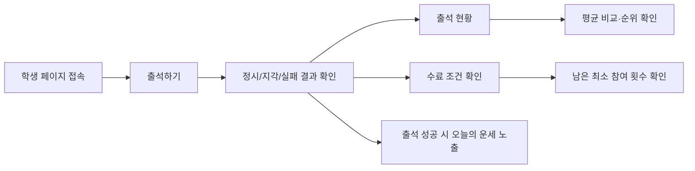

# User Side Guide

> 문서 링크: [docs/Wiki/01_User_Side_Guide.md](./01_User_Side_Guide.md) | [GitHub](https://github.com/cloud-club/CloudClubAttendanceSystem/blob/gh-pages/docs/Wiki/01_User_Side_Guide.md)

## 빠른 흐름도

## 사용자 관점 시나리오
학생 입장에서는 “오늘 출석이 정상 처리됐는지”와 “현재 수료 가능한 상태인지”를 빠르게 아는 것이 가장 중요합니다. 학생 화면은 `출석하기`, `출석 현황`, `행사 일정`, `수료 조건 확인` 4개 탭으로 구성하며, 모바일에서는 오른쪽 위 메뉴 버튼으로 탭을 이동합니다.

### 행사 일정 확인

`행사 일정` 탭은 현재 시즌의 행사명, 날짜·시간, 위치 안내와 Google 지도 링크를 보여 줍니다. 시즌의 첫 행사와 마지막 행사는 `필수` 배지로 표시합니다. Apps Script가 아직 새 공개 액션을 제공하지 않으면 기존 출석 기능은 유지하고 업데이트 안내만 표시합니다.

운영 측에서도 이 단순 흐름을 유지해야 안내 비용이 줄어듭니다. 아래 절차는 실제 학생 안내 메시지와 동일한 순서로 정리했습니다.

### 1) 출석하기
1. 학생은 기본 진입 경로인 `/web/student/latest/`로 접속합니다.
2. `출석하기` 탭에서 `010`으로 시작하는 전화번호 11자리를 입력하고 출석을 요청합니다.
3. 성공 시 `정시/지각` 판정과 현재 출석 통계를 바로 확인합니다.

모바일 기본 화면은 출석 가능 시간, 전화번호 입력, 출석 버튼, 위치 확인 상태를 한 화면에서 확인할 수 있도록 압축합니다. 위치 확인이 필요한 회차에서만 브라우저의 위치 권한을 요청합니다.

### 2) 출석 현황 확인
1. `출석 현황` 탭에서 같은 전화번호로 누적 현황을 조회합니다.
2. 본인의 출석률, 전체 사용자 평균 출석률, 평균과의 차이(%p), 전체 순위와 상위 비율을 확인합니다.
3. 출석·지각·결석·유고 횟수와 회차별 기록을 확인합니다.
4. 서버가 공개 사유를 제공한 행만 누르면 상태·날짜·시간·사유를 상세 다이얼로그에서 확인합니다. 사유가 없거나 legacy인 행은 비대화형입니다.
5. 상세 다이얼로그는 `Escape`로 닫을 수 있고, 키보드 포커스는 다이얼로그 안에서 순환한 뒤 닫을 때 연결된 행으로 돌아갑니다.
6. 하단 랭킹 보드에서 기존 시즌 상위 순위를 확인합니다.

### 3) 수료 조건 확인
1. `수료 조건 확인` 탭에서 전화번호를 입력합니다. 마지막으로 사용한 번호는 세 탭의 입력란에 함께 반영됩니다.
2. 시즌 수료 기준, 현재 출석·지각·결석·유고 횟수, 지각의 결석 환산 기준을 확인합니다.
3. 앞으로 남은 수업 수와 그중 최소 참여해야 하는 횟수를 확인합니다.
4. `출석 조항 확인하기`를 누르면 최소 출석 횟수, 지각 환산, 첫·마지막 필수 회차를 팝업에서 설명합니다.
4. 필수 회차 충족 여부, 환산 결석률, 현재 기준 수료 가능 여부를 확인합니다.

수료 가능 여부는 Apps Script가 계산한 값을 그대로 표시합니다. 시즌이 끝나기 전에는 `수료 가능/불가`, 모든 회차가 끝난 뒤에는 `수료/미수료`로 구분합니다.

`이 화면에는 스터디 출석이 반영되지 않습니다. 최종 수료 여부는 스터디 출석률에 따라 달라질 수 있습니다.` 이 안내는 조회 성공 여부와 무관하게 수료 결과 앞에 항상 표시됩니다.

### 화면 크기별 배치
- 학생 정보 구조는 항상 `출석하기 → 출석 현황 → 수료 조건 확인` 3개 탭 순서를 유지합니다.
- `1200px` 초과에서는 넓은 대시보드, `769px`부터 `1200px`까지는 컴팩트 데스크톱 배치, `768px` 이하에서는 모바일 메뉴와 한 열 카드를 사용합니다.
- 상세 사유는 원본 Note가 아니라 서버가 본인 상태에 맞게 공개한 최대 300자 텍스트만 표시합니다.

### 4) 출석 랭킹 확인
랭킹은 단순 재미 요소가 아니라, 학생이 자신의 시즌 참여 상태를 빠르게 파악하는 지표입니다. 그래서 출석현황 조회 흐름과 같은 화면에서 자연스럽게 이어지도록 배치되어 있습니다.

1. `출석현황` 탭 하단 랭킹 보드에서 시즌 랭킹을 확인합니다.
2. 정렬 규칙은 `출석 횟수` 우선, 동률 시 `평균 출석 오프셋`, 최종 동률은 이름 순입니다.

### 5) 오늘의 운세 확인
오늘의 운세는 독립 탭이 아니라 출석 성공 결과 카드의 일부입니다. 이 설계는 학생이 별도 액션 없이 출석 완료 맥락 안에서 메시지를 확인하도록 하기 위한 것입니다.

1. 서버(`Appsscript/30_attendance_core.gs`)는 출석 성공 응답에 `fortune` 값을 포함합니다.
2. 학생 화면(`web/student/student.js`)은 같은 결과 카드에서 운세를 렌더링합니다.

## 학생 v6.3 현재 정책 요약
- 현재 학생 기능 식별 계약은 2026.07.14-v6.3, studentAttendanceReasonV1=true, extractStudentDisplayReason=true입니다.
- 기존 status와 insights를 유지하고 선택적 안전 필드 details[].displayReason만 additive로 추가합니다.
- Pages-first 배포에서도 구버전 Apps Script의 기존 기능은 유지되고, 사유가 없거나 legacy인 행은 비대화형으로 남습니다.
- 공개 사유는 Note의 선두 공개 영역에서만 읽으며, 첫 번째 비어 있지 않은 비일치·내부 줄을 만나면 중단하므로 뒤의 일치 prefix는 공개하지 않습니다.
- Apps Script 배포는 운영자만 수행하며, 레포는 현재 외부 콘솔 상태를 단정하지 않습니다.
- 문제가 생기면 Pages는 직전 artifact로, Apps Script는 운영자가 직전 정상 배포 버전으로 롤백합니다.

## 왜 latest 진입 경로를 고정했는가
시즌별 URL을 직접 안내하면 공지 누락이나 이전 시즌 북마크 때문에 잘못된 페이지로 진입하는 문제가 자주 발생합니다. 이를 줄이기 위해 학생 공지 기준 URL은 항상 `/web/student/latest/`로 고정합니다.

운영자는 시즌 변경 시 내부 매핑만 갱신하고, 학생에게는 동일 URL만 안내하면 됩니다. 이 방식이 인수인계 시에도 가장 실수가 적습니다.

## 자주 발생하는 질문 (FAQ)
### Q1. 출석 버튼을 눌렀는데 실패 메시지가 나옵니다.
대부분은 세션 미오픈/마감, 미등록 전화번호, 또는 이미 처리된 중복 출석입니다. 먼저 메시지 코드를 확인한 뒤 운영진에게 문의하도록 안내합니다.

### Q2. 랭킹이 바로 갱신되지 않습니다.
출석 처리 직후 반영 시점에 따라 지연이 생길 수 있습니다. 새로고침 후 다시 조회하도록 안내하면 대부분 해소됩니다.

### Q3. 오늘의 운세가 보이지 않습니다.
운세는 출석 성공 시에만 노출됩니다. 실패 응답이나 조회 전용 동작에서는 표시되지 않습니다.

### Q4. 평균 비교나 수료 조건에 “Apps Script 업데이트 후 확인 가능”이 표시됩니다.
GitHub Pages가 Apps Script보다 먼저 배포된 호환 상태입니다. 출석과 기존 현황 조회는 계속 사용할 수 있으며, 운영자가 새 Apps Script 버전을 배포하면 추가 지표가 활성화됩니다.

### Q5. 어떤 출석 행은 눌러지고 어떤 행은 눌러지지 않습니다.
본인의 현재 상태와 일치하는 공개 사유가 있는 행만 상세를 열 수 있습니다. 구버전 Apps Script, 사유가 없는 기록, 공개 규칙과 맞지 않는 legacy 메모는 기존 기록처럼 비대화형으로 표시됩니다.

## 관련 파일
- 학생 HTML: [web/student/latest/index.html](../../web/student/latest/index.html) | [GitHub](https://github.com/cloud-club/CloudClubAttendanceSystem/blob/gh-pages/web/student/latest/index.html)
- 학생 로직: [web/student/student.js](../../web/student/student.js) | [GitHub](https://github.com/cloud-club/CloudClubAttendanceSystem/blob/gh-pages/web/student/student.js)
- 백엔드 출석 API: [Appsscript/30_attendance_core.gs](../../Appsscript/30_attendance_core.gs) | [GitHub](https://github.com/cloud-club/CloudClubAttendanceSystem/blob/gh-pages/Appsscript/30_attendance_core.gs)
- 백엔드 수료 판정: [Appsscript/33_graduation_manual_excused.gs](../../Appsscript/33_graduation_manual_excused.gs) | [GitHub](https://github.com/cloud-club/CloudClubAttendanceSystem/blob/gh-pages/Appsscript/33_graduation_manual_excused.gs)

## 관련 문서
- 관리자 가이드: [02_Admin_Side_Guide.md](./02_Admin_Side_Guide.md) | [GitHub](https://github.com/cloud-club/CloudClubAttendanceSystem/blob/gh-pages/docs/Wiki/02_Admin_Side_Guide.md)
- 운영 런북: [04_Operations_Runbook.md](./04_Operations_Runbook.md) | [GitHub](https://github.com/cloud-club/CloudClubAttendanceSystem/blob/gh-pages/docs/Wiki/04_Operations_Runbook.md)
