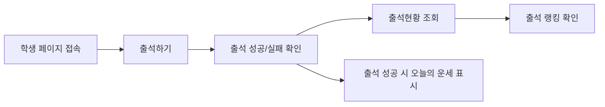

# User Side Guide

> 문서 링크: [docs/Wiki/01_User_Side_Guide.md](./01_User_Side_Guide.md) | [GitHub](https://github.com/cloud-club/CloudClubAttendanceSystem/blob/gh-pages/docs/Wiki/01_User_Side_Guide.md)

## 빠른 흐름도

## 1. 출석하기 및 출석 현황 확인
1. 학생 기본 진입은 `/web/student/latest/`입니다.
2. `출석하기` 탭에서 전화번호(숫자 10~11자리)를 입력하고 출석을 요청합니다.
3. 성공 시 `정시/지각` 판정, 현재 출석 통계, 출석 상세 정보가 표시됩니다.
4. `출석현황` 탭에서 같은 전화번호로 누적 현황(출석/지각/결석/유고)을 조회합니다.

### 주요 예외
- 세션 미오픈/마감: 출석 불가 메시지 노출
- 미등록 번호: 등록되지 않은 번호 안내
- 중복 출석: 이미 출석 처리됨 안내

## 2. 출석 랭킹 확인
1. `출석현황` 탭 하단 랭킹 보드에서 시즌 랭킹을 확인합니다.
2. 정렬 규칙은 `출석 횟수` 우선, 동률 시 `평균 출석 오프셋`, 최종 동률은 이름 순입니다.

## 3. 오늘의 운세 확인
- 오늘의 운세는 별도 탭 기능이 아니라, **출석 성공 응답 카드 내부**에서 표시됩니다.
- 서버(`Code.gs`)가 출석 성공 시 `fortune` 값을 함께 내려주고, 학생 화면(`web/student/student.js`)이 카드로 렌더합니다.

## 관련 파일
- 학생 HTML: [web/student/latest/index.html](../../web/student/latest/index.html) | [GitHub](https://github.com/cloud-club/CloudClubAttendanceSystem/blob/gh-pages/web/student/latest/index.html)
- 학생 로직: [web/student/student.js](../../web/student/student.js) | [GitHub](https://github.com/cloud-club/CloudClubAttendanceSystem/blob/gh-pages/web/student/student.js)
- 백엔드 출석 API: [Code.gs](../../Code.gs) | [GitHub](https://github.com/cloud-club/CloudClubAttendanceSystem/blob/gh-pages/Code.gs)
