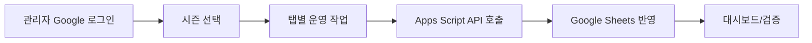

# Admin Side Guide

> 문서 링크: [docs/Wiki/02_Admin_Side_Guide.md](./02_Admin_Side_Guide.md) | [GitHub](https://github.com/cloud-club/CloudClubAttendanceSystem/blob/gh-pages/docs/Wiki/02_Admin_Side_Guide.md)

## 빠른 흐름도

## 1. 출석 체크 시스템 동작 원리
1. 프런트: GitHub Pages(`web/admin`, `web/student`).
2. API 게이트웨이: Google Apps Script(`Code.gs`, JSONP).
3. 데이터: Google Sheets 시즌 시트 + 메타 시트(`_admins`, `_session_meta`, `_import_meta`).
4. 권한: `public / admin / super` 액션 레벨 + `_admins` + Google OAuth.

## 2. 관리자 탭 상세 (실제 UI 9개)

### 출석하기
- 목적: 실시간 세션 상태 확인 + 관리자 수동 출석 배치 승인.
- 핵심 기능: 세션 카운트다운, 회원 다중 선택, 공통/개별 멘트, 강제 덮어쓰기.
- 점검 파일: [web/admin/index.html](../../web/admin/index.html) | [GitHub](https://github.com/cloud-club/CloudClubAttendanceSystem/blob/gh-pages/web/admin/index.html), [web/admin/admin.js](../../web/admin/admin.js) | [GitHub](https://github.com/cloud-club/CloudClubAttendanceSystem/blob/gh-pages/web/admin/admin.js), [Code.gs](../../Code.gs) | [GitHub](https://github.com/cloud-club/CloudClubAttendanceSystem/blob/gh-pages/Code.gs)

### 출석현황
- 목적: 대시보드/KPI/드릴다운/랭킹/개인 조회.
- 핵심 기능: 필터, 상단/하단 차트, 드릴다운, 순위 확인.
- 점검 API: `attendanceDashboardSummary`, `attendanceDashboardDrilldown`, `status`, `ranking`.

### 일정 관리
- 목적: 회차 생성/수정/삭제 + 캘린더 기반 운영.
- 핵심 정책: 날짜 유일성(`SCHEDULE_DATE_DUPLICATE`), 출석 기록 존재 시 강제삭제 확인.
- 점검 API: `scheduleList`, `scheduleSave`, `scheduleDelete`.

### 유고 처리
- 목적: 유고 지정/해제 및 덮어쓰기 제어.
- 핵심 정책: 기존 출석/지각 덮어쓰기 시 2단계 확인.
- 점검 API: `excusedSet`, `graduationReport`.

### QR코드 관리
- 목적: 학생 Latest URL/관리자 URL QR 생성.
- 핵심 정책: 학생 기본 진입은 `/web/student/latest/` 고정.
- 점검 API: `studentUrl`, `adminUrl`, `sheetLink`.

### 변수명 관리 (Super)
- 목적: `variable` 정책값(value) 관리.
- 핵심 정책: value-only 편집, 정규화/템플릿 복구 분리.
- 점검 API: `variablesGet`, `variablesUpdate`, `variablesNormalize`, `variablesResetTemplate`.

### 수료 판정
- 목적: 시즌별 수료 판정표 조회/정렬.
- 핵심 정책: 변수 기반 계산(`required_attendance_count`, `late_to_absence_ratio` 등).
- 점검 API: `graduationReport`.

### 시즌 생성/업로드 (Super)
- 목적: 합격자 파일 분석→미리보기→시즌 생성/반영.
- 핵심 정책: begin/chunk/diff/finalize 게이트, BLOCKER 차단.
- 점검 API: `sheetSchemaAudit`, `seasonImportBegin`, `seasonImportChunk`, `seasonImportDiff`, `seasonImportFinalize`, `seasonImportAbort`.

### 관리자 관리 (Super)
- 목적: 관리자 계정 등록/수정/삭제.
- 핵심 정책: 고정 super 보호, role/season/is_active 정책 준수.
- 점검 API: `adminUsersList`, `adminUsersUpsert`, `adminUsersDelete`.

## 3. 정확한 탭 이름
- 출석하기
- 출석현황
- 일정 관리
- 유고 처리
- QR코드 관리
- 변수명 관리
- 수료 판정
- 시즌 생성/업로드
- 관리자 관리

## 연계 문서
- 탭별 코드/수정 맵: [03_Admin_Tab_Change_Map.md](./03_Admin_Tab_Change_Map.md) | [GitHub](https://github.com/cloud-club/CloudClubAttendanceSystem/blob/gh-pages/docs/Wiki/03_Admin_Tab_Change_Map.md)
- 운영 런북: [04_Operations_Runbook.md](./04_Operations_Runbook.md) | [GitHub](https://github.com/cloud-club/CloudClubAttendanceSystem/blob/gh-pages/docs/Wiki/04_Operations_Runbook.md)
