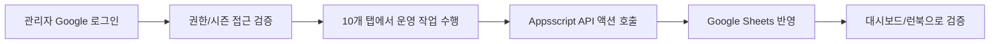

# Admin Side Guide

> 문서 링크: [docs/Wiki/02_Admin_Side_Guide.md](./02_Admin_Side_Guide.md) | [GitHub](https://github.com/cloud-club/CloudClubAttendanceSystem/blob/gh-pages/docs/Wiki/02_Admin_Side_Guide.md)

## 빠른 흐름도

## 관리자 가이드 목적과 독자
이 문서는 관리자가 실제 운영 중에 어떤 판단을 해야 하는지, 그리고 개발자가 탭 수정 시 어디를 먼저 봐야 하는지를 함께 다룹니다. 단순 기능 목록이 아니라, 운영 상황에서 왜 해당 탭이 필요한지를 먼저 설명하는 것이 목표입니다.

특히 인수인계 상황에서는 “어떤 버튼을 누르는가”보다 “어떤 조건에서 어떤 탭을 열어야 하는가”를 알아야 실수를 줄일 수 있습니다. 그래서 각 탭은 동일한 설명 템플릿으로 정리했습니다.

## 왜 2티어 구조로 운영하는가
기존 1티어(Apps Script 단일 렌더링) 구조는 변경이 빠르지만, 인증·화면·데이터 이슈가 하나의 배포 단위에 섞여 원인 파악이 늦어지는 문제가 있었습니다. 2026년 2월 17~18일 전후 전환된 현재 구조는 UI와 API/데이터를 분리해 장애 분석과 롤백 경로를 명확히 합니다.

현재 운영은 다음 경계를 기준으로 움직입니다.
1. 프런트: GitHub Pages (`web/admin`, `web/student`)
2. 인증/API: Google Apps Script (`Appsscript/*`, OAuth 검증)
3. 데이터: Google Sheets (시즌 시트 + 메타 시트)

## 출석 체크 시스템 동작 원리
관리자 액션은 모두 같은 흐름으로 처리됩니다. 이 원리를 먼저 이해하면 어떤 탭을 수정하더라도 영향 범위를 빠르게 좁힐 수 있습니다.

1. 관리자 화면(`web/admin`)에서 사용자 입력/버튼 이벤트 발생
2. `web/admin/scripts/`가 액션별 API 호출
3. `Appsscript/00_entry_api.gs`가 `Appsscript/01_constants_access.gs`의 `ACTION_ACCESS_LEVELS` 기준으로 권한 검증
4. 시트 읽기/쓰기 수행 후 JSON 응답 반환
5. 화면에서 결과 렌더링 및 후속 검증

## 운영 하루 흐름 (준비/진행/마감)
운영은 탭별 개별 작업처럼 보이지만, 실제로는 하루 루틴으로 연결되어 있습니다. 아래 순서를 기본으로 삼으면 운영 누락을 줄일 수 있습니다.

1. 준비
- 관리자 로그인, 시즌 선택, 일정/세션 상태 확인
- 필요한 경우 QR 및 운영 변수 사전 점검

2. 진행
- 출석하기 탭으로 실시간 처리
- 예외 케이스는 유고 처리/수동 승인으로 보정

3. 마감
- 출석현황/수료 판정 확인
- 이슈 발생 시 런북 절차로 원인 분리 및 증빙 기록

## 공통 장애 대응 포인트
장애 대응의 핵심은 “어느 계층에서 실패했는지”를 먼저 가르는 것입니다. 인증 실패인지, API 권한인지, 시트 데이터인지 분리하지 않으면 같은 점검을 반복하게 됩니다.

1. 로그인 단계 실패: OAuth Origin/Consent, `authGoogleLogin` 결과 코드 확인
2. 탭 동작 실패: 액션 권한(`public/admin/super`)과 시즌 접근 가드 확인
3. 데이터 반영 실패: 시트 헤더/키(`Phone`) 및 메타 시트 상태 확인
4. 배포 의심 시: `APPS_SCRIPT_WEB_APP_URL`와 Pages 재배포 이력 확인
5. 과거 시즌 조회 실패: 관리자 호출은 `season + adminToken` 전달 여부를 우선 확인
6. 런타임 누락 의심: `apiInfo.runtimeChecks`에서 필수 함수 존재 여부를 확인

## 관리자 탭 상세 (실제 UI 10개)

### 출석하기
#### 이 탭이 필요한 이유
실시간 운영에서 가장 먼저 쓰는 탭으로, 현재 세션이 열려 있는지와 출석 처리 결과를 한 곳에서 확인합니다. 출석 처리 실패가 발생하면 가장 먼저 이 탭에서 재현됩니다.

#### 언제 사용하는가
- 세션 시작 직전/진행 중 출석 처리 시
- 수동 출석 배치 승인 또는 강제 보정 시
- 현장 문의(출석 반영 여부) 대응 시

#### 동작 흐름 (UI → API → Sheet)
1. `checkAttendanceSession`으로 세션 상태 조회
2. `doAttendance` 또는 `submitManualApproveBatch` 호출
3. `attendance`/`manualApproveBatch` 액션이 판정 및 시트 반영
4. 결과(정시/지각/실패 코드) 표시

#### 운영 시 주의사항
- 세션 미오픈/마감 상태에서 무리하게 재시도하지 않기
- 강제 덮어쓰기 사용 시 사유를 운영 기록에 남기기
- 동일 전화번호 중복 처리는 안내 문구와 함께 확인하기
- 인증 만료/토큰 이상 시 오류를 반복하지 말고 인증 게이트 복귀 후 재로그인하기

#### 수정 시 확인 파일
- [web/admin/index.html](../../web/admin/index.html) | [GitHub](https://github.com/cloud-club/CloudClubAttendanceSystem/blob/gh-pages/web/admin/index.html)
- [web/admin/scripts/20_attendance.js](../../web/admin/scripts/20_attendance.js) | [GitHub](https://github.com/cloud-club/CloudClubAttendanceSystem/blob/gh-pages/web/admin/scripts/20_attendance.js)
- [web/admin/scripts/](../../web/admin/scripts/) | [GitHub](https://github.com/cloud-club/CloudClubAttendanceSystem/tree/gh-pages/web/admin/scripts)
- [Appsscript/00_entry_api.gs](../../Appsscript/00_entry_api.gs) | [GitHub](https://github.com/cloud-club/CloudClubAttendanceSystem/blob/gh-pages/Appsscript/00_entry_api.gs)
- [Appsscript/30_attendance_core.gs](../../Appsscript/30_attendance_core.gs) | [GitHub](https://github.com/cloud-club/CloudClubAttendanceSystem/blob/gh-pages/Appsscript/30_attendance_core.gs)
- [Appsscript/33_graduation_manual_excused.gs](../../Appsscript/33_graduation_manual_excused.gs) | [GitHub](https://github.com/cloud-club/CloudClubAttendanceSystem/blob/gh-pages/Appsscript/33_graduation_manual_excused.gs)

### 출석현황
#### 이 탭이 필요한 이유
당일 운영 품질과 시즌 전체 건강도를 동시에 보는 탭입니다. 단순 조회용이 아니라, 이상 징후를 조기에 발견하고 그래프 클릭 후 바로 해당 멤버를 식별하는 운영 대시보드 역할을 합니다.

#### 언제 사용하는가
- 출석 처리 직후 통계 반영 점검 시
- 그래프에서 이상 구간을 보고 즉시 대상 멤버를 확인해야 할 때
- 학생 문의 대응(개인 현황/랭킹 근거 제시) 시
- 운영 회고용 지표 확인 시

#### 동작 흐름 (UI → API → Sheet)
출석현황 탭은 먼저 필터와 기간을 정한 뒤 전체 흐름을 읽고, 필요할 때만 상세를 내려가는 식으로 사용하는 것이 가장 자연스럽습니다. 핵심은 상단에서 요약을 보고 끝내는 것이 아니라, 그래프에서 이상 구간을 발견했을 때 하단 드릴다운으로 바로 연결된다는 점입니다.

1. 필터/기간 선택 후 조회 트리거
2. `attendanceDashboardSummary`로 KPI/차트/빠른 필터 인덱스 로드
3. 그래프 클릭 시 하단 드릴다운은 프런트에서 즉시 계산
4. `출석일 확인` 클릭 시에만 `attendanceDashboardDrilldown(member)` 호출
5. `status`, `ranking` 액션으로 개인/랭킹 데이터 보완

#### 현재 대시보드 해석 기준
이 탭에서 가장 먼저 기억할 점은 상단 세 번째 차트가 더 이상 개인별 비교 차트가 아니라, **현재 필터에 걸린 대상의 회차별 평균 출석시간 추이**라는 점입니다. 멤버를 선택하지 않으면 전체 평균으로 읽고, 1명만 선택하면 사실상 개인 추이처럼 읽으며, 2명 이상을 선택하면 선택 집합의 평균값 1개 라인으로 해석합니다. 이 멤버 선택은 차트 전용 부분집합 필터일 뿐, KPI나 랭킹, 도넛 전체를 다시 계산하는 전역 필터는 아닙니다.

하단 카드도 예전과 역할이 달라졌습니다. 이제 하단은 행사/개인 drilldown 기본 표가 아니라, 그래프 클릭 결과를 바로 보여주는 **대시보드 드릴다운 카드**입니다. `출석 상태 비율` 도넛은 클릭 시 하단을 상태별 랭킹으로 바꾸고, `행사별 출석/지각/결석/유고 분포`, `OB/YB 구성 비율`, `출석 횟수 분포`는 하단 멤버 목록으로 연결됩니다. 반대로 `행사별 출석률`과 `평균 출석 시간 추이` 차트는 hover-only로 두어, 상호작용 의미가 섞이지 않게 정리했습니다.

이 구조 덕분에 운영자는 “숫자를 본다 -> 눌러 본다 -> 아래에서 사람을 확인한다 -> 정말 필요할 때만 개인 출석일을 연다”는 흐름으로 자연스럽게 움직이게 됩니다. 구현상으로는 `attendanceDashboardSummary.meta.quickFilter`와 `attendanceDashboardDrilldown(member)`가 역할을 나눠 가지지만, 운영자는 “빠른 건 하단에서 즉시, 자세한 건 모달에서”라고 이해하면 충분합니다.

#### 운영 시 주의사항
운영 시에는 필터가 바뀐 상태에서 이전 결과를 그대로 해석하지 않도록 주의해야 합니다. 멤버를 비워 둔 상태는 오류가 아니라 **전체 평균 기본 상태**이고, 빠른 필터는 항상 마지막으로 클릭한 slice 1개만 유지되며 다시 클릭하면 해제됩니다. 하단 드릴다운은 서버를 다시 조회하지 않고 summary 응답의 quick filter 인덱스에서 즉시 계산되므로, 숫자와 원본 시트가 다르게 느껴질 때는 먼저 필터 범위와 현재 시즌을 다시 확인하는 편이 좋습니다.

또 하나 중요한 해석 포인트는 `출석 상태 비율` 도넛의 `출석`이 전체 출석이 아니라 **정시 출석(on_time)** 기준 랭킹이라는 점입니다. 개인 회차 이력이 정말 필요할 때는 하단 결과의 `출석일 확인` 버튼을 사용하면 되고, 이 모달은 항상 **현재 대시보드 필터 기준 회차만** 보여준다고 안내하는 것이 맞습니다. 인증 만료가 발생했을 때는 일반 에러 원인을 추측하기보다 `handleUnauthorizedError` 경로로 로그인 게이트가 정상 복귀하는지부터 확인하는 것이 운영상 더 안전합니다.

#### 수정 시 확인 파일
- [web/admin/index.html](../../web/admin/index.html) | [GitHub](https://github.com/cloud-club/CloudClubAttendanceSystem/blob/gh-pages/web/admin/index.html)
- [web/admin/scripts/20_attendance.js](../../web/admin/scripts/20_attendance.js) | [GitHub](https://github.com/cloud-club/CloudClubAttendanceSystem/blob/gh-pages/web/admin/scripts/20_attendance.js)
- [web/admin/scripts/21_dashboard.js](../../web/admin/scripts/21_dashboard.js) | [GitHub](https://github.com/cloud-club/CloudClubAttendanceSystem/blob/gh-pages/web/admin/scripts/21_dashboard.js)
- [web/admin/scripts/](../../web/admin/scripts/) | [GitHub](https://github.com/cloud-club/CloudClubAttendanceSystem/tree/gh-pages/web/admin/scripts)
- [Appsscript/00_entry_api.gs](../../Appsscript/00_entry_api.gs) | [GitHub](https://github.com/cloud-club/CloudClubAttendanceSystem/blob/gh-pages/Appsscript/00_entry_api.gs)
- [Appsscript/30_attendance_core.gs](../../Appsscript/30_attendance_core.gs) | [GitHub](https://github.com/cloud-club/CloudClubAttendanceSystem/blob/gh-pages/Appsscript/30_attendance_core.gs)
- [Appsscript/31_dashboard.gs](../../Appsscript/31_dashboard.gs) | [GitHub](https://github.com/cloud-club/CloudClubAttendanceSystem/blob/gh-pages/Appsscript/31_dashboard.gs)

### 일정 관리
#### 이 탭이 필요한 이유
세션 기준 시간은 출석 판정과 직접 연결되므로, 일정 데이터는 단순 캘린더가 아니라 출석 정책의 기준값입니다. 이 탭에서 잘못 등록하면 이후 모든 판정에 영향을 줍니다.

#### 언제 사용하는가
- 신규 회차 생성/수정/삭제 시
- 날짜/시간 오입력 정정 시
- 시즌 중 운영 스케줄 조정 시

#### 동작 흐름 (UI → API → Sheet)
1. `loadScheduleList`로 현재 일정 조회
2. `saveSchedule` 또는 `deleteSelectedSchedule` 실행
3. `scheduleSave`, `scheduleDelete` 액션으로 시트 반영
4. 충돌/중복 정책 검증 후 결과 반영

#### 운영 시 주의사항
- 날짜 유일성 정책(`SCHEDULE_DATE_DUPLICATE`) 위반 여부 확인
- 출석 기록이 이미 존재하는 회차 삭제는 매우 신중히 처리
- 시간대 변경 후 출석 판정 기준이 바뀌는지 재검증

#### 수정 시 확인 파일
- [web/admin/index.html](../../web/admin/index.html) | [GitHub](https://github.com/cloud-club/CloudClubAttendanceSystem/blob/gh-pages/web/admin/index.html)
- [web/admin/scripts/](../../web/admin/scripts/) | [GitHub](https://github.com/cloud-club/CloudClubAttendanceSystem/tree/gh-pages/web/admin/scripts)
- [Appsscript/00_entry_api.gs](../../Appsscript/00_entry_api.gs) | [GitHub](https://github.com/cloud-club/CloudClubAttendanceSystem/blob/gh-pages/Appsscript/00_entry_api.gs)
- [Appsscript/32_schedule.gs](../../Appsscript/32_schedule.gs) | [GitHub](https://github.com/cloud-club/CloudClubAttendanceSystem/blob/gh-pages/Appsscript/32_schedule.gs)

### 운세 관리
#### 이 탭이 필요한 이유
운세 문구는 운영 공지성 텍스트이지만 학생/관리자 화면에 직접 노출되므로, 코드 수정 없이도 안전하게 갱신하고 과거 버전을 복구할 수 있어야 합니다. 이 탭은 하드코딩 기반 운영을 버전형 데이터 운영으로 전환하기 위한 제어점입니다.

#### 언제 사용하는가
- 시즌 운영 중 운세 문구를 일괄 갱신할 때
- 운영 피드백 반영으로 일부 문구를 수정할 때
- 과거 버전으로 롤백하거나 재가공 후 재업로드할 때

#### 동작 흐름 (UI → API → Sheet)
1. `loadFortuneFromFile` 또는 직접 편집 입력 후 `analyzeFortuneInput` 검증 실행
2. `refreshFortuneManagement`로 current/버전 목록 동기화
3. `executeFortuneUpload`로 청크 업로드 수행
4. `fortuneUploadBegin` → `fortuneUploadChunk` → `fortuneUploadFinalize` 반영
5. `fortuneVersionList`, `fortuneVersionGet`으로 버전 조회/다운로드/재편집

#### 운영 시 주의사항
- 저장 전 미리보기/검증 오류 0건 상태를 확인하고 최종 체크박스를 활성화할 것
- 입력은 `CSV`, `XLSX`, 직접 편집(1행 1운세 또는 CSV/TSV 붙여넣기) 모두 가능하나 최종 검증 규칙은 동일
- 구버전 백엔드에서 `fortune*` 미지원이면 탭 내부에서만 차단되며, 다른 탭 동작은 유지돼야 함

#### 수정 시 확인 파일
- [web/admin/index.html](../../web/admin/index.html) | [GitHub](https://github.com/cloud-club/CloudClubAttendanceSystem/blob/gh-pages/web/admin/index.html)
- [web/admin/scripts/28_fortune.js](../../web/admin/scripts/28_fortune.js) | [GitHub](https://github.com/cloud-club/CloudClubAttendanceSystem/blob/gh-pages/web/admin/scripts/28_fortune.js)
- [web/admin/scripts/10_auth.js](../../web/admin/scripts/10_auth.js) | [GitHub](https://github.com/cloud-club/CloudClubAttendanceSystem/blob/gh-pages/web/admin/scripts/10_auth.js)
- [Appsscript/00_entry_api.gs](../../Appsscript/00_entry_api.gs) | [GitHub](https://github.com/cloud-club/CloudClubAttendanceSystem/blob/gh-pages/Appsscript/00_entry_api.gs)
- [Appsscript/35_fortune_admin.gs](../../Appsscript/35_fortune_admin.gs) | [GitHub](https://github.com/cloud-club/CloudClubAttendanceSystem/blob/gh-pages/Appsscript/35_fortune_admin.gs)
- [Appsscript/91_fortune.gs](../../Appsscript/91_fortune.gs) | [GitHub](https://github.com/cloud-club/CloudClubAttendanceSystem/blob/gh-pages/Appsscript/91_fortune.gs)

### 유고 처리
#### 이 탭이 필요한 이유
현장 운영에서는 결석 사유나 예외 승인 같은 경계 케이스가 반드시 발생합니다. 유고 처리는 출석 신뢰도를 유지하면서 예외를 기록 가능한 정책으로 반영하기 위한 탭입니다.

#### 언제 사용하는가
- 공식 사유가 확인된 결석/지각 보정 시
- 운영진 승인 기반 예외 처리 시
- 수료 판정 전 유고 데이터 정리 시

#### 동작 흐름 (UI → API → Sheet)
1. 대상 회원/회차 선택
2. `openExcuseModal`, `submitExcuseOverrideModal` 실행
3. `excusedSet` 액션으로 상태 갱신
4. 필요 시 `graduationReport`로 영향 확인

#### 운영 시 주의사항
- 기존 정시/지각 데이터를 덮어쓰기 전 2단계 확인
- 유고 사유의 운영 근거를 별도 기록
- 수료 판정 직전 대량 수정은 피하고 사전 정리

#### 수정 시 확인 파일
- [web/admin/index.html](../../web/admin/index.html) | [GitHub](https://github.com/cloud-club/CloudClubAttendanceSystem/blob/gh-pages/web/admin/index.html)
- [web/admin/scripts/](../../web/admin/scripts/) | [GitHub](https://github.com/cloud-club/CloudClubAttendanceSystem/tree/gh-pages/web/admin/scripts)
- [Appsscript/00_entry_api.gs](../../Appsscript/00_entry_api.gs) | [GitHub](https://github.com/cloud-club/CloudClubAttendanceSystem/blob/gh-pages/Appsscript/00_entry_api.gs)
- [Appsscript/33_graduation_manual_excused.gs](../../Appsscript/33_graduation_manual_excused.gs) | [GitHub](https://github.com/cloud-club/CloudClubAttendanceSystem/blob/gh-pages/Appsscript/33_graduation_manual_excused.gs)

### QR코드 관리
#### 이 탭이 필요한 이유
운영 공지의 혼선을 줄이기 위해 학생/관리자 진입 경로를 즉시 배포 가능한 형태로 관리합니다. 특히 학생은 `/latest` 고정 진입을 유지해야 시즌 전환 시 공지 비용이 줄어듭니다.

#### 언제 사용하는가
- 시즌 시작 전 학생/관리자 QR 배포 시
- 공지 채널(노션/디스코드) 링크 갱신 시
- URL 불일치 문의 대응 시

#### 동작 흐름 (UI → API → Sheet)
1. QR 생성 버튼 이벤트
2. `studentUrl`, `adminUrl`, `sheetLink` 조회
3. URL 검증 후 QR 렌더링
4. 공지 채널에 반영

#### 운영 시 주의사항
- 학생 URL은 `/web/student/latest/` 기준으로 고정 안내
- 관리자 URL 공유 범위 최소화
- QR 재생성 후 실제 링크 클릭 테스트 수행

#### 수정 시 확인 파일
- [web/admin/index.html](../../web/admin/index.html) | [GitHub](https://github.com/cloud-club/CloudClubAttendanceSystem/blob/gh-pages/web/admin/index.html)
- [web/admin/scripts/](../../web/admin/scripts/) | [GitHub](https://github.com/cloud-club/CloudClubAttendanceSystem/tree/gh-pages/web/admin/scripts)
- [Appsscript/00_entry_api.gs](../../Appsscript/00_entry_api.gs) | [GitHub](https://github.com/cloud-club/CloudClubAttendanceSystem/blob/gh-pages/Appsscript/00_entry_api.gs)
- [Appsscript/10_auth_admin.gs](../../Appsscript/10_auth_admin.gs) | [GitHub](https://github.com/cloud-club/CloudClubAttendanceSystem/blob/gh-pages/Appsscript/10_auth_admin.gs)
- [Appsscript/30_attendance_core.gs](../../Appsscript/30_attendance_core.gs) | [GitHub](https://github.com/cloud-club/CloudClubAttendanceSystem/blob/gh-pages/Appsscript/30_attendance_core.gs)
- [Appsscript/32_schedule.gs](../../Appsscript/32_schedule.gs) | [GitHub](https://github.com/cloud-club/CloudClubAttendanceSystem/blob/gh-pages/Appsscript/32_schedule.gs)

### 변수명 관리
#### 이 탭이 필요한 이유
운영 정책 상수(예: 수료 기준, 지각 환산 비율)는 코드 하드코딩보다 운영 가능한 값 테이블로 관리하는 편이 안전합니다. 이 탭은 정책 변경을 코드 수정 없이 적용하기 위한 Super 전용 제어점입니다.

#### 언제 사용하는가
- 수료/판정 정책값 조정 시
- 변수 템플릿 복구 또는 정규화 시
- 시즌 운영 기준 재설정 시

#### 동작 흐름 (UI → API → Sheet)
1. `loadVariables`로 현재 value 조회
2. `saveVariables` 또는 `resetVariablesTemplate` 실행
3. `variablesUpdate`/`variablesNormalize`/`variablesResetTemplate` 반영
4. 관련 기능(수료 판정 등) 재조회

#### 운영 시 주의사항
- value-only 편집 원칙 준수
- 템플릿 리셋 전 현재 값 백업
- 변경 후 수료 판정 결과 샘플 검증

#### 수정 시 확인 파일
- [web/admin/index.html](../../web/admin/index.html) | [GitHub](https://github.com/cloud-club/CloudClubAttendanceSystem/blob/gh-pages/web/admin/index.html)
- [web/admin/scripts/](../../web/admin/scripts/) | [GitHub](https://github.com/cloud-club/CloudClubAttendanceSystem/tree/gh-pages/web/admin/scripts)
- [Appsscript/00_entry_api.gs](../../Appsscript/00_entry_api.gs) | [GitHub](https://github.com/cloud-club/CloudClubAttendanceSystem/blob/gh-pages/Appsscript/00_entry_api.gs)
- [Appsscript/21_variables_sessionmeta.gs](../../Appsscript/21_variables_sessionmeta.gs) | [GitHub](https://github.com/cloud-club/CloudClubAttendanceSystem/blob/gh-pages/Appsscript/21_variables_sessionmeta.gs)

### 수료 판정
#### 이 탭이 필요한 이유
수료 판정은 출석 데이터의 최종 소비 지점입니다. 운영진이 공지하는 결과와 시스템 계산 결과가 항상 일치해야 하므로, 정책 값과 데이터 품질을 함께 검증하는 탭입니다.

#### 언제 사용하는가
- 시즌 중간 점검 및 종료 직전 검토 시
- 유고/출석 보정 이후 재산출 시
- 운영진 내부 확정 회의 전 검토 시

#### 동작 흐름 (UI → API → Sheet)
1. 대상 시즌 선택 후 보고서 로드
2. `graduationReport` 호출
3. 변수 기반 계산(`required_attendance_count`, `late_to_absence_ratio` 등)
4. 결과 테이블 검토

#### 운영 시 주의사항
- 변수 변경 직후 반드시 재조회
- 유고 처리 반영 여부 선확인
- 공지 직전 샘플 계정 교차검증

#### 수정 시 확인 파일
- [web/admin/index.html](../../web/admin/index.html) | [GitHub](https://github.com/cloud-club/CloudClubAttendanceSystem/blob/gh-pages/web/admin/index.html)
- [web/admin/scripts/](../../web/admin/scripts/) | [GitHub](https://github.com/cloud-club/CloudClubAttendanceSystem/tree/gh-pages/web/admin/scripts)
- [Appsscript/00_entry_api.gs](../../Appsscript/00_entry_api.gs) | [GitHub](https://github.com/cloud-club/CloudClubAttendanceSystem/blob/gh-pages/Appsscript/00_entry_api.gs)
- [Appsscript/21_variables_sessionmeta.gs](../../Appsscript/21_variables_sessionmeta.gs) | [GitHub](https://github.com/cloud-club/CloudClubAttendanceSystem/blob/gh-pages/Appsscript/21_variables_sessionmeta.gs)
- [Appsscript/33_graduation_manual_excused.gs](../../Appsscript/33_graduation_manual_excused.gs) | [GitHub](https://github.com/cloud-club/CloudClubAttendanceSystem/blob/gh-pages/Appsscript/33_graduation_manual_excused.gs)

### 시즌 생성/업로드
#### 이 탭이 필요한 이유
시즌 교체 시점은 가장 위험한 운영 구간입니다. 신규 명단 반영을 안전하게 수행하려면 분석→검증→최종 반영 단계를 분리한 업로드 절차가 필요합니다.

#### 언제 사용하는가
- 신규 시즌 시작 전 명단 반영 시
- 대규모 회원 데이터 갱신 시
- 스키마 감사/차이 비교 후 확정 반영 시

#### 동작 흐름 (UI → API → Sheet)
1. `analyzeImportFile`로 파일 분석
2. `seasonImportBegin`/`seasonImportChunk`로 분할 업로드
3. `seasonImportDiff`로 변경점 검토
4. `seasonImportFinalize` 확정(문제 시 `seasonImportAbort`)

#### 운영 시 주의사항
- `sheetSchemaAudit` 선통과 후 진행
- BLOCKER 존재 시 finalize 금지
- finalize 전 diff 결과를 운영 기록으로 보관

#### 수정 시 확인 파일
- [web/admin/index.html](../../web/admin/index.html) | [GitHub](https://github.com/cloud-club/CloudClubAttendanceSystem/blob/gh-pages/web/admin/index.html)
- [web/admin/scripts/](../../web/admin/scripts/) | [GitHub](https://github.com/cloud-club/CloudClubAttendanceSystem/tree/gh-pages/web/admin/scripts)
- [Appsscript/00_entry_api.gs](../../Appsscript/00_entry_api.gs) | [GitHub](https://github.com/cloud-club/CloudClubAttendanceSystem/blob/gh-pages/Appsscript/00_entry_api.gs)
- [Appsscript/32_schedule.gs](../../Appsscript/32_schedule.gs) | [GitHub](https://github.com/cloud-club/CloudClubAttendanceSystem/blob/gh-pages/Appsscript/32_schedule.gs)
- [Appsscript/34_season_import.gs](../../Appsscript/34_season_import.gs) | [GitHub](https://github.com/cloud-club/CloudClubAttendanceSystem/blob/gh-pages/Appsscript/34_season_import.gs)

### 관리자 관리
#### 이 탭이 필요한 이유
인증 체계의 신뢰성은 관리자 계정 데이터의 정확성에 달려 있습니다. 이 탭은 단순 사용자 관리가 아니라, 운영 권한의 경계를 명시적으로 관리하기 위한 Super 전용 제어점입니다.

#### 언제 사용하는가
- 관리자 신규 등록/퇴임 처리 시
- 역할(role) 또는 시즌 범위 조정 시
- 비활성화/권한 회수 시

#### 동작 흐름 (UI → API → Sheet)
1. `loadAdminUsers`로 목록 조회
2. `saveAdminUser` 또는 `deleteAdminUser` 실행
3. `adminUsersUpsert`/`adminUsersDelete` 반영
4. 권한 반영 재로그인 검증

#### 운영 시 주의사항
- 고정 Super 계정 보호 규칙 준수
- `role`, `season`, `is_active` 조합 검증
- 변경 후 실제 로그인 권한 테스트 필수

#### 수정 시 확인 파일
- [web/admin/index.html](../../web/admin/index.html) | [GitHub](https://github.com/cloud-club/CloudClubAttendanceSystem/blob/gh-pages/web/admin/index.html)
- [web/admin/scripts/](../../web/admin/scripts/) | [GitHub](https://github.com/cloud-club/CloudClubAttendanceSystem/tree/gh-pages/web/admin/scripts)
- [Appsscript/00_entry_api.gs](../../Appsscript/00_entry_api.gs) | [GitHub](https://github.com/cloud-club/CloudClubAttendanceSystem/blob/gh-pages/Appsscript/00_entry_api.gs)
- [Appsscript/10_auth_admin.gs](../../Appsscript/10_auth_admin.gs) | [GitHub](https://github.com/cloud-club/CloudClubAttendanceSystem/blob/gh-pages/Appsscript/10_auth_admin.gs)

## 정확한 탭 이름 (UI 기준)
아래 이름은 `web/admin/index.html` 표기와 동일해야 하며, 운영 문서에서도 같은 표기를 사용합니다.

- 출석하기
- 출석현황
- 일정 관리
- 운세 관리
- 유고 처리
- QR코드 관리
- 변수명 관리
- 수료 판정
- 시즌 생성/업로드
- 관리자 관리

## 연계 문서
- 탭별 코드/수정 맵: [03_Admin_Tab_Change_Map.md](./03_Admin_Tab_Change_Map.md) | [GitHub](https://github.com/cloud-club/CloudClubAttendanceSystem/blob/gh-pages/docs/Wiki/03_Admin_Tab_Change_Map.md)
- 운영 런북: [04_Operations_Runbook.md](./04_Operations_Runbook.md) | [GitHub](https://github.com/cloud-club/CloudClubAttendanceSystem/blob/gh-pages/docs/Wiki/04_Operations_Runbook.md)
- 데이터/RBAC 레퍼런스: [05_Data_And_RBAC_Reference.md](./05_Data_And_RBAC_Reference.md) | [GitHub](https://github.com/cloud-club/CloudClubAttendanceSystem/blob/gh-pages/docs/Wiki/05_Data_And_RBAC_Reference.md)
- 인증 전환 배경(History): [018_관리자_인증전환_배경_구현방식_및_인프라구조.md](../History/018_관리자_인증전환_배경_구현방식_및_인프라구조.md) | [GitHub](https://github.com/cloud-club/CloudClubAttendanceSystem/blob/gh-pages/docs/History/018_%EA%B4%80%EB%A6%AC%EC%9E%90_%EC%9D%B8%EC%A6%9D%EC%A0%84%ED%99%98_%EB%B0%B0%EA%B2%BD_%EA%B5%AC%ED%98%84%EB%B0%A9%EC%8B%9D_%EB%B0%8F_%EC%9D%B8%ED%94%84%EB%9D%BC%EA%B5%AC%EC%A1%B0.md)
