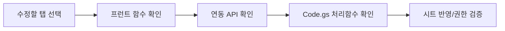

# Admin Tab Change Map

> 문서 링크: [docs/Wiki/03_Admin_Tab_Change_Map.md](./03_Admin_Tab_Change_Map.md) | [GitHub](https://github.com/cloud-club/CloudClubAttendanceSystem/blob/gh-pages/docs/Wiki/03_Admin_Tab_Change_Map.md)

## 빠른 흐름도

## 탭별 수정 체크 테이블
| 탭 | 프런트 주요 함수 (`web/admin/admin.js`) | API 액션 (`Code.gs`) | 점검 파일 |
|---|---|---|---|
| 출석하기 | `checkAttendanceSession`, `doAttendance`, `submitManualApproveBatch` | `session`, `attendance`, `manualApproveBatch`, `members` | [web/admin/admin.js](../../web/admin/admin.js) [GitHub](https://github.com/cloud-club/CloudClubAttendanceSystem/blob/gh-pages/web/admin/admin.js) [Code.gs](../../Code.gs) [GitHub](https://github.com/cloud-club/CloudClubAttendanceSystem/blob/gh-pages/Code.gs) |
| 출석현황 | `checkAttendanceStatus`, `loadRankings`, `loadAttendanceDashboard` | `status`, `ranking`, `attendanceDashboardSummary`, `attendanceDashboardDrilldown` | [web/admin/admin.js](../../web/admin/admin.js) [GitHub](https://github.com/cloud-club/CloudClubAttendanceSystem/blob/gh-pages/web/admin/admin.js) [Code.gs](../../Code.gs) [GitHub](https://github.com/cloud-club/CloudClubAttendanceSystem/blob/gh-pages/Code.gs) |
| 일정 관리 | `loadScheduleList`, `saveSchedule`, `deleteSelectedSchedule` | `scheduleList`, `scheduleSave`, `scheduleDelete` | [web/admin/admin.js](../../web/admin/admin.js) [GitHub](https://github.com/cloud-club/CloudClubAttendanceSystem/blob/gh-pages/web/admin/admin.js) [Code.gs](../../Code.gs) [GitHub](https://github.com/cloud-club/CloudClubAttendanceSystem/blob/gh-pages/Code.gs) |
| 유고 처리 | `openExcuseModal`, `submitExcuseOverrideModal` | `excusedSet`, `graduationReport` | [web/admin/admin.js](../../web/admin/admin.js) [GitHub](https://github.com/cloud-club/CloudClubAttendanceSystem/blob/gh-pages/web/admin/admin.js) [Code.gs](../../Code.gs) [GitHub](https://github.com/cloud-club/CloudClubAttendanceSystem/blob/gh-pages/Code.gs) |
| QR코드 관리 | `generateSeasonQRCode`, `loadAdminQrCode` | `studentUrl`, `adminUrl`, `sheetLink` | [web/admin/admin.js](../../web/admin/admin.js) [GitHub](https://github.com/cloud-club/CloudClubAttendanceSystem/blob/gh-pages/web/admin/admin.js) [Code.gs](../../Code.gs) [GitHub](https://github.com/cloud-club/CloudClubAttendanceSystem/blob/gh-pages/Code.gs) |
| 변수명 관리 | `loadVariables`, `saveVariables`, `resetVariablesTemplate` | `variablesGet`, `variablesUpdate`, `variablesNormalize`, `variablesResetTemplate` | [web/admin/admin.js](../../web/admin/admin.js) [GitHub](https://github.com/cloud-club/CloudClubAttendanceSystem/blob/gh-pages/web/admin/admin.js) [Code.gs](../../Code.gs) [GitHub](https://github.com/cloud-club/CloudClubAttendanceSystem/blob/gh-pages/Code.gs) |
| 수료 판정 | `loadGraduationReport` | `graduationReport` | [web/admin/admin.js](../../web/admin/admin.js) [GitHub](https://github.com/cloud-club/CloudClubAttendanceSystem/blob/gh-pages/web/admin/admin.js) [Code.gs](../../Code.gs) [GitHub](https://github.com/cloud-club/CloudClubAttendanceSystem/blob/gh-pages/Code.gs) |
| 시즌 생성/업로드 | `analyzeImportFile`, `executeSeasonImport`, `fetchSeasonImportDiff` | `sheetSchemaAudit`, `seasonImport*` | [web/admin/admin.js](../../web/admin/admin.js) [GitHub](https://github.com/cloud-club/CloudClubAttendanceSystem/blob/gh-pages/web/admin/admin.js) [Code.gs](../../Code.gs) [GitHub](https://github.com/cloud-club/CloudClubAttendanceSystem/blob/gh-pages/Code.gs) |
| 관리자 관리 | `loadAdminUsers`, `saveAdminUser`, `deleteAdminUser` | `adminUsersList`, `adminUsersUpsert`, `adminUsersDelete` | [web/admin/admin.js](../../web/admin/admin.js) [GitHub](https://github.com/cloud-club/CloudClubAttendanceSystem/blob/gh-pages/web/admin/admin.js) [Code.gs](../../Code.gs) [GitHub](https://github.com/cloud-club/CloudClubAttendanceSystem/blob/gh-pages/Code.gs) |

## 권한 체크 포인트
- Super 전용: `variables`, `seasonImport`, `adminUsers` 탭.
- 관리자 인증 가드: `authGoogleLogin`, `authSession`, `ACTION_ACCESS_LEVELS`.
- 시즌 접근 가드: `requireSeasonAccess`.

## 관련 문서
- 관리자 가이드: [02_Admin_Side_Guide.md](./02_Admin_Side_Guide.md) | [GitHub](https://github.com/cloud-club/CloudClubAttendanceSystem/blob/gh-pages/docs/Wiki/02_Admin_Side_Guide.md)
- RBAC 레퍼런스: [05_Data_And_RBAC_Reference.md](./05_Data_And_RBAC_Reference.md) | [GitHub](https://github.com/cloud-club/CloudClubAttendanceSystem/blob/gh-pages/docs/Wiki/05_Data_And_RBAC_Reference.md)
