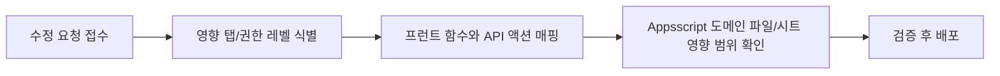

# Admin Tab Change Map

> 문서 링크: [docs/Wiki/03_Admin_Tab_Change_Map.md](./03_Admin_Tab_Change_Map.md) | [GitHub](https://github.com/cloud-club/CloudClubAttendanceSystem/blob/gh-pages/docs/Wiki/03_Admin_Tab_Change_Map.md)

## 빠른 흐름도

## 이 문서를 언제 쓰는가
탭 수정 이슈는 대부분 “어디를 고쳐야 하는지”를 찾는 단계에서 시간이 가장 많이 소모됩니다. 이 문서는 그 탐색 시간을 줄이기 위해, 탭별로 프런트 함수와 백엔드 액션을 한 번에 연결해 둔 지도입니다.

즉, 이 문서는 참고용 표가 아니라 수정 의사결정 도구입니다. 기능 이슈가 발생했을 때 첫 진입점으로 사용하고, 상세 정책은 Admin Guide/RBAC 문서로 이어서 확인합니다.

## 변경 유형별 진입 가이드
수정 요청 유형이 다르면 확인 순서도 달라집니다. 아래 분류를 먼저 적용하면 불필요한 파일 탐색을 줄일 수 있습니다.

1. UI 이벤트/렌더링 이상
- 우선 `web/admin/index.html`, `web/admin/scripts/` 확인
- 액션 호출명과 파라미터 전달부 검증

2. 권한/응답 코드 이상
- `Appsscript/01_constants_access.gs`의 `ACTION_ACCESS_LEVELS` 및 가드 로직 확인
- `_admins` 및 시즌 접근 제약 확인

3. 데이터 반영 이상
- API 액션의 시트 write 경로 확인
- 시트 헤더/키 정책(`Phone`)과 메타 시트 상태 확인

## 변경 작업 표준 절차 (분석→수정→검증→배포)
이 절차는 탭 종류와 무관하게 동일하게 적용합니다. 순서를 고정하면 회귀 발생 시 원인 추적이 쉬워집니다.

1. 분석
- 어떤 탭의 어떤 사용자 행동에서 실패하는지 재현
- 아래 매핑 테이블로 관련 함수/API 범위 확정

2. 수정
- 프런트/백엔드 중 최소 범위 변경 원칙 적용
- 권한 레벨과 시즌 접근 가드 회귀 여부 점검
- 출석 경로(`session/ranking/attendance/status`)는 `season + adminToken` 전달을 필수 확인
- 인증 오류 처리 경로에서 `handleUnauthorizedError` 우선 처리 유지 여부 확인

3. 검증
- 성공 경로 + 실패 경로 + 권한 경로까지 점검
- 필요 시 `04_Operations_Runbook` 기준으로 canary 수행
- `apiInfo.runtimeChecks`로 배포 런타임 무결성 확인

4. 배포
- Apps Script/Pages 반영 후 운영 URL에서 재검증
- 변경 근거와 결과를 운영 기록에 남김

## 탭별 수정 체크 테이블
아래 표는 “탭 이름 → 프런트 함수 → API 액션 → 확인 파일”의 기본 매핑입니다. 먼저 이 표로 수정 시작점을 고정한 뒤 상세 구현으로 내려가면 안전합니다.

| 탭 | 프런트 주요 함수 (`web/admin/scripts/`) | API 액션 (`Appsscript/00_entry_api.gs` 라우팅) | 점검 파일 |
|---|---|---|---|
| 출석하기 | `checkAttendanceSession`, `doAttendance`, `submitManualApproveBatch` | `session`, `attendance`, `manualApproveBatch`, `members` | [web/admin/scripts/](../../web/admin/scripts/) [GitHub](https://github.com/cloud-club/CloudClubAttendanceSystem/tree/gh-pages/web/admin/scripts) [Appsscript/00_entry_api.gs](../../Appsscript/00_entry_api.gs) [GitHub](https://github.com/cloud-club/CloudClubAttendanceSystem/blob/gh-pages/Appsscript/00_entry_api.gs) [Appsscript/30_attendance_core.gs](../../Appsscript/30_attendance_core.gs) [GitHub](https://github.com/cloud-club/CloudClubAttendanceSystem/blob/gh-pages/Appsscript/30_attendance_core.gs) [Appsscript/33_graduation_manual_excused.gs](../../Appsscript/33_graduation_manual_excused.gs) [GitHub](https://github.com/cloud-club/CloudClubAttendanceSystem/blob/gh-pages/Appsscript/33_graduation_manual_excused.gs) |
| 출석현황 | `checkAttendanceStatus`, `loadRankings`, `loadAttendanceDashboard` | `status`, `ranking`, `attendanceDashboardSummary`, `attendanceDashboardDrilldown` | [web/admin/scripts/](../../web/admin/scripts/) [GitHub](https://github.com/cloud-club/CloudClubAttendanceSystem/tree/gh-pages/web/admin/scripts) [Appsscript/00_entry_api.gs](../../Appsscript/00_entry_api.gs) [GitHub](https://github.com/cloud-club/CloudClubAttendanceSystem/blob/gh-pages/Appsscript/00_entry_api.gs) [Appsscript/30_attendance_core.gs](../../Appsscript/30_attendance_core.gs) [GitHub](https://github.com/cloud-club/CloudClubAttendanceSystem/blob/gh-pages/Appsscript/30_attendance_core.gs) [Appsscript/31_dashboard.gs](../../Appsscript/31_dashboard.gs) [GitHub](https://github.com/cloud-club/CloudClubAttendanceSystem/blob/gh-pages/Appsscript/31_dashboard.gs) |
| 일정 관리 | `loadScheduleList`, `openTodayScheduleCalendarModal`, `selectScheduleForEdit`, `submitScheduleCalendarModal`, `deleteFromCalendarModal`, `onScheduleCalendarDateChanged` | `scheduleList`, `scheduleSave`, `scheduleDelete` | [web/admin/scripts/](../../web/admin/scripts/) [GitHub](https://github.com/cloud-club/CloudClubAttendanceSystem/tree/gh-pages/web/admin/scripts) [Appsscript/00_entry_api.gs](../../Appsscript/00_entry_api.gs) [GitHub](https://github.com/cloud-club/CloudClubAttendanceSystem/blob/gh-pages/Appsscript/00_entry_api.gs) [Appsscript/32_schedule.gs](../../Appsscript/32_schedule.gs) [GitHub](https://github.com/cloud-club/CloudClubAttendanceSystem/blob/gh-pages/Appsscript/32_schedule.gs) |
| 운세 관리 | `refreshFortuneManagement`, `loadFortuneFromFile`, `analyzeFortuneInput`, `executeFortuneUpload` | `fortuneVersionList`, `fortuneVersionGet`, `fortuneUploadBegin`, `fortuneUploadChunk`, `fortuneUploadFinalize`, `fortuneUploadAbort` | [web/admin/index.html](../../web/admin/index.html) [GitHub](https://github.com/cloud-club/CloudClubAttendanceSystem/blob/gh-pages/web/admin/index.html) [web/admin/scripts/28_fortune.js](../../web/admin/scripts/28_fortune.js) [GitHub](https://github.com/cloud-club/CloudClubAttendanceSystem/blob/gh-pages/web/admin/scripts/28_fortune.js) [Appsscript/35_fortune_admin.gs](../../Appsscript/35_fortune_admin.gs) [GitHub](https://github.com/cloud-club/CloudClubAttendanceSystem/blob/gh-pages/Appsscript/35_fortune_admin.gs) [Appsscript/91_fortune.gs](../../Appsscript/91_fortune.gs) [GitHub](https://github.com/cloud-club/CloudClubAttendanceSystem/blob/gh-pages/Appsscript/91_fortune.gs) [Appsscript/00_entry_api.gs](../../Appsscript/00_entry_api.gs) [GitHub](https://github.com/cloud-club/CloudClubAttendanceSystem/blob/gh-pages/Appsscript/00_entry_api.gs) |
| 유고 처리 | `openExcuseModal`, `submitExcuseOverrideModal` | `excusedSet`, `graduationReport` | [web/admin/scripts/](../../web/admin/scripts/) [GitHub](https://github.com/cloud-club/CloudClubAttendanceSystem/tree/gh-pages/web/admin/scripts) [Appsscript/00_entry_api.gs](../../Appsscript/00_entry_api.gs) [GitHub](https://github.com/cloud-club/CloudClubAttendanceSystem/blob/gh-pages/Appsscript/00_entry_api.gs) [Appsscript/33_graduation_manual_excused.gs](../../Appsscript/33_graduation_manual_excused.gs) [GitHub](https://github.com/cloud-club/CloudClubAttendanceSystem/blob/gh-pages/Appsscript/33_graduation_manual_excused.gs) |
| QR코드 관리 | `generateSeasonQRCode`, `loadAdminQrCode` | `studentUrl`, `adminUrl`, `sheetLink` | [web/admin/scripts/](../../web/admin/scripts/) [GitHub](https://github.com/cloud-club/CloudClubAttendanceSystem/tree/gh-pages/web/admin/scripts) [Appsscript/00_entry_api.gs](../../Appsscript/00_entry_api.gs) [GitHub](https://github.com/cloud-club/CloudClubAttendanceSystem/blob/gh-pages/Appsscript/00_entry_api.gs) [Appsscript/10_auth_admin.gs](../../Appsscript/10_auth_admin.gs) [GitHub](https://github.com/cloud-club/CloudClubAttendanceSystem/blob/gh-pages/Appsscript/10_auth_admin.gs) [Appsscript/30_attendance_core.gs](../../Appsscript/30_attendance_core.gs) [GitHub](https://github.com/cloud-club/CloudClubAttendanceSystem/blob/gh-pages/Appsscript/30_attendance_core.gs) [Appsscript/32_schedule.gs](../../Appsscript/32_schedule.gs) [GitHub](https://github.com/cloud-club/CloudClubAttendanceSystem/blob/gh-pages/Appsscript/32_schedule.gs) |
| 변수명 관리 | `loadVariables`, `saveVariables`, `resetVariablesTemplate` | `variablesGet`, `variablesUpdate`, `variablesNormalize`, `variablesResetTemplate` | [web/admin/scripts/](../../web/admin/scripts/) [GitHub](https://github.com/cloud-club/CloudClubAttendanceSystem/tree/gh-pages/web/admin/scripts) [Appsscript/00_entry_api.gs](../../Appsscript/00_entry_api.gs) [GitHub](https://github.com/cloud-club/CloudClubAttendanceSystem/blob/gh-pages/Appsscript/00_entry_api.gs) [Appsscript/21_variables_sessionmeta.gs](../../Appsscript/21_variables_sessionmeta.gs) [GitHub](https://github.com/cloud-club/CloudClubAttendanceSystem/blob/gh-pages/Appsscript/21_variables_sessionmeta.gs) |
| 수료 판정 | `loadGraduationReport` | `graduationReport` | [web/admin/scripts/](../../web/admin/scripts/) [GitHub](https://github.com/cloud-club/CloudClubAttendanceSystem/tree/gh-pages/web/admin/scripts) [Appsscript/00_entry_api.gs](../../Appsscript/00_entry_api.gs) [GitHub](https://github.com/cloud-club/CloudClubAttendanceSystem/blob/gh-pages/Appsscript/00_entry_api.gs) [Appsscript/21_variables_sessionmeta.gs](../../Appsscript/21_variables_sessionmeta.gs) [GitHub](https://github.com/cloud-club/CloudClubAttendanceSystem/blob/gh-pages/Appsscript/21_variables_sessionmeta.gs) [Appsscript/33_graduation_manual_excused.gs](../../Appsscript/33_graduation_manual_excused.gs) [GitHub](https://github.com/cloud-club/CloudClubAttendanceSystem/blob/gh-pages/Appsscript/33_graduation_manual_excused.gs) |
| 시즌 생성/업로드 | `analyzeImportFile`, `executeSeasonImport`, `fetchSeasonImportDiff` | `sheetSchemaAudit`, `seasonImport*` | [web/admin/scripts/](../../web/admin/scripts/) [GitHub](https://github.com/cloud-club/CloudClubAttendanceSystem/tree/gh-pages/web/admin/scripts) [Appsscript/00_entry_api.gs](../../Appsscript/00_entry_api.gs) [GitHub](https://github.com/cloud-club/CloudClubAttendanceSystem/blob/gh-pages/Appsscript/00_entry_api.gs) [Appsscript/32_schedule.gs](../../Appsscript/32_schedule.gs) [GitHub](https://github.com/cloud-club/CloudClubAttendanceSystem/blob/gh-pages/Appsscript/32_schedule.gs) [Appsscript/34_season_import.gs](../../Appsscript/34_season_import.gs) [GitHub](https://github.com/cloud-club/CloudClubAttendanceSystem/blob/gh-pages/Appsscript/34_season_import.gs) |
| 관리자 관리 | `loadAdminUsers`, `saveAdminUser`, `deleteAdminUser` | `adminUsersList`, `adminUsersUpsert`, `adminUsersDelete` | [web/admin/scripts/](../../web/admin/scripts/) [GitHub](https://github.com/cloud-club/CloudClubAttendanceSystem/tree/gh-pages/web/admin/scripts) [Appsscript/00_entry_api.gs](../../Appsscript/00_entry_api.gs) [GitHub](https://github.com/cloud-club/CloudClubAttendanceSystem/blob/gh-pages/Appsscript/00_entry_api.gs) [Appsscript/10_auth_admin.gs](../../Appsscript/10_auth_admin.gs) [GitHub](https://github.com/cloud-club/CloudClubAttendanceSystem/blob/gh-pages/Appsscript/10_auth_admin.gs) |

## 출석현황 탭의 대시보드 해석 주의
최근 기준에서 출석현황 탭의 상단 세 번째 차트는 더 이상 “기본 3명 개인 시계열 비교”가 아닙니다. 이 탭은 이제 한쪽에서는 평균 추이를 보고, 다른 한쪽에서는 그래프 클릭 결과를 하단 드릴다운으로 바로 확인하는 구조로 읽어야 합니다. 즉 차트의 의미가 바뀌었고, 하단 영역의 역할도 함께 바뀌었습니다.

차트 C는 **필터 대상 평균 출석시간 추이**입니다. 멤버를 선택하지 않으면 전체 평균, 1명 선택 시 사실상 개인 추이, 2명 이상 선택 시 선택 집합 평균으로 해석합니다. 이 멤버 선택은 KPI/랭킹/도넛 전체를 다시 계산하는 전역 필터가 아니라, 여전히 **차트 C 전용 부분집합 필터**입니다.

하단 영역은 더 이상 이벤트/개인 drilldown 기본 표가 아니라 **상태별 랭킹 또는 빠른 멤버 필터를 보여주는 단일 드릴다운 카드**입니다. `출석 상태 비율` 도넛은 하단을 상태별 랭킹 카드로 전환하며, 여기서 `출석` slice는 `정시 출석(on_time)` 기준으로 해석합니다. 이 도넛은 `명`보다 **상태 발생 횟수(`회`)** 기준으로 읽는 것이 맞지만, **진행 중 회차의 `pending(미확정)`은 여기서 따로 보여주지 않습니다.** 대신 진행 중 회차에서 이미 기록된 `출석/지각/유고`만 실시간 반영하고, 결석은 `lateDeadline` 이후에만 계산합니다. 반대로 `행사별 출석/지각/결석/유고/미확정 분포`, `OB/YB 구성 비율`, `출석 횟수 분포`는 하단 빠른 멤버 필터 카드로 연결됩니다. 특히 행사 상태 막대는 이제 기존 quickFilter 결과만 보여주는 것이 아니라, **해당 회차 event drilldown 응답을 재사용해 멤버 목록에 `출석 시간(HH:MM)`까지 함께 렌더**합니다. `출석일 확인` 모달은 여전히 `attendanceDashboardDrilldown(member)`를 사용합니다.

`행사별 출석률`, `평균 출석 시간 추이` 차트는 계속 hover-only로 두며 click drilldown을 하지 않습니다. 다만 이제 이 둘도 **진행 중 회차를 실시간 반영**합니다. 행사별 출석률은 진행 중 회차에서 `현재 반영 인원 / 전체 대상` 기준의 임시 진행률로, 평균 출석 시간 추이는 `현재까지 기록된 출석자 평균`으로 읽는 것이 맞습니다. 즉 진행 중 회차의 회색 `pending`은 행사별 상태 분포에만 직접 보이고, 출석률/평균 추이 차트는 같은 진행 중 회차를 **다른 방식의 실시간 지표**로 재해석합니다. 백엔드 응답의 `meta.defaultMemberKeys`는 현재 프런트 기본 선택에 사용되지 않는 레거시 호환용 필드이고, 실제 기본 상태는 `selectedMemberKeys=[]` 기준으로 해석합니다. `attendanceDashboardSummary.meta.quickFilter`는 하단 멤버 목록과 상태별 랭킹을 즉시 계산하기 위한 additive field이며, 기존 summary 계약을 대체하지 않습니다.

추가로, 회차 일정이 미리 여러 개 등록되어 있어도 기본 그래프는 **처음 회차부터 오늘 기준 완료 회차 + 현재 활성 회차까지** 자동으로 보여주는 것이 맞습니다. 즉 미래 회차는 기본 그래프에서 제외하고, 사용자가 날짜/회차 필터를 직접 바꾸기 전까지만 이 누적 기본값을 적용합니다. 수동 필터를 건 뒤에는 사용자 선택을 우선합니다. 또한 진행 중 회차의 bar slice를 눌러 하단 멤버 목록을 열어둔 상태에서 30초 자동 새로고침이 돌아와도, 같은 slice를 유지한 채 **멤버 목록이 최신 데이터로 갱신**되어야 합니다.

여기서 중요한 세부 기준은 “새로 불러오는 범위”를 그래프 전체가 아니라 **현재 활성 회차의 열린 slice**로 제한하는 것입니다. 이미 지난 회차의 드릴다운은 불변으로 보고 캐시를 유지하며, timeout이 나더라도 기존 표를 지우지 않는 것이 맞습니다. 즉 event status 경로는 `event drilldown 재사용 + past cache 유지 + active slice만 실시간 재조회 + 실패 시 기존 표 유지`로 이해하는 것이 가장 정확합니다.

## 권한 체크 포인트
권한 경계는 기능 성공 여부만큼 중요합니다. 수정 중에는 아래 조건을 항상 함께 확인해야 운영 회귀를 막을 수 있습니다.

- Super 전용 탭: `변수명 관리`, `시즌 생성/업로드`, `관리자 관리`
- 운세 탭: `admin` 접근 가능, Super 전용 아님 (`season_admin` 포함)
- 공통 인증 가드: `authGoogleLogin`, `authSession`, `ACTION_ACCESS_LEVELS`
- 시즌 접근 가드: `requireSeasonAccess`
- 호환성 가드: `apiInfo.supportedActions`에 `fortune*` 액션 존재 여부를 탭 진입 전에 확인

## 출석하기/출석현황 추가 회귀 체크
최근 장애 기준으로 출석 관련 수정 시 아래 항목을 기본 체크리스트로 고정합니다.

1. `session/ranking/attendance/status` 호출에 `season + adminToken`이 모두 포함되는지 확인
2. `UNAUTHORIZED` 발생 시 일반 에러 렌더보다 `handleUnauthorizedError`가 먼저 실행되는지 확인
3. `apiInfo.runtimeChecks`에서 필수 함수가 모두 `true`인지 확인
4. `SERVER_INTEGRITY_MISSING` 분기 시 같은 deployment 재배포 절차로 복구하는지 확인
5. `attendanceDashboardDrilldown`의 `event`, `member`, `memberAverage` 해석이 서로 충돌하지 않는지 확인
6. 멤버 미선택 상태에서 차트 C가 비어 있지 않고 전체 평균을 렌더하는지 확인
7. 멤버 1명 선택 시 차트 C가 개인 추이처럼 해석 가능한지 확인
8. 멤버 2명 이상 선택 시 KPI/랭킹/도넛은 그대로 두고 차트 C만 부분집합 평균으로 변하는지 확인
9. 행사별 출석/지각/결석/유고 분포의 stacked bar segment 클릭 시 하단 멤버 목록이 즉시 갱신되고, `출석 시간` 컬럼이 `이메일`과 `출석일 확인` 사이에 보이는지 확인
10. 출석 상태 비율 donut의 `출석/지각/결석/유고` 클릭이 모두 하단 상태별 랭킹으로 즉시 전환되는지 확인하고, `미확정` slice가 더 이상 노출되지 않는지 확인
11. OB/YB 구성 비율 donut 클릭 시 하단 멤버 목록이 즉시 갱신되는지 확인
12. 출석 횟수 분포 donut의 exact bucket과 `기타` 클릭이 모두 올바른 멤버 목록을 보여주는지 확인
13. 상태 bar 클릭 경로는 event drilldown 응답을 재사용해 `출석 시간(HH:MM)`을 그리며, `출석일 확인`은 기존 member drilldown을 유지하는지 확인
14. `행사별 출석률`, `평균 출석 시간 추이` 차트는 click drilldown을 시도하지 않으며, 진행 중 회차가 있을 때 실시간으로 값이 갱신되는지 확인

## 관련 문서
- 관리자 가이드: [02_Admin_Side_Guide.md](./02_Admin_Side_Guide.md) | [GitHub](https://github.com/cloud-club/CloudClubAttendanceSystem/blob/gh-pages/docs/Wiki/02_Admin_Side_Guide.md)
- 운영 런북: [04_Operations_Runbook.md](./04_Operations_Runbook.md) | [GitHub](https://github.com/cloud-club/CloudClubAttendanceSystem/blob/gh-pages/docs/Wiki/04_Operations_Runbook.md)
- RBAC 레퍼런스: [05_Data_And_RBAC_Reference.md](./05_Data_And_RBAC_Reference.md) | [GitHub](https://github.com/cloud-club/CloudClubAttendanceSystem/blob/gh-pages/docs/Wiki/05_Data_And_RBAC_Reference.md)
