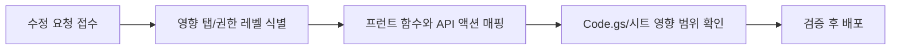

# Admin Tab Change Map

> 문서 링크: [docs/Wiki/03_Admin_Tab_Change_Map.md](./03_Admin_Tab_Change_Map.md) | [GitHub](https://github.com/cloud-club/CloudClubAttendanceSystem/blob/gh-pages/docs/Wiki/03_Admin_Tab_Change_Map.md)

## 빠른 흐름도

## 이 문서를 언제 쓰는가
탭 수정 이슈는 대부분 “어디를 고쳐야 하는지”를 찾는 단계에서 시간이 가장 많이 소모됩니다. 이 문서는 그 탐색 시간을 줄이기 위해, 탭별로 프런트 함수와 백엔드 액션을 한 번에 연결해 둔 지도입니다.

즉, 이 문서는 참고용 표가 아니라 수정 의사결정 도구입니다. 기능 이슈가 발생했을 때 첫 진입점으로 사용하고, 상세 정책은 Admin Guide/RBAC 문서로 이어서 확인합니다.

## 변경 유형별 진입 가이드
수정 요청 유형이 다르면 확인 순서도 달라집니다. 아래 분류를 먼저 적용하면 불필요한 파일 탐색을 줄일 수 있습니다.

1. UI 이벤트/렌더링 이상
- 우선 `web/admin/index.html`, `web/admin/admin.js` 확인
- 액션 호출명과 파라미터 전달부 검증

2. 권한/응답 코드 이상
- `Code.gs`의 `ACTION_ACCESS_LEVELS` 및 가드 로직 확인
- `_admins` 및 시즌 접근 제약 확인

3. 데이터 반영 이상
- API 액션의 시트 write 경로 확인
- 시트 헤더/키 정책(`Phone`)과 메타 시트 상태 확인

## 변경 작업 표준 절차 (분석→수정→검증→배포)
이 절차는 탭 종류와 무관하게 동일하게 적용합니다. 순서를 고정하면 회귀 발생 시 원인 추적이 쉬워집니다.

1. 분석
- 어떤 탭의 어떤 사용자 행동에서 실패하는지 재현
- 아래 매핑 테이블로 관련 함수/API 범위 확정

2. 수정
- 프런트/백엔드 중 최소 범위 변경 원칙 적용
- 권한 레벨과 시즌 접근 가드 회귀 여부 점검

3. 검증
- 성공 경로 + 실패 경로 + 권한 경로까지 점검
- 필요 시 `04_Operations_Runbook` 기준으로 canary 수행

4. 배포
- Apps Script/Pages 반영 후 운영 URL에서 재검증
- 변경 근거와 결과를 운영 기록에 남김

## 탭별 수정 체크 테이블
아래 표는 “탭 이름 → 프런트 함수 → API 액션 → 확인 파일”의 기본 매핑입니다. 먼저 이 표로 수정 시작점을 고정한 뒤 상세 구현으로 내려가면 안전합니다.

| 탭 | 프런트 주요 함수 (`web/admin/admin.js`) | API 액션 (`Code.gs`) | 점검 파일 |
|---|---|---|---|
| 출석하기 | `checkAttendanceSession`, `doAttendance`, `submitManualApproveBatch` | `session`, `attendance`, `manualApproveBatch`, `members` | [web/admin/admin.js](../../web/admin/admin.js) [GitHub](https://github.com/cloud-club/CloudClubAttendanceSystem/blob/gh-pages/web/admin/admin.js) [Code.gs](../../Code.gs) [GitHub](https://github.com/cloud-club/CloudClubAttendanceSystem/blob/gh-pages/Code.gs) |
| 출석현황 | `checkAttendanceStatus`, `loadRankings`, `loadAttendanceDashboard` | `status`, `ranking`, `attendanceDashboardSummary`, `attendanceDashboardDrilldown` | [web/admin/admin.js](../../web/admin/admin.js) [GitHub](https://github.com/cloud-club/CloudClubAttendanceSystem/blob/gh-pages/web/admin/admin.js) [Code.gs](../../Code.gs) [GitHub](https://github.com/cloud-club/CloudClubAttendanceSystem/blob/gh-pages/Code.gs) |
| 일정 관리 | `loadScheduleList`, `saveSchedule`, `deleteSelectedSchedule` | `scheduleList`, `scheduleSave`, `scheduleDelete` | [web/admin/admin.js](../../web/admin/admin.js) [GitHub](https://github.com/cloud-club/CloudClubAttendanceSystem/blob/gh-pages/web/admin/admin.js) [Code.gs](../../Code.gs) [GitHub](https://github.com/cloud-club/CloudClubAttendanceSystem/blob/gh-pages/Code.gs) |
| 유고 처리 | `openExcuseModal`, `submitExcuseOverrideModal` | `excusedSet`, `graduationReport` | [web/admin/admin.js](../../web/admin/admin.js) [GitHub](https://github.com/cloud-club/CloudClubAttendanceSystem/blob/gh-pages/web/admin/admin.js) [Code.gs](../../Code.gs) [GitHub](https://github.com/cloud-club/CloudClubAttendanceSystem/blob/gh-pages/Code.gs) |
| QR코드 관리 | `generateSeasonQRCode`, `loadAdminQrCode` | `studentUrl`, `adminUrl`, `sheetLink` | [web/admin/admin.js](../../web/admin/admin.js) [GitHub](https://github.com/cloud-club/CloudClubAttendanceSystem/blob/gh-pages/web/admin/admin.js) [Code.gs](../../Code.gs) [GitHub](https://github.com/cloud-club/CloudClubAttendanceSystem/blob/gh-pages/Code.gs) |
| 변수명 관리 | `loadVariables`, `saveVariables`, `resetVariablesTemplate` | `variablesGet`, `variablesUpdate`, `variablesNormalize`, `variablesResetTemplate` | [web/admin/admin.js](../../web/admin/admin.js) [GitHub](https://github.com/cloud-club/CloudClubAttendanceSystem/blob/gh-pages/web/admin/admin.js) [Code.gs](../../Code.gs) [GitHub](https://github.com/cloud-club/CloudClubAttendanceSystem/blob/gh-pages/Code.gs) |
| 수료 판정 | `loadGraduationReport` | `graduationReport` | [web/admin/admin.js](../../web/admin/admin.js) [GitHub](https://github.com/cloud-club/CloudClubAttendanceSystem/blob/gh-pages/web/admin/admin.js) [Code.gs](../../Code.gs) [GitHub](https://github.com/cloud-club/CloudClubAttendanceSystem/blob/gh-pages/Code.gs) |
| 시즌 생성/업로드 | `analyzeImportFile`, `executeSeasonImport`, `fetchSeasonImportDiff` | `sheetSchemaAudit`, `seasonImport*` | [web/admin/admin.js](../../web/admin/admin.js) [GitHub](https://github.com/cloud-club/CloudClubAttendanceSystem/blob/gh-pages/web/admin/admin.js) [Code.gs](../../Code.gs) [GitHub](https://github.com/cloud-club/CloudClubAttendanceSystem/blob/gh-pages/Code.gs) |
| 관리자 관리 | `loadAdminUsers`, `saveAdminUser`, `deleteAdminUser` | `adminUsersList`, `adminUsersUpsert`, `adminUsersDelete` | [web/admin/admin.js](../../web/admin/admin.js) [GitHub](https://github.com/cloud-club/CloudClubAttendanceSystem/blob/gh-pages/web/admin/admin.js) [Code.gs](../../Code.gs) [GitHub](https://github.com/cloud-club/CloudClubAttendanceSystem/blob/gh-pages/Code.gs) |

## 권한 체크 포인트
권한 경계는 기능 성공 여부만큼 중요합니다. 수정 중에는 아래 조건을 항상 함께 확인해야 운영 회귀를 막을 수 있습니다.

- Super 전용 탭: `변수명 관리`, `시즌 생성/업로드`, `관리자 관리`
- 공통 인증 가드: `authGoogleLogin`, `authSession`, `ACTION_ACCESS_LEVELS`
- 시즌 접근 가드: `requireSeasonAccess`

## 관련 문서
- 관리자 가이드: [02_Admin_Side_Guide.md](./02_Admin_Side_Guide.md) | [GitHub](https://github.com/cloud-club/CloudClubAttendanceSystem/blob/gh-pages/docs/Wiki/02_Admin_Side_Guide.md)
- 운영 런북: [04_Operations_Runbook.md](./04_Operations_Runbook.md) | [GitHub](https://github.com/cloud-club/CloudClubAttendanceSystem/blob/gh-pages/docs/Wiki/04_Operations_Runbook.md)
- RBAC 레퍼런스: [05_Data_And_RBAC_Reference.md](./05_Data_And_RBAC_Reference.md) | [GitHub](https://github.com/cloud-club/CloudClubAttendanceSystem/blob/gh-pages/docs/Wiki/05_Data_And_RBAC_Reference.md)
