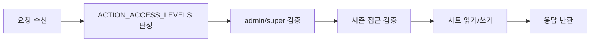

# Data And RBAC Reference

> 문서 링크: [docs/Wiki/05_Data_And_RBAC_Reference.md](./05_Data_And_RBAC_Reference.md) | [GitHub](https://github.com/cloud-club/CloudClubAttendanceSystem/blob/gh-pages/docs/Wiki/05_Data_And_RBAC_Reference.md)

## 빠른 흐름도

## 1. 시트 스키마 v2
- 회원 헤더(A~L):
  `Name`, `Season`, `Phone`, `Email`, `Github ID`, `Github Email`, `Notion Email`, `Discord ID`, `Slack Email`, `회비 체크`, `수료 여부`, `운영진 여부`
- 세션 컬럼: `M+` (`YYYY-MM-DD-HH:MM` 또는 `YYYY-MM-DD-HH:MM~HH:MM`)
- 슈퍼키: `Phone` only

## 2. 핵심 보조 시트
- `_admins`: 관리자 계정/권한
- `_session_meta`: 세션 메타(임계값/마감)
- `_import_meta`: 시즌 업로드 세션 상태

## 3. 권한 모델
- `user`: 공개 액션
- `admin`(`season_admin`): 관리자 액션(시즌 범위 제한)
- `super`: 전체 관리자 + 계정/변수/업로드 관리

## 4. 액션 레벨 기준
`Code.gs`의 `ACTION_ACCESS_LEVELS`를 정본으로 사용합니다.

주요 그룹:
- Public: `session`, `attendance`, `status`, `ranking`, `latestSeason`, `authGoogleConfig`, `authGoogleLogin`
- Admin: `attendanceDashboardSummary`, `schedule*`, `manualApprove*`, `excusedSet`, `graduationReport`, `sheetSchemaAudit`
- Super: `adminUsers*`, `variables*`, `seasonImport*`, `setActiveSheet`

## 참조 파일
- 백엔드: [Code.gs](../../Code.gs) | [GitHub](https://github.com/cloud-club/CloudClubAttendanceSystem/blob/gh-pages/Code.gs)
- 관리자 프런트: [web/admin/admin.js](../../web/admin/admin.js) | [GitHub](https://github.com/cloud-club/CloudClubAttendanceSystem/blob/gh-pages/web/admin/admin.js)
- 학생 프런트: [web/student/student.js](../../web/student/student.js) | [GitHub](https://github.com/cloud-club/CloudClubAttendanceSystem/blob/gh-pages/web/student/student.js)

## 관련 문서
- Admin Guide: [02_Admin_Side_Guide.md](./02_Admin_Side_Guide.md) | [GitHub](https://github.com/cloud-club/CloudClubAttendanceSystem/blob/gh-pages/docs/Wiki/02_Admin_Side_Guide.md)
- History 020: [020_권한관리체계_user_admin_super_운영정책.md](../History/020_권한관리체계_user_admin_super_운영정책.md) | [GitHub](https://github.com/cloud-club/CloudClubAttendanceSystem/blob/gh-pages/docs/History/020_%EA%B6%8C%ED%95%9C%EA%B4%80%EB%A6%AC%EC%B2%B4%EA%B3%84_user_admin_super_%EC%9A%B4%EC%98%81%EC%A0%95%EC%B1%85.md)
