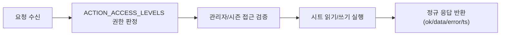

# Data And RBAC Reference

> 문서 링크: [docs/Wiki/05_Data_And_RBAC_Reference.md](./05_Data_And_RBAC_Reference.md) | [GitHub](https://github.com/cloud-club/CloudClubAttendanceSystem/blob/gh-pages/docs/Wiki/05_Data_And_RBAC_Reference.md)

## 빠른 흐름도

## 데이터/RBAC 문서 목적
출석 시스템은 UI보다 데이터와 권한 모델이 오래 남습니다. 그래서 이 문서는 “현재 값”을 외우는 용도가 아니라, 운영 정책이 어떤 구조 위에서 동작하는지 이해하도록 작성되었습니다.

특히 운영 중 이슈가 발생했을 때는 기능 화면보다 권한 경계와 시트 스키마를 먼저 확인해야 원인을 빠르게 좁힐 수 있습니다.

## 권한 판정이 필요한 이유
같은 액션이라도 사용자 유형에 따라 허용 범위가 달라야 운영 사고를 막을 수 있습니다. 예를 들어 조회는 공개돼도, 관리자 계정 관리나 시즌 업로드는 Super만 수행해야 합니다.

이 프로젝트는 권한 판정을 `Code.gs`의 `ACTION_ACCESS_LEVELS`를 단일 정본으로 삼아 처리합니다. 따라서 문서와 코드가 어긋나지 않도록, 정책 설명도 이 상수를 기준으로 유지합니다.

## 시트 스키마 v2
회원 데이터는 출석 판정과 수료 계산의 원천입니다. 헤더 규칙이 흔들리면 API는 정상이어도 결과가 왜곡될 수 있으므로, 스키마는 운영 정책의 일부로 취급합니다.

- 회원 헤더(A~L):
  `Name`, `Season`, `Phone`, `Email`, `Github ID`, `Github Email`, `Notion Email`, `Discord ID`, `Slack Email`, `회비 체크`, `수료 여부`, `운영진 여부`
- 세션 컬럼: `M+` (`YYYY-MM-DD-HH:MM` 또는 `YYYY-MM-DD-HH:MM~HH:MM`)
- 슈퍼키: `Phone` only

## 핵심 보조 시트
보조 시트는 기능 부가정보가 아니라 운영 제어점입니다. 메타 시트가 깨지면 사용자 기능이 연쇄적으로 영향을 받을 수 있습니다.

- `_admins`: 관리자 계정/역할/활성 상태
- `_session_meta`: 세션 임계값/마감 등 판정 보조 메타
- `_import_meta`: 시즌 업로드 세션 상태 및 단계 관리

## 권한 모델
역할 모델은 간단하지만, 각 역할의 책임이 분명해야 운영이 안정됩니다. 아래 정의는 운영 안내, 코드 검증, 장애 분석에서 공통으로 사용하는 기준입니다.

- `user`: 공개 액션만 허용
- `admin`(`season_admin`): 시즌 범위 내 관리자 액션 허용
- `super`: 전체 시즌 + 계정/변수/업로드 관리 허용

## 액션 레벨 기준 (정본: ACTION_ACCESS_LEVELS)
문서에 있는 권한 그룹은 설명용 요약이고, 최종 판정 기준은 항상 `Code.gs`의 `ACTION_ACCESS_LEVELS`입니다. 권한 이슈가 발생하면 문서보다 코드 상수를 우선 확인합니다.

- Public: `session`, `attendance`, `status`, `ranking`, `latestSeason`, `authGoogleConfig`, `authGoogleLogin`
- Admin: `attendanceDashboardSummary`, `schedule*`, `manualApprove*`, `excusedSet`, `graduationReport`, `sheetSchemaAudit`
- Super: `adminUsers*`, `variables*`, `seasonImport*`, `setActiveSheet`

## 변경 영향도 (스키마/권한/업로드)
정책 변경은 단일 파일 수정처럼 보여도 여러 경로에 파급됩니다. 아래 영향도를 먼저 보고 변경 범위를 확정합니다.

1. 스키마 변경
- 영향: 출석 판정, 대시보드, 업로드 파싱
- 필수 점검: 헤더 일치, 키 컬럼(`Phone`) 무결성

2. 권한 변경
- 영향: 관리자 로그인, 탭 접근, 액션 차단
- 필수 점검: `ACTION_ACCESS_LEVELS`, `_admins`, 시즌 접근 가드

3. 업로드 정책 변경
- 영향: 시즌 생성/업데이트, diff/finalize 안전장치
- 필수 점검: `sheetSchemaAudit`, `seasonImport*` 게이트 통과

## 참조 파일
- 백엔드: [Code.gs](../../Code.gs) | [GitHub](https://github.com/cloud-club/CloudClubAttendanceSystem/blob/gh-pages/Code.gs)
- 관리자 프런트: [web/admin/admin.js](../../web/admin/admin.js) | [GitHub](https://github.com/cloud-club/CloudClubAttendanceSystem/blob/gh-pages/web/admin/admin.js)
- 학생 프런트: [web/student/student.js](../../web/student/student.js) | [GitHub](https://github.com/cloud-club/CloudClubAttendanceSystem/blob/gh-pages/web/student/student.js)

## 관련 문서
- Admin Guide: [02_Admin_Side_Guide.md](./02_Admin_Side_Guide.md) | [GitHub](https://github.com/cloud-club/CloudClubAttendanceSystem/blob/gh-pages/docs/Wiki/02_Admin_Side_Guide.md)
- Tab Change Map: [03_Admin_Tab_Change_Map.md](./03_Admin_Tab_Change_Map.md) | [GitHub](https://github.com/cloud-club/CloudClubAttendanceSystem/blob/gh-pages/docs/Wiki/03_Admin_Tab_Change_Map.md)
- History 020: [020_권한관리체계_user_admin_super_운영정책.md](../History/020_권한관리체계_user_admin_super_운영정책.md) | [GitHub](https://github.com/cloud-club/CloudClubAttendanceSystem/blob/gh-pages/docs/History/020_%EA%B6%8C%ED%95%9C%EA%B4%80%EB%A6%AC%EC%B2%B4%EA%B3%84_user_admin_super_%EC%9A%B4%EC%98%81%EC%A0%95%EC%B1%85.md)
