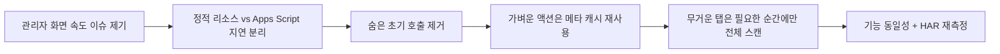

# Admin Performance Optimization Guide

> 문서 링크: [docs/Wiki/07_Admin_Performance_Optimization_Guide.md](./07_Admin_Performance_Optimization_Guide.md) | [GitHub](https://github.com/cloud-club/CloudClubAttendanceSystem/blob/gh-pages/docs/Wiki/07_Admin_Performance_Optimization_Guide.md)

## 빠른 흐름도

## 이 문서의 목적
이 문서는 관리자 화면의 성능을 지금 어떤 기준으로 운영하고 있는지 설명하는 정본입니다. 핵심은 “빨라야 한다”가 아니라, **어떤 지연은 구조상 남고 어떤 지연은 코드로 줄일 수 있는지**를 구분하는 데 있습니다.

이 프로젝트의 운영 구조는 `GitHub Pages UI + Apps Script API/RBAC + Google Sheets 데이터`입니다. 따라서 관리자 성능 문제는 항상 세 층으로 나눠서 봐야 합니다.

1. 정적 프런트 다운로드/렌더
2. Apps Script Web App 진입/리다이렉트
3. Sheets 읽기/집계/권한 재검증

## 현재 기준에서 느림의 해석
### 빠른 영역
- 관리자 HTML/CSS/JS 자체는 보통 수십 ms ~ 수백 ms 수준에서 내려옵니다.
- GitHub Pages 정적 리소스, CDN 라이브러리, 폰트는 대체로 병목의 주원인이 아닙니다.

### 느린 영역
- `script.google.com/macros/.../exec` 진입은 Apps Script Web App 특성상 고정 오버헤드가 있습니다.
- `script.google.com -> script.googleusercontent.com` 리다이렉트는 구조적으로 사라지지 않습니다.
- `getDataRange().getValues()` 또는 대량 `getNotes()`가 들어가는 액션은 시즌 시트 크기에 따라 2~5초 이상 늘어날 수 있습니다.

즉 관리자 화면 속도를 볼 때는 “브라우저 렌더”보다 “관리자 API 체인”을 먼저 의심하는 것이 맞습니다.

## 현재 성능 설계 원칙
### 1. 보이지 않는 탭 데이터는 미리 불러오지 않는다
- 초기 관리자 진입은 현재 활성 탭에 필요한 데이터만 우선 로드합니다.
- `sheetLink`, QR, 운세, 관리자 목록, 변수 목록 같은 비가시 탭 데이터는 해당 탭 진입 시점으로 늦춥니다.

### 2. `attend` 탭은 일정 우선, 수동 승인 상세는 지연 로드
- 기본 `attend` 탭에서는 `scheduleList`와 현재 출석 세션 확인이 우선입니다.
- 수동 승인용 `members`/상태 데이터는 첫 상호작용 또는 유휴 시점에만 로드합니다.
- 수동 승인 상태는 `graduationReport` 전체를 재활용하지 않고 `manualApproveStatus` 전용 API로 읽습니다.

### 3. `status` 탭은 기본 범위를 클라이언트에서 먼저 확정한다
- 일정 정보가 이미 있으면 완료 회차 + 현재 활성 회차 기준으로 기본 범위를 먼저 잡습니다.
- 날짜 범위와 회차 범위를 서버 응답 이후 각각 다시 맞추며 여러 번 summary를 재요청하지 않도록 합니다.
- 평균 추이는 여전히 “선택이 없으면 전체 평균”이 기본 해석입니다.

### 4. 가벼운 메타는 Script Cache를 우선 사용한다
- `_admins` 조회, 시즌 시트 후보, 운세 버전/엔트리처럼 자주 쓰는 메타는 Script Cache로 재사용합니다.
- 이 원칙은 가벼운 API(`authSession`, `adminSeasonList`, `sheetLink`, `apiInfo`, `fortuneVersionList/Get`)의 바닥 지연을 낮추는 데 사용합니다.

### 5. 무거운 통계는 필요한 범위만 읽는다
- `attendanceDashboardSummary`는 summary에 필요 없는 note 전체 조회를 피합니다.
- `attendanceDashboardDrilldown`은 필요한 회차의 note 컬럼만 읽습니다.
- 진행 중 세션이 있어도 아주 짧은 TTL의 서버 캐시를 허용해 강제 새로고침 남용을 줄입니다.

## 기능 동일성 원칙
성능 개선은 기존 기능을 바꾸지 않는 것이 우선입니다. 현재 성능 개선에서 유지해야 하는 기준은 아래와 같습니다.

1. 관리자 로그인/권한 해석은 기존과 동일해야 한다.
2. `status` 탭의 기본 평균 추이는 여전히 전체 평균이어야 한다.
3. `attend` 탭의 수동 승인 기능은 그대로 동작해야 한다.
4. `graduation`, `fortune`, `QR`, `adminUsers` 탭 기능은 지연 로드되더라도 결과는 동일해야 한다.
5. 권한 동기화 의미는 유지하되, 같은 정보를 매번 원본 시트에서 다시 읽지 않도록 캐시를 활용해야 한다.

## 현재 성능 민감 API
다음 액션은 수정 시 성능 영향이 크므로, 탭 수정과 별도로 성능 영향도까지 같이 봐야 합니다.

| 영역 | 액션 | 주의 포인트 |
|---|---|---|
| 인증/세션 | `authSession`, `adminSeasonList` | 관리자 재검증, 시즌 동기화, `_admins` 조회 |
| 기본 출석 | `session`, `ranking`, `scheduleList`, `sheetLink` | 초기 부트스트랩 직렬화 여부 |
| 대시보드 | `attendanceDashboardSummary`, `attendanceDashboardDrilldown` | 전체 시트 스캔, notes 범위, 하이드레이션 재호출 |
| 수동 승인 | `members`, `manualApproveStatus`, `manualApproveBatch` | 프로필 컬럼 범위, 회차 단위 상태 계산 |
| 수료/유고 | `graduationReport`, `excusedSet` | 전체 회차/회원 스캔 |
| 운세 | `apiInfo`, `fortuneVersionList`, `fortuneVersionGet` | 버전/엔트리 메타 재조회 |

## “정상적으로 느릴 수 있는” 경우
아래는 지금 구조에서 어느 정도는 정상 범주로 봐야 하는 케이스입니다.

1. 첫 로그인 직후
- Apps Script와 Google 인증 검증이 겹쳐 2~5초대가 나올 수 있습니다.

2. 큰 시즌 시트의 대시보드 첫 진입
- summary/drilldown이 많은 회차와 note를 읽으면 2~5초대가 나올 수 있습니다.

3. 업로드/수료/운세처럼 메타가 큰 탭
- 해당 탭은 본질적으로 전체 데이터 재구성이 필요하므로 `session/ranking`보다 느릴 수 있습니다.

즉 “모든 관리자 액션이 항상 1초 내”는 현재 스택의 목표가 아닙니다.

## “비정상적으로 느린” 징후
아래는 구조적 한계보다 코드/호출 순서 문제를 먼저 의심해야 하는 신호입니다.

1. 초기 진입에서 보이지 않는 탭의 API까지 함께 호출됨
2. `status` 탭 한 번 클릭에 summary가 2~3회 이상 반복 호출됨
3. 수동 승인 상태를 보려고 `graduationReport` 전체가 자동 호출됨
4. 같은 탭을 연속 진입해도 메타성 API가 매번 cold start처럼 느림
5. 캐시 warm 상태에서도 `authSession`, `adminSeasonList`, `sheetLink`, `fortuneVersionList/Get`가 매번 과하게 느림

## 수정 시 회귀 체크
성능 관련 코드를 수정할 때는 아래를 함께 확인합니다.

1. 첫 진입 HAR에서 `DOMContentLoaded`와 `onLoad`를 함께 본다.
2. `attend` 탭 초기 진입 시 `graduationReport`가 자동 호출되지 않는지 본다.
3. `status` 탭 첫 진입에서 `attendanceDashboardSummary` 호출 수가 줄었는지 본다.
4. `manualApproveStatus`가 `graduationReport`를 대체하는지 본다.
5. 배포 후 기능 동일성 기준이 유지되는지 실제 탭 동선으로 확인한다.

## 레포가 알고 있는 사실 vs 사람이 확인할 상태
이 문서가 말할 수 있는 것은 “코드와 HAR 기준의 현재 설계”입니다. 실제 운영 배포 상태는 아래 항목을 사람이 확인해야 합니다.

1. Apps Script에 어떤 deployment가 현재 배포되어 있는지
2. GitHub Pages가 어떤 커밋을 반영 중인지
3. Secret `APPS_SCRIPT_WEB_APP_URL`가 최신 `.../exec`인지
4. 실제 운영 계정 기준 HAR에서 응답 시간이 얼마나 개선됐는지

## 관련 문서
- 탭별 수정 지도: [03_Admin_Tab_Change_Map.md](./03_Admin_Tab_Change_Map.md)
- 운영 런북: [04_Operations_Runbook.md](./04_Operations_Runbook.md)
- 회귀 더블체크: [06_Doublecheck_Regression_Gate.md](./06_Doublecheck_Regression_Gate.md)
- 배경 기록: [docs/History/031_관리자_응답속도_최적화_및_기능동일성_재검증_운영기록_2026-04-05.md](../History/031_%EA%B4%80%EB%A6%AC%EC%9E%90_%EC%9D%91%EB%8B%B5%EC%86%8D%EB%8F%84_%EC%B5%9C%EC%A0%81%ED%99%94_%EB%B0%8F_%EA%B8%B0%EB%8A%A5%EB%8F%99%EC%9D%BC%EC%84%B1_%EC%9E%AC%EA%B2%80%EC%A6%9D_%EC%9A%B4%EC%98%81%EA%B8%B0%EB%A1%9D_2026-04-05.md)
